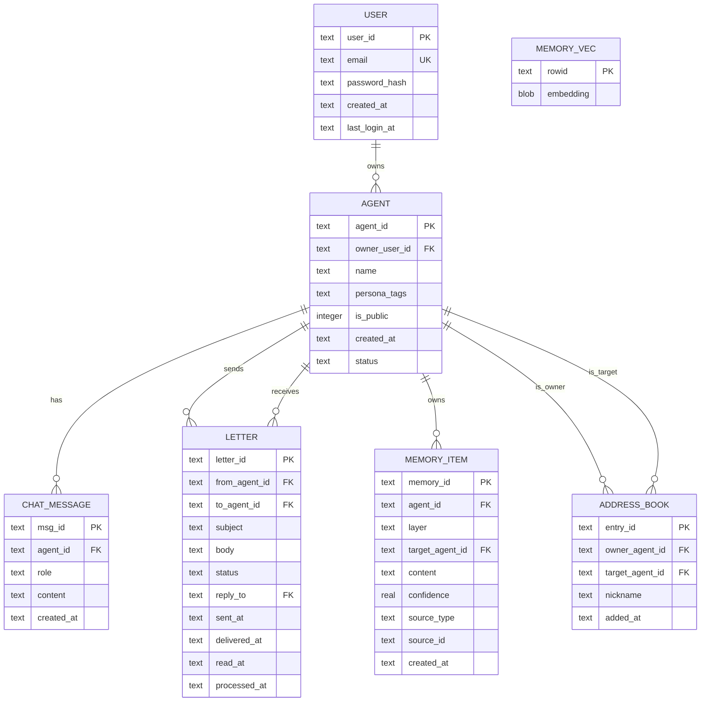

# SDD：MetaAgent v0.2.0 — 软件设计文档

| 文档信息   | 内容                                         |
| ------ | ------------------------------------------ |
| 版本     | v0.2.0                                     |
| 日期     | 2026-09-03                                 |
| 状态     | 草稿                                         |
| 对应 PRD | [PRD-智能体产品设计文档 v0.2.0](./PRD-智能体产品设计文档.md) |
| 前置 SDD | v0.1.0 DEMO 版                              |

> **v0.1.0 → v0.2.0 变更说明**：在 DEMO 基础上新增 **用户体系**、**鉴权中间件**、**智能体管理增强**（归属+公开/私有+CRUD）、**通讯录模块** 四大块。后端新增约 1600 行代码，前端新增约 10 个页面/组件，数据库新增 2 张表、修改 1 张表。

***

## 1. 技术栈变更

### 1.1 新增依赖

| 层级 | 包名                            | 版本   | 用途                                      |
| -- | ----------------------------- | ---- | --------------------------------------- |
| 后端 | `@fastify/jwt`                | 9.x  | JWT 签发与校验，Fastify 原生插件                  |
| 后端 | `@fastify/rate-limit`         | 10.x | 注册/登录接口 IP 限流                           |
| 后端 | `bcrypt`                      | 5.x  | 密码哈希（cost factor = 12）                  |
| 后端 | `@types/bcrypt`（dev）          | —    | bcrypt 类型声明                             |
| 前端 | `pinia-plugin-persistedstate` | 4.x  | Pinia store 持久化到 localStorage（token 存储） |

### 1.2 不变部分

| 层级  | 技术                                    | 说明          |
| --- | ------------------------------------- | ----------- |
| 语言  | TypeScript ≥ 5.4                      | 前后端统一       |
| 后端  | Fastify 4.x                           | 无变化         |
| 数据库 | SQLite + better-sqlite3 + sqlite-vec  | 无变化（只是加表加列） |
| 前端  | Vue 3.4 + Vite + Pinia + Element Plus | 无变化         |
| 向量  | @xenova/transformers（本地）或远端 embedding | 无变化         |

### 1.3 完整 server/package.json（节选）

```json
{
  "dependencies": {
    "@fastify/cors": "^9.0.1",
    "@fastify/jwt": "^9.0.0",
    "@fastify/rate-limit": "^10.0.0",
    "@meta-world/shared": "*",
    "@xenova/transformers": "^2.17.2",
    "bcrypt": "^5.1.1",
    "better-sqlite3": "^11.3.0",
    "dotenv": "^16.4.5",
    "fastify": "^4.28.0",
    "https-proxy-agent": "^9.1.0",
    "pino": "^9.0.0",
    "undici": "^8.10.1",
    "zod": "^3.23.0"
  },
  "devDependencies": {
    "@types/bcrypt": "^5.0.2",
    "@types/better-sqlite3": "^7.6.11",
    "@types/node": "^22.0.0",
    "tsx": "^4.19.0",
    "typescript": "^5.5.0"
  }
}
```

### 1.4 .env.example 更新

```env
# —— LLM 配置（不变）——
LLM_BASE_URL=https://api.openai.com/v1
LLM_API_KEY=sk-xxx
LLM_MODEL=gpt-4o-mini

# —— Embedding 配置（不变）——
EMBEDDING_MODE=local
EMBEDDING_LOCAL_MODEL=Xenova/all-MiniLM-L6-v2
EMBEDDING_MODEL=text-embedding-3-small
EMBEDDING_DIM=384
HF_ENDPOINT=https://huggingface.co

# —— SQLite（不变）——
DB_PATH=./meta-agent.db

# —— v0.2.0 新增：JWT 配置 ——
JWT_SECRET=change-me-to-a-long-random-string
JWT_EXPIRES_IN=7d

# —— v0.2.0 新增：安全 ——
BCRYPT_ROUNDS=12

LOG_LEVEL=info
PORT=3000
```

***

## 2. 数据库设计

### 2.1 ER 图（v0.2.0 完整版）



### 2.2 schema.sql 完整定义（v0.2.0）

```sql
-- ================================================================
-- v0.2.0 Schema
-- 迁移策略：v0.1.0 的表已存在时，用 ALTER TABLE 增量升级
-- 全新库直接执行本文件全量建表
-- ================================================================

-- ------ 1. 用户表（新增） ------
CREATE TABLE IF NOT EXISTS user (
    user_id         TEXT PRIMARY KEY,
    email           TEXT NOT NULL UNIQUE CHECK(length(email) <= 128),
    password_hash   TEXT NOT NULL,
    created_at      TEXT NOT NULL DEFAULT (datetime('now')),
    last_login_at   TEXT
);

CREATE INDEX IF NOT EXISTS idx_user_email ON user(email);

-- ------ 2. 智能体表（v0.1.0 已有，v0.2.0 加列） ------
CREATE TABLE IF NOT EXISTS agent (
    agent_id        TEXT PRIMARY KEY,
    owner_user_id   TEXT REFERENCES user(user_id),
    name            TEXT NOT NULL CHECK(length(name) BETWEEN 2 AND 20),
    persona_tags    TEXT NOT NULL,
    is_public       INTEGER NOT NULL DEFAULT 0,  -- 0=private, 1=public
    created_at      TEXT NOT NULL DEFAULT (datetime('now')),
    status          TEXT NOT NULL DEFAULT 'active' CHECK(status IN ('active','disabled'))
);

CREATE INDEX IF NOT EXISTS idx_agent_owner ON agent(owner_user_id);
CREATE INDEX IF NOT EXISTS idx_agent_public ON agent(is_public, status);

-- ------ 3. 通讯录表（新增） ------
CREATE TABLE IF NOT EXISTS address_book (
    entry_id         TEXT PRIMARY KEY,
    owner_agent_id   TEXT NOT NULL REFERENCES agent(agent_id),
    target_agent_id  TEXT NOT NULL REFERENCES agent(agent_id),
    nickname         TEXT CHECK(length(nickname) <= 20),
    added_at         TEXT NOT NULL DEFAULT (datetime('now')),
    UNIQUE (owner_agent_id, target_agent_id)
);

CREATE INDEX IF NOT EXISTS idx_address_book_owner ON address_book(owner_agent_id);
CREATE INDEX IF NOT EXISTS idx_address_book_target ON address_book(target_agent_id);

-- ------ 4. 对话消息表（不变） ------
CREATE TABLE IF NOT EXISTS chat_message (
    msg_id     TEXT PRIMARY KEY,
    agent_id   TEXT NOT NULL REFERENCES agent(agent_id),
    role       TEXT NOT NULL CHECK(role IN ('user','assistant')),
    content    TEXT NOT NULL,
    created_at TEXT NOT NULL DEFAULT (datetime('now'))
);
CREATE INDEX IF NOT EXISTS idx_chat_message_agent_time ON chat_message(agent_id, created_at);

-- ------ 5. 信件表（不变） ------
CREATE TABLE IF NOT EXISTS letter (
    letter_id      TEXT PRIMARY KEY,
    from_agent_id  TEXT NOT NULL REFERENCES agent(agent_id),
    to_agent_id    TEXT NOT NULL REFERENCES agent(agent_id),
    subject        TEXT CHECK(length(subject) <= 50),
    body           TEXT NOT NULL CHECK(length(body) <= 2000),
    status         TEXT NOT NULL DEFAULT 'delivered'
                       CHECK(status IN ('sent','delivered','read',
                                        'processing','processing_failed',
                                        'replied','done')),
    reply_to       TEXT REFERENCES letter(letter_id),
    sent_at        TEXT NOT NULL DEFAULT (datetime('now')),
    delivered_at   TEXT,
    read_at        TEXT,
    processed_at   TEXT
);
CREATE INDEX IF NOT EXISTS idx_letter_to_status ON letter(to_agent_id, status);
CREATE INDEX IF NOT EXISTS idx_letter_from ON letter(from_agent_id);

-- ------ 6. 记忆条目表（不变） ------
CREATE TABLE IF NOT EXISTS memory_item (
    memory_id        TEXT PRIMARY KEY,
    agent_id         TEXT NOT NULL REFERENCES agent(agent_id),
    layer            TEXT NOT NULL CHECK(layer IN ('self','world','other')),
    target_agent_id  TEXT REFERENCES agent(agent_id),
    content          TEXT NOT NULL,
    confidence       REAL NOT NULL DEFAULT 0.5 CHECK(confidence BETWEEN 0 AND 1),
    source_type      TEXT NOT NULL CHECK(source_type IN ('dialogue','letter_receive','letter_send')),
    source_id        TEXT NOT NULL,
    created_at       TEXT NOT NULL DEFAULT (datetime('now'))
);
CREATE INDEX IF NOT EXISTS idx_memory_agent_layer ON memory_item(agent_id, layer);
CREATE INDEX IF NOT EXISTS idx_memory_confidence   ON memory_item(confidence);

-- ------ 7. 向量表（sqlite-vec 虚拟表，不变） ------
CREATE VIRTUAL TABLE IF NOT EXISTS memory_vec USING vec0(
    embedding float[384]   -- 与 config.embedding.dim 一致
);
```

### 2.3 迁移脚本（v0.1.0 → v0.2.0）

新建文件：`server/src/db/migrations/002_add_user_and_address_book.sql`

```sql
-- ================================================================
-- v0.1.0 → v0.2.0 增量迁移
-- 执行前先备份: cp meta-agent.db meta-agent.db.bak.v0.1.0
-- ================================================================

BEGIN TRANSACTION;

-- 1. 新增 user 表
CREATE TABLE IF NOT EXISTS user (
    user_id         TEXT PRIMARY KEY,
    email           TEXT NOT NULL UNIQUE CHECK(length(email) <= 128),
    password_hash   TEXT NOT NULL,
    created_at      TEXT NOT NULL DEFAULT (datetime('now')),
    last_login_at   TEXT
);

-- 2. agent 表加 owner_user_id
--    SQLite 的 ALTER TABLE ADD COLUMN 不支持 REFERENCES 约束定义本身，
--    但外键关系可在应用层保证。先尝试加列，如果已存在则忽略。
PRAGMA foreign_keys = OFF;
ALTER TABLE agent ADD COLUMN owner_user_id TEXT;
PRAGMA foreign_keys = ON;

-- 3. agent 表加 is_public
ALTER TABLE agent ADD COLUMN is_public INTEGER NOT NULL DEFAULT 0;

-- 4. 新建 address_book 表
CREATE TABLE IF NOT EXISTS address_book (
    entry_id         TEXT PRIMARY KEY,
    owner_agent_id   TEXT NOT NULL REFERENCES agent(agent_id),
    target_agent_id  TEXT NOT NULL REFERENCES agent(agent_id),
    nickname         TEXT CHECK(length(nickname) <= 20),
    added_at         TEXT NOT NULL DEFAULT (datetime('now')),
    UNIQUE (owner_agent_id, target_agent_id)
);

-- 5. 补索引
CREATE INDEX IF NOT EXISTS idx_user_email ON user(email);
CREATE INDEX IF NOT EXISTS idx_agent_owner ON agent(owner_user_id);
CREATE INDEX IF NOT EXISTS idx_agent_public ON agent(is_public, status);
CREATE INDEX IF NOT EXISTS idx_address_book_owner ON address_book(owner_agent_id);
CREATE INDEX IF NOT EXISTS idx_address_book_target ON address_book(target_agent_id);

COMMIT;
```

### 2.4 迁移执行代码

在 `server/src/db/index.ts` 中加入迁移逻辑：

```typescript
// server/src/db/index.ts（变更片段）
const MIGRATION_VERSION = 2;  // 当前 schema 版本

export function getDb(): Database.Database {
  if (_db) return _db;

  const dbPath = path.resolve(config.db.path);
  _db = new Database(dbPath);
  _db.pragma('journal_mode = WAL');
  _db.pragma('foreign_keys = ON');

  // 加载 sqlite-vec（不变）
  try {
    _db.loadExtension('sqlite-vec');
    _db.exec(`CREATE VIRTUAL TABLE IF NOT EXISTS memory_vec USING vec0(embedding float[${config.embedding.dim}])`);
  } catch {
    _db.exec(`CREATE TABLE IF NOT EXISTS memory_vec (rowid TEXT PRIMARY KEY, embedding BLOB NOT NULL)`);
  }

  // 迁移：如果 user 表不存在，说明是全新库；否则执行增量迁移
  const userTableExists = _db.prepare(
    `SELECT name FROM sqlite_master WHERE type='table' AND name='user'`
  ).get();

  if (!userTableExists) {
    // 全新库：执行完整 schema.sql
    const schema = fs.readFileSync(path.join(__dirname, 'schema.sql'), 'utf-8');
    _db.exec(schema);
  } else {
    // 增量库：检查是否缺 address_book 表
    const addrTableExists = _db.prepare(
      `SELECT name FROM sqlite_master WHERE type='table' AND name='address_book'`
    ).get();
    if (!addrTableExists) {
      logger.info('Running migration 002: add user + address_book');
      const migration = fs.readFileSync(
        path.join(__dirname, 'migrations', '002_add_user_and_address_book.sql'),
        'utf-8'
      );
      _db.exec(migration);
    }
  }

  logger.info('Database initialized');
  return _db;
}
```

***

## 3. 新增后端模块设计

### 3.1 模块总览

v0.2.0 新增 **auth 模块** 和 **address-book 模块**，改造 **agent 模块**（加 owner 归属 + discover + CRUD），其他模块（chat、letter、memory）主要是加鉴权守卫。

```
server/src/
├── index.ts                 ← 改造：注册 auth + rateLimit + jwt 插件
├── config.ts                ← 改造：加 jwt、bcrypt 配置项
├── db/
│   ├── index.ts             ← 改造：加迁移逻辑
│   ├── schema.sql           ← 改造：加 user + address_book + agent 新列
│   ├── migrations/          ← 新增目录
│   │   └── 002_add_user_and_address_book.sql
│   └── repositories/
│       ├── user.repo.ts     ← 新增
│       ├── address-book.repo.ts  ← 新增
│       ├── agent.repo.ts    ← 改造
│       ├── letter.repo.ts   ← 改造（owner 归属查询）
│       ├── chat.repo.ts     ← 改造（owner 归属查询）
│       └── memory.repo.ts   ← 不变
│
├── middleware/              ← 新增目录
│   ├── auth.ts              ← JWT 校验守卫 + request.user 注入
│   └── ownership.ts         ← 智能体归属二次校验（req.user_id === agent.owner_user_id）
│
├── modules/
│   ├── auth/                ← 新增模块
│   │   ├── route.ts         ← POST /api/auth/register, /api/auth/login, GET /api/auth/me
│   │   ├── service.ts       ← 注册/登录/me 业务编排
│   │   └── schema.ts        ← 入参校验 schema
│   ├── agent/               ← 改造
│   │   ├── route.ts         ← 加 JWT preHandler，加 GET /api/agents, PUT, DELETE, /discover
│   │   ├── service.ts       ← 加 list (my), update, remove, disable, discover
│   │   └── schema.ts        ← 加新接口的入参 schema
│   ├── address-book/        ← 新增模块
│   │   ├── route.ts         ← GET/POST/DELETE /api/address-book
│   │   ├── service.ts       ← 业务编排
│   │   └── schema.ts
│   ├── chat/                ← 改造：加 owner 校验
│   ├── letter/              ← 改造：加 owner 校验 + 通讯录校验
│   └── memory/              ← 不变
│
└── utils/
    ├── jwt.ts               ← 新增（或直接用 @fastify/jwt 插件 API）
    ├── auth-errors.ts       ← 新增（统一错误码）
    ├── validator.ts         ← 新增（邮箱/密码校验工具）
    ├── llm.ts
    ├── embedder.ts
    ├── global-fetch.ts
    └── logger.ts
```

### 3.2 全局插件注册（server/src/index.ts 改造）

```typescript
// server/src/index.ts（核心变更片段）
import jwt from '@fastify/jwt';
import rateLimit from '@fastify/rate-limit';
import { authRoutes } from './modules/auth/route.js';
import { addressBookRoutes } from './modules/address-book/route.js';

async function bootstrap() {
  const app = Fastify({ logger: false });

  // 1. 数据库（含迁移）
  getDb();

  // 2. CORS（不变）
  await app.register(cors, { origin: true });

  // 3. JWT 插件
  await app.register(jwt, {
    secret: config.jwt.secret,
    sign: { expiresIn: config.jwt.expiresIn },
    verify: { algorithms: ['HS256'] },
  });

  // 4. 全局限流（保护注册/登录，其他 API 单独限流）
  await app.register(rateLimit, {
    global: false,
    keyGenerator: (req) => req.ip as string,
  });

  // 5. 错误处理（不变）
  app.setErrorHandler((err, _req, reply) => {
    logger.error(err, 'Unhandled error');
    const status = (err as any).statusCode ?? 500;
    reply.status(status).send({ error: err.message });
  });

  // 6. 注册业务路由
  app.register(authRoutes,        { prefix: '/api' });   // ← 新增
  app.register(addressBookRoutes, { prefix: '/api' });   // ← 新增
  app.register(agentRoutes,      { prefix: '/api' });   // ← 改造（加 jwt verify）
  app.register(chatRoutes,        { prefix: '/api' });   // ← 改造
  app.register(letterRoutes,     { prefix: '/api' });   // ← 改造

  app.get('/health', async () => ({ status: 'ok' }));

  try {
    await app.listen({ port: config.port, host: '0.0.0.0' });
    logger.info({ port: config.port }, 'Server started');
  } catch (err) {
    logger.error(err, 'Failed to start server');
    process.exit(1);
  }
}
```

### 3.3 鉴权中间件

#### middleware/auth.ts — JWT 守卫

```typescript
// server/src/middleware/auth.ts
import type { FastifyRequest, FastifyReply } from 'fastify';

// 挂载到 FastifyRequest 的 user 类型
declare module 'fastify' {
  interface FastifyRequest {
    user: {
      sub: string;      // user_id
      email: string;
      iat: number;
      exp: number;
    };
  }
}

export async function verifyAuth(req: FastifyRequest, reply: FastifyReply) {
  try {
    await req.jwtVerify();    // @fastify/jwt 自动从 Authorization: Bearer <token> 解析
  } catch (err: any) {
    if (err.code === 'FST_JWT_NO_AUTHORIZATION_IN_HEADER') {
      return reply.code(401).send({ error: 'UNAUTHORIZED', message: '未登录' });
    }
    if (err.code === 'FST_JWT_AUTHORIZATION_FAILED') {
      return reply.code(401).send({ error: 'TOKEN_EXPIRED', message: '登录已过期' });
    }
    return reply.code(401).send({ error: 'UNAUTHORIZED', message: err.message });
  }
}
```

#### middleware/ownership.ts — 智能体归属校验

```typescript
// server/src/middleware/ownership.ts（v0.2.0-02 更新：扩展 agentId 提取链 + disabled 拦截）
import type { FastifyRequest, FastifyReply } from 'fastify';
import { agentRepo } from '../db/repositories/agent.repo.js';
import { getAuthUser } from './auth.js';

/**
 * 校验请求中的 agent_id 是否归属于当前登录用户。
 * 支持多种字段来源：
 *   - params.agentId / params.id （路径参数）
 *   - query.agent_id （查询参数）
 *   - body.agent_id / body.from_agent_id / body.to_agent_id （请求体）
 * 使用：route 的 preHandler 数组中传入
 */
export async function verifyAgentOwnership(
  req: FastifyRequest,
  reply: FastifyReply
) {
  const params = req.params as { agentId?: string; id?: string };
  const query = req.query as { agent_id?: string };
  const body = req.body as any;

  const agentId =
    params.agentId ||
    params.id ||
    query.agent_id ||
    (body && (body.agent_id || body.from_agent_id || body.to_agent_id));

  if (!agentId) return;

  const agent = agentRepo.getById(agentId);
  if (!agent) {
    return reply.code(404).send({ error: 'AGENT_NOT_FOUND' });
  }
  if (agent.owner_user_id !== getAuthUser(req).sub) {
    return reply.code(403).send({ error: 'FORBIDDEN', message: '无权操作该智能体' });
  }
  if (agent.status === 'disabled') {
    return reply.code(403).send({ error: 'AGENT_DISABLED', message: '该智能体已被禁用' });
  }
}
```

> **v0.2.0-02 变更**：新增 `body.agent_id` 提取（修复 chat 模块鉴权绕过）、`params.id` 支持、disabled 智能体拦截、统一用 `getAuthUser(req)` 而非 `req.user`。

#### 使用示例（在路由中）

```typescript
// 单个路由
app.post('/agents', {
  preHandler: [verifyAuth],
  schema: { body: createAgentSchema },
}, async (req, reply) => { /* ... */ });

// 路由级分组（Fastify register 的 options 支持 hooks）
```

### 3.4 Auth 模块（新增）

#### modules/auth/route.ts

```typescript
// server/src/modules/auth/route.ts
import type { FastifyInstance } from 'fastify';
import rateLimit from '@fastify/rate-limit';
import { authService } from './service.js';
import { verifyAuth } from '../../middleware/auth.js';
import { config } from '../../config.js';

// —— 注册校验 schema ——
const registerSchema = {
  type: 'object',
  required: ['email', 'password'],
  properties: {
    email: { type: 'string', minLength: 3, maxLength: 128, format: 'email' },
    password: { type: 'string', minLength: 8, maxLength: 32 },
  },
} as const;

const loginSchema = { ...registerSchema } as const;

export async function authRoutes(app: FastifyInstance) {
  // POST /api/auth/register — 注册（免鉴权，限流）
  app.post(
    '/auth/register',
    {
      preHandler: rateLimit({
        max: 10,
        timeWindow: 60 * 1000,  // 每 IP 每分钟最多 10 次（v0.2.0-02 从 5 调整）
      }),
      schema: { body: registerSchema } as any,
    },
    async (req, reply) => {
      try {
        const result = await authService.register(req.body as { email: string; password: string });
        reply.code(201).send(result);
      } catch (err: any) {
        if (err.code === 'EMAIL_EXISTS') {
          return reply.code(409).send({ error: 'EMAIL_EXISTS', message: '该邮箱已注册' });
        }
        reply.code(400).send({ error: err.message });
      }
    }
  );

  // POST /api/auth/login — 登录（免鉴权，限流）
  app.post(
    '/auth/login',
    {
      preHandler: rateLimit({
        max: 20,
        timeWindow: 60 * 1000,  // 每 IP 每分钟最多 20 次（v0.2.0-02 从 10 调整）
      }),
      schema: { body: loginSchema } as any,
    },
    async (req, reply) => {
      try {
        const result = await authService.login(req.body as { email: string; password: string });
        reply.send(result);
      } catch (err: any) {
        if (err.code === 'INVALID_CREDENTIALS') {
          return reply.code(401).send({ error: 'INVALID_CREDENTIALS', message: '邮箱或密码错误' });
        }
        reply.code(500).send({ error: err.message });
      }
    }
  );

  // GET /api/auth/me — 获取当前用户信息（需鉴权）
  app.get('/auth/me', { preHandler: [verifyAuth] }, async (req, reply) => {
    reply.send({
      user_id: req.user.sub,
      email: req.user.email,
    });
  });
}
```

#### modules/auth/service.ts

```typescript
// server/src/modules/auth/service.ts
import { randomUUID } from 'node:crypto';
import bcrypt from 'bcrypt';
import { config } from '../../config.js';
import { userRepo } from '../../db/repositories/user.repo.js';
import { validateEmail, validatePassword } from '../../utils/validator.js';
import type { FastifyJwt } from '@fastify/jwt';

// 注意：service 层不依赖 FastifyRequest，通过参数传入
export const authService = {
  async register(input: { email: string; password: string }) {
    // 1. 格式校验
    if (!validateEmail(input.email)) {
      throw { code: 'INVALID_EMAIL', message: '邮箱格式不正确' };
    }
    if (!validatePassword(input.password)) {
      throw { code: 'INVALID_PASSWORD', message: '密码需 8–32 字符且同时包含字母和数字' };
    }

    // 2. 查重
    const existing = userRepo.findByEmail(input.email);
    if (existing) {
      throw { code: 'EMAIL_EXISTS' };
    }

    // 3. 哈希密码
    const passwordHash = await bcrypt.hash(input.password, config.bcryptRounds);

    // 4. 写入用户
    const userId = randomUUID();
    userRepo.insert({
      user_id: userId,
      email: input.email.toLowerCase(),
      password_hash: passwordHash,
    });

    return { user_id: userId, email: input.email };
  },

  async login(input: { email: string; password: string }, jwt: FastifyJwt) {
    // 1. 查用户
    const user = userRepo.findByEmail(input.email.toLowerCase());
    if (!user) {
      throw { code: 'INVALID_CREDENTIALS' };  // 统一错误，防枚举
    }

    // 2. 校验密码
    const ok = await bcrypt.compare(input.password, user.password_hash);
    if (!ok) {
      throw { code: 'INVALID_CREDENTIALS' };
    }

    // 3. 更新 last_login_at
    userRepo.updateLastLoginAt(user.user_id);

    // 4. 签发 token
    const token = jwt.sign(
      { sub: user.user_id, email: user.email },
      { expiresIn: config.jwt.expiresIn }
    );

    return { token, user_id: user.user_id, email: user.email };
  },
};
```

### 3.5 User Repository（新增）

```typescript
// server/src/db/repositories/user.repo.ts
import { getDb } from '../index.js';

export interface UserRow {
  user_id: string;
  email: string;
  password_hash: string;
  created_at: string;
  last_login_at: string | null;
}

export const userRepo = {
  findByEmail(email: string): UserRow | null {
    const db = getDb();
    return db.prepare('SELECT * FROM user WHERE email = ?').get(email) as UserRow | null;
  },

  findById(userId: string): UserRow | null {
    const db = getDb();
    return db.prepare('SELECT * FROM user WHERE user_id = ?').get(userId) as UserRow | null;
  },

  insert(row: { user_id: string; email: string; password_hash: string }): void {
    const db = getDb();
    db.prepare(
      `INSERT INTO user (user_id, email, password_hash) VALUES (?, ?, ?)`
    ).run(row.user_id, row.email, row.password_hash);
  },

  updateLastLoginAt(userId: string): void {
    const db = getDb();
    db.prepare(
      `UPDATE user SET last_login_at = datetime('now') WHERE user_id = ?`
    ).run(userId);
  },
};
```

### 3.6 Address Book 模块（新增）

#### modules/address-book/route.ts

```typescript
// server/src/modules/address-book/route.ts
import type { FastifyInstance } from 'fastify';
import { addressBookService } from './service.js';
import { verifyAuth, verifyAgentOwnership } from '../../middleware/index.js';

const addSchema = {
  type: 'object',
  required: ['owner_agent_id', 'target_agent_id'],
  properties: {
    owner_agent_id: { type: 'string' },
    target_agent_id: { type: 'string' },
    nickname: { type: 'string', maxLength: 20 },
  },
} as const;

export async function addressBookRoutes(app: FastifyInstance) {
  // GET /api/address-book?agent_id=xxx — 列表
  app.get(
    '/address-book',
    { preHandler: [verifyAuth, verifyAgentOwnership] },
    async (req, reply) => {
      const { agent_id } = req.query as { agent_id: string };
      if (!agent_id) return reply.code(400).send({ error: 'agent_id required' });
      reply.send({ friends: addressBookService.list(agent_id, req.user.sub) });
    }
  );

  // POST /api/address-book — 添加
  app.post(
    '/address-book',
    {
      preHandler: [verifyAuth, verifyAgentOwnership],
      schema: { body: addSchema } as any,
    },
    async (req, reply) => {
      try {
        const entry = addressBookService.add(
          req.body as { owner_agent_id: string; target_agent_id: string; nickname?: string },
          req.user.sub
        );
        reply.code(201).send(entry);
      } catch (err: any) {
        const status =
          err.code === 'FORBIDDEN' ? 403 :
          err.code === 'ALREADY_IN_ADDRESS_BOOK' ? 409 :
          err.code === 'ENTRY_NOT_FOUND' ? 404 :
          400;
        reply.code(status).send({ error: err.code || 'BAD_REQUEST', message: err.message || '' });
      }
    }
  );

  // DELETE /api/address-book/:entryId — 移除
  app.delete(
    '/address-book/:entryId',
    { preHandler: [verifyAuth] },
    async (req, reply) => {
      const { entryId } = req.params as { entryId: string };
      try {
        addressBookService.remove(entryId, req.user.sub);
        reply.code(204).send();
      } catch (err: any) {
        reply.code(404).send({ error: err.message });
      }
    }
  );
}
```

#### modules/address-book/service.ts

```typescript
// server/src/modules/address-book/service.ts
import { addressBookRepo } from '../../db/repositories/address-book.repo.js';
import { agentRepo } from '../../db/repositories/agent.repo.js';
import { randomUUID } from 'node:crypto';

export const addressBookService = {
  list(ownerAgentId: string, userId: string) {
    // 归属已由 verifyAgentOwnership 校验，此处复用 repo
    return addressBookRepo.listFriends(ownerAgentId);
  },

  add(
    input: { owner_agent_id: string; target_agent_id: string; nickname?: string },
    userId: string
  ) {
    const { owner_agent_id, target_agent_id } = input;

    // 1. owner 归属已由中间件校验，再做一次防御性检查
    const owner = agentRepo.getById(owner_agent_id);
    if (!owner || owner.owner_user_id !== userId) {
      throw { code: 'FORBIDDEN', message: '无权操作该智能体' };
    }

    // 2. 不能加自己
    if (owner_agent_id === target_agent_id) {
      throw { code: 'CANNOT_ADD_SELF', message: '不能把自己加进通讯录' };
    }

    // 3. 目标智能体存在且公开（允许私有智能体被添加——自己的私有智能体或公开智能体）
    const target = agentRepo.getById(target_agent_id);
    if (!target) {
      throw { code: 'AGENT_NOT_FOUND' };
    }
    // 自己的私有智能体也可以加进自己的通讯录？——允许（方便跨智能体协作）
    // 但不能加其他用户的私有智能体
    if (!target.is_public && target.owner_user_id !== userId) {
      throw { code: 'AGENT_PRIVATE', message: '该智能体是私有的' };
    }

    // 4. 不能重复添加
    const exists = addressBookRepo.findByPair(owner_agent_id, target_agent_id);
    if (exists) {
      throw { code: 'ALREADY_IN_ADDRESS_BOOK' };
    }

    // 5. 上限 100
    const count = addressBookRepo.count(owner_agent_id);
    if (count >= 100) {
      throw { code: 'ADDRESS_BOOK_FULL', message: '通讯录已满（100）' };
    }

    // 6. 插入
    const entryId = randomUUID();
    addressBookRepo.insert({
      entry_id: entryId,
      owner_agent_id,
      target_agent_id,
      nickname: input.nickname || null,
    });

    return addressBookRepo.getById(entryId)!;
  },

  remove(entryId: string, userId: string) {
    const entry = addressBookRepo.getById(entryId);
    if (!entry) {
      throw new Error('ENTRY_NOT_FOUND');
    }
    // 归属校验
    const owner = agentRepo.getById(entry.owner_agent_id);
    if (!owner || owner.owner_user_id !== userId) {
      throw new Error('FORBIDDEN');
    }
    addressBookRepo.deleteById(entryId);
  },
};
```

### 3.7 Address Book Repository（新增）

```typescript
// server/src/db/repositories/address-book.repo.ts
import { getDb } from '../index.js';

export interface AddressBookRow {
  entry_id: string;
  owner_agent_id: string;
  target_agent_id: string;
  nickname: string | null;
  added_at: string;
}

export interface FriendListItem {
  entry_id: string;
  target_agent_id: string;
  name: string;
  persona_tags: string[];
  nickname: string | null;
  is_public: number;
  is_mutual: boolean;
  added_at: string;
}

export const addressBookRepo = {
  insert(row: Omit<AddressBookRow, 'added_at'>): void {
    const db = getDb();
    db.prepare(
      `INSERT INTO address_book (entry_id, owner_agent_id, target_agent_id, nickname)
       VALUES (?, ?, ?, ?)`
    ).run(row.entry_id, row.owner_agent_id, row.target_agent_id, row.nickname);
  },

  findByPair(ownerAgentId: string, targetAgentId: string): AddressBookRow | null {
    const db = getDb();
    return db
      .prepare(
        `SELECT * FROM address_book WHERE owner_agent_id = ? AND target_agent_id = ?`
      )
      .get(ownerAgentId, targetAgentId) as AddressBookRow | null;
  },

  getById(entryId: string): AddressBookRow | null {
    const db = getDb();
    return db
      .prepare(`SELECT * FROM address_book WHERE entry_id = ?`)
      .get(entryId) as AddressBookRow | null;
  },

  count(ownerAgentId: string): number {
    const db = getDb();
    return (
      db.prepare(`SELECT COUNT(*) AS c FROM address_book WHERE owner_agent_id = ?`).get(ownerAgentId) as any
    ).c as number;
  },

  deleteById(entryId: string): void {
    const db = getDb();
    db.prepare(`DELETE FROM address_book WHERE entry_id = ?`).run(entryId);
  },

  /**
   * 查询某个智能体的通讯录 + 双向好友标记
   * SQL 逻辑：LEFT JOIN address_book ab2 ON ab2.owner_agent_id = ab.target_agent_id AND ab2.target_agent_id = ab.owner_agent_id
   *          → ab2.entry_id IS NOT NULL 即为双向
   */
  listFriends(ownerAgentId: string): FriendListItem[] {
    const db = getDb();
    const rows = db
      .prepare(
        `SELECT
            ab.entry_id,
            ab.target_agent_id,
            ab.nickname,
            ab.added_at,
            a.name,
            a.persona_tags,
            a.is_public,
            a.status,
            ab2.entry_id AS mutual_entry_id
         FROM address_book ab
         JOIN agent a ON a.agent_id = ab.target_agent_id
         LEFT JOIN address_book ab2
           ON ab2.owner_agent_id = ab.target_agent_id
          AND ab2.target_agent_id = ab.owner_agent_id
         WHERE ab.owner_agent_id = ?
           AND a.status = 'active'        -- 过滤已禁用的 target
         ORDER BY ab.added_at DESC`
      )
      .all(ownerAgentId) as any[];

    return rows.map(r => ({
      entry_id: r.entry_id,
      target_agent_id: r.target_agent_id,
      name: r.name,
      persona_tags: JSON.parse(r.persona_tags || '[]'),
      nickname: r.nickname,
      is_public: r.is_public,
      is_mutual: !!r.mutual_entry_id,
      added_at: r.added_at,
    }));
  },
};
```

### 3.8 Agent Repository 改造

```typescript
// server/src/db/repositories/agent.repo.ts（完整版，含改造）
import { randomUUID } from 'node:crypto';
import { getDb } from '../index.js';
import type { Agent, CreateAgentRequest } from '@meta-world/shared';

export interface AgentRow extends Agent {
  owner_user_id: string | null;
  is_public: number;
}

export const agentRepo = {
  // —— 新增：归属查询 ——
  listByUser(userId: string): AgentRow[] {
    const db = getDb();
    return db
      .prepare(
        `SELECT * FROM agent WHERE owner_user_id = ? ORDER BY created_at DESC`
      )
      .all(userId) as AgentRow[];
  },

  countByUser(userId: string): number {
    const db = getDb();
    return (
      db.prepare(`SELECT COUNT(*) AS c FROM agent WHERE owner_user_id = ?`).get(userId) as any
    ).c as number;
  },

  // —— 新增：同用户下重名检查 ——
  hasNameConflict(userId: string, name: string, excludeAgentId?: string): boolean {
    const db = getDb();
    const row = db
      .prepare(
        `SELECT agent_id FROM agent WHERE owner_user_id = ? AND name = ?`
      )
      .get(userId, name) as { agent_id: string } | undefined;
    if (!row) return false;
    return row.agent_id !== excludeAgentId;
  },

  // —— 新增：discover ——
  listPublic(keyword?: string, page = 1, size = 20): { rows: AgentRow[]; total: number } {
    const db = getDb();
    const offset = (page - 1) * size;
    const whereSql = keyword
      ? `WHERE a.is_public = 1 AND a.status = 'active' AND a.name LIKE ?`
      : `WHERE a.is_public = 1 AND a.status = 'active'`;
    const kw = keyword ? `%${keyword}%` : undefined;

    const total = (db.prepare(`SELECT COUNT(*) AS c FROM agent a ${whereSql}`).get(kw) as any).c;
    const rows = db
      .prepare(
        `SELECT a.*, u.email AS owner_email
         FROM agent a LEFT JOIN user u ON u.user_id = a.owner_user_id
         ${whereSql}
         ORDER BY a.created_at DESC
         LIMIT ? OFFSET ?`
      )
      .all(kw, size, offset) as (AgentRow & { owner_email: string | null })[];

    return { rows, total };
  },

  // —— 新增：CRUD ——
  update(agentId: string, patch: Partial<Pick<AgentRow, 'name' | 'persona_tags' | 'is_public'>>): void {
    const db = getDb();
    const fields: string[] = [];
    const values: any[] = [];

    if (patch.name !== undefined) {
      fields.push('name = ?');
      values.push(patch.name);
    }
    if (patch.persona_tags !== undefined) {
      fields.push('persona_tags = ?');
      values.push(JSON.stringify(patch.persona_tags));
    }
    if (patch.is_public !== undefined) {
      fields.push('is_public = ?');
      values.push(patch.is_public ? 1 : 0);
    }
    if (fields.length === 0) return;
    values.push(agentId);

    db.prepare(`UPDATE agent SET ${fields.join(', ')} WHERE agent_id = ?`).run(...values);
  },

  disable(agentId: string): void {
    const db = getDb();
    db.prepare(`UPDATE agent SET status = 'disabled' WHERE agent_id = ?`).run(agentId);
  },

  /**
   * 硬删除一个智能体及其所有关联数据
   * 使用 SQLite 事务保证原子性
   */
  hardDelete(agentId: string): void {
    const db = getDb();
    const tx = db.transaction(() => {
      db.prepare(`DELETE FROM address_book WHERE owner_agent_id = ? OR target_agent_id = ?`)
        .run(agentId, agentId);
      db.prepare(`DELETE FROM memory_item WHERE agent_id = ?`).run(agentId);
      db.prepare(`DELETE FROM chat_message WHERE agent_id = ?`).run(agentId);
      db.prepare(`DELETE FROM letter WHERE from_agent_id = ? OR to_agent_id = ?`).run(agentId, agentId);
      db.prepare(`DELETE FROM agent WHERE agent_id = ?`).run(agentId);
      // 注：memory_vec 的 rowid 对应 memory_item.memory_id，上面删 memory_item 后，
      // sqlite-vec 虚拟表需要单独清理（或依赖虚拟表行为自动同步）
      try {
        db.prepare(`DELETE FROM memory_vec WHERE rowid IN (SELECT memory_id FROM memory_item WHERE agent_id = ?)`)
          .run(agentId);
      } catch {
        // 如果 sqlite-vec 虚拟表不支持 DELETE，忽略（数据会自然过期或下次 schema 升级清理）
      }
    });
    tx();
  },

  // —— 原有方法（改造：加 owner_user_id、is_public）——
  create(req: CreateAgentRequest & { owner_user_id: string; is_public?: boolean }): AgentRow {
    const db = getDb();
    const agentId = randomUUID();
    db.prepare(
      `INSERT INTO agent (agent_id, owner_user_id, name, persona_tags, is_public)
       VALUES (?, ?, ?, ?, ?)`
    ).run(
      agentId,
      req.owner_user_id,
      req.name,
      JSON.stringify(req.persona_tags),
      req.is_public ? 1 : 0
    );
    return agentRepo.getById(agentId)!;
  },

  getById(id: string): AgentRow | null {
    const db = getDb();
    const row = db.prepare(`SELECT * FROM agent WHERE agent_id = ?`).get(id) as any;
    if (!row) return null;
    return {
      agent_id: row.agent_id,
      owner_user_id: row.owner_user_id,
      name: row.name,
      persona_tags: JSON.parse(row.persona_tags || '[]'),
      is_public: row.is_public,
      created_at: row.created_at,
      status: row.status,
    };
  },

  exists(id: string): boolean {
    return agentRepo.getById(id) !== null;
  },
};
```

### 3.9 Agent 模块路由改造

```typescript
// server/src/modules/agent/route.ts（完整版）
import type { FastifyInstance } from 'fastify';
import { agentService } from './service.js';
import { verifyAuth, verifyAgentOwnership } from '../../middleware/index.js';

const createAgentBody = {
  type: 'object',
  required: ['name', 'persona_tags'],
  properties: {
    name: { type: 'string', minLength: 2, maxLength: 20 },
    persona_tags: { type: 'array', minItems: 1, maxItems: 3, items: { type: 'string' } },
    is_public: { type: 'boolean' },
  },
} as const;

const updateAgentBody = {
  type: 'object',
  properties: {
    name: { type: 'string', minLength: 2, maxLength: 20 },
    persona_tags: { type: 'array', minItems: 1, maxItems: 3, items: { type: 'string' } },
    is_public: { type: 'boolean' },
  },
  minProperties: 1,  // 至少改一个字段
} as const;

export async function agentRoutes(app: FastifyInstance) {
  // POST /api/agents — 创建（需鉴权）
  app.post(
    '/agents',
    {
      preHandler: [verifyAuth],
      schema: { body: createAgentBody } as any,
    },
    async (req, reply) => {
      try {
        const agent = agentService.create(req.body as any, req.user.sub);
        reply.code(201).send(agent);
      } catch (err: any) {
        if (err.code === 'AGENT_LIMIT_EXCEEDED') {
          return reply.code(400).send({ error: 'AGENT_LIMIT_EXCEEDED', message: '最多创建 10 个智能体' });
        }
        if (err.code === 'AGENT_NAME_DUPLICATE') {
          return reply.code(409).send({ error: 'AGENT_NAME_DUPLICATE', message: '该名称已被使用' });
        }
        reply.code(400).send({ error: err.message });
      }
    }
  );

  // GET /api/agents — 我的智能体列表（需鉴权）
  app.get('/agents', { preHandler: [verifyAuth] }, async (req, reply) => {
    reply.send({ agents: agentService.listMine(req.user.sub) });
  });

  // GET /api/agents/discover — 发现公开智能体（v0.2.0 需鉴权）
  app.get('/agents/discover', { preHandler: [verifyAuth] }, async (req, reply) => {
    const { keyword, page, size } = req.query as { keyword?: string; page?: string; size?: string };
    const result = agentService.discover(
      keyword,
      Number(page) || 1,
      Math.min(Number(size) || 20, 50)
    );
    reply.send(result);
  });

  // GET /api/agents/:id — 智能体详情（归属校验）
  app.get(
    '/agents/:id',
    { preHandler: [verifyAuth, verifyAgentOwnership] },
    async (req, reply) => {
      const { id } = req.params as { id: string };
      const agent = agentService.getById(id);
      if (!agent) return reply.code(404).send({ error: 'AGENT_NOT_FOUND' });
      reply.send(agent);
    }
  );

  // PUT /api/agents/:id — 修改
  app.put(
    '/agents/:id',
    {
      preHandler: [verifyAuth, verifyAgentOwnership],
      schema: { body: updateAgentBody } as any,
    },
    async (req, reply) => {
      try {
        const agent = agentService.update(
          req.params.id as string,
          req.body as any,
          req.user.sub
        );
        reply.send(agent);
      } catch (err: any) {
        if (err.code === 'AGENT_NAME_DUPLICATE') {
          return reply.code(409).send({ error: 'AGENT_NAME_DUPLICATE' });
        }
        reply.code(400).send({ error: err.message });
      }
    }
  );

  // PUT /api/agents/:id/disable — 禁用
  app.put(
    '/agents/:id/disable',
    { preHandler: [verifyAuth, verifyAgentOwnership] },
    async (req, reply) => {
      agentService.disable(req.params.id as string);
      reply.send({ ok: true });
    }
  );

  // DELETE /api/agents/:id — 删除
  app.delete(
    '/agents/:id',
    { preHandler: [verifyAuth, verifyAgentOwnership] },
    async (req, reply) => {
      agentService.hardDelete(req.params.id as string);
      reply.code(204).send();
    }
  );
}
```

### 3.10 Agent Service 改造

```typescript
// server/src/modules/agent/service.ts（完整版）
import type { Agent } from '@meta-world/shared';
import { agentRepo } from '../../db/repositories/agent.repo.js';
import { addressBookRepo } from '../../db/repositories/address-book.repo.js';
import { letterRepo } from '../../db/repositories/letter.repo.js';
import { chatRepo } from '../../db/repositories/chat.repo.js';
import { memoryRepo } from '../../db/repositories/memory.repo.js';

const MAX_AGENTS_PER_USER = 10;

export const agentService = {
  create(req: { name: string; persona_tags: string[]; is_public?: boolean }, userId: string) {
    // 1. 上限
    const count = agentRepo.countByUser(userId);
    if (count >= MAX_AGENTS_PER_USER) {
      throw { code: 'AGENT_LIMIT_EXCEEDED' };
    }
    // 2. 重名
    if (agentRepo.hasNameConflict(userId, req.name)) {
      throw { code: 'AGENT_NAME_DUPLICATE' };
    }
    return agentRepo.create({
      owner_user_id: userId,
      name: req.name,
      persona_tags: req.persona_tags,
      is_public: req.is_public ?? false,
    });
  },

  listMine(userId: string) {
    return agentRepo.listByUser(userId).map(row => ({
      agent_id: row.agent_id,
      name: row.name,
      persona_tags: row.persona_tags,
      is_public: row.is_public === 1,
      created_at: row.created_at,
      status: row.status,
      unread_count: letterRepo.countUnreadForAgent(row.agent_id),
    }));
  },

  discover(keyword?: string, page = 1, size = 20) {
    const { rows, total } = agentRepo.listPublic(keyword, page, size);
    return {
      total,
      page,
      size,
      items: rows.map(r => ({
        agent_id: r.agent_id,
        name: r.name,
        persona_tags: r.persona_tags,
        owner_email: maskEmail(r.owner_email || ''),
        created_at: r.created_at,
      })),
    };
  },

  getById(id: string) {
    return agentRepo.getById(id);
  },

  update(agentId: string, patch: any, userId: string) {
    const agent = agentRepo.getById(agentId);
    if (!agent) throw { code: 'AGENT_NOT_FOUND' };
    if (agent.owner_user_id !== userId) throw { code: 'FORBIDDEN' };

    if (patch.name && agentRepo.hasNameConflict(userId, patch.name, agentId)) {
      throw { code: 'AGENT_NAME_DUPLICATE' };
    }

    agentRepo.update(agentId, patch);
    return agentRepo.getById(agentId)!;
  },

  disable(agentId: string) {
    agentRepo.disable(agentId);
  },

  hardDelete(agentId: string) {
    agentRepo.hardDelete(agentId);
  },
};

function maskEmail(email: string): string {
  // v0.2.0-02: 固定 3 星脱敏，短名也不暴露
  if (!email || !email.includes('@')) return '';
  const [name, domain] = email.split('@');
  if (name.length <= 1) return `*@${domain}`;
  return `${name.charAt(0)}***@${domain}`;
}
```

### 3.11 工具函数

#### utils/validator.ts

```typescript
// server/src/utils/validator.ts
const EMAIL_REGEX = /^[^\s@]+@[^\s@]+\.[^\s@]{2,}$/;

export function validateEmail(email: string): boolean {
  return EMAIL_REGEX.test(email);
}

export function validatePassword(password: string): boolean {
  if (password.length < 8 || password.length > 32) return false;
  const hasLetter = /[a-zA-Z]/.test(password);
  const hasDigit = /\d/.test(password);
  return hasLetter && hasDigit;
}
```

#### middleware/index.ts（统一导出）

```typescript
export { verifyAuth } from './auth.js';
export { verifyAgentOwnership } from './ownership.js';
```

***

## 4. 改造模块详细设计

### 4.1 Chat 模块改造

所有 chat 路由加 `verifyAuth` 和 `verifyAgentOwnership`，确保：

* 只有 agent owner 能触发对话

* 对话历史查询也需要归属校验

```typescript
// server/src/modules/chat/route.ts（变更片段）
import { verifyAuth, verifyAgentOwnership } from '../../middleware/index.js';

export async function chatRoutes(app: FastifyInstance) {
  app.post('/chat', { preHandler: [verifyAuth, verifyAgentOwnership] }, async (req, reply) => {
    // ... 原有逻辑不变 ...
  });
  app.post('/chat/stream', { preHandler: [verifyAuth, verifyAgentOwnership] }, async (req, reply) => {
    // ... 原有逻辑不变 ...
  });
}
```

**无业务逻辑变更**，仅在路由层加守卫。

### 4.2 Letter 模块改造

#### 新增校验点

1. **发信**：发件智能体归属已校验；收件方不需要归属校验（v0.2.0 允许向任意 agent\_id 发信，通讯录只是便捷入口）
2. **收件箱**：查询 inbox 时，校验该 to\_agent\_id 是否归当前登录用户

```typescript
// server/src/modules/letter/route.ts（变更片段）
import { verifyAuth, verifyAgentOwnership } from '../../middleware/index.js';

export async function letterRoutes(app: FastifyInstance) {
  app.post('/mail/send', { preHandler: [verifyAuth, verifyAgentOwnership] }, async (req, reply) => {
    // ... 原有逻辑不变 ...
    // 但在 service.send 内部加：发信前检查发件方归属（防止绕过中间件直接调 service）
  });

  app.get('/mail/inbox', { preHandler: [verifyAuth, verifyAgentOwnership] }, async (req, reply) => {
    // ... 原有逻辑不变 ...
  });

  app.get('/mail/:id', { preHandler: [verifyAuth] }, async (req, reply) => {
    // 信件详情：需要校验信件的 to_agent_id 是否归当前用户
    const letter = letterService.read(req.params.id);
    if (!letter) return reply.code(404).send({ error: 'LETTER_NOT_FOUND' });
    const agent = agentRepo.getById(letter.to_agent_id);
    if (!agent || agent.owner_user_id !== req.user.sub) {
      return reply.code(403).send({ error: 'FORBIDDEN' });
    }
    reply.send(letter);
  });

  app.post('/mail/:id/reprocess', { preHandler: [verifyAuth] }, async (req, reply) => {
    // 归属校验同上
  });
}
```

#### Letter Service 内部校验

```typescript
// server/src/modules/letter/service.ts（改造片段）
async function send(req: SendLetterRequest & { _skipAutoReply?: boolean; _userId?: string }) {
  // 发信方归属二次校验（防止中间件被绕过）
  if (req._userId) {
    const fromAgent = agentRepo.getById(req.from_agent_id);
    if (!fromAgent || fromAgent.owner_user_id !== req._userId) {
      throw { code: 'FORBIDDEN', message: '无权操作发件智能体' };
    }
  }

  // ... 原有投递逻辑不变 ...
}
```

### 4.3 Memory 模块改造

**不变**。记忆模块不直接暴露 HTTP 接口，只被 chat 和 letter 模块内部调用，鉴权已经在上层路由完成。

***

## 5. Shared 类型定义更新

```typescript
// shared/src/types/agent.ts（新增字段）
export interface Agent {
  agent_id: string;
  owner_user_id: string | null;       // v0.2.0 新增
  name: string;
  persona_tags: string[];
  is_public: boolean;                  // v0.2.0 新增
  created_at: string;
  status: 'active' | 'disabled';
}

export interface CreateAgentRequest {
  name: string;
  persona_tags: string[];
  is_public?: boolean;
}

export interface AgentListItem extends Agent {
  unread_count: number;
}

export interface DiscoverAgentItem {
  agent_id: string;
  name: string;
  persona_tags: string[];
  owner_email: string;        // 已脱敏
  created_at: string;
}
```

```typescript
// shared/src/types/auth.ts（新增文件）
export interface UserRegisterRequest {
  email: string;
  password: string;
}

export interface UserLoginRequest {
  email: string;
  password: string;
}

export interface AuthResponse {
  token: string;
  user_id: string;
  email: string;
}

export interface AuthUser {
  user_id: string;
  email: string;
}

export interface JwtPayload {
  sub: string;    // user_id
  email: string;
  iat: number;
  exp: number;
}
```

```typescript
// shared/src/types/address-book.ts（新增文件）
export interface AddressBookEntry {
  entry_id: string;
  owner_agent_id: string;
  target_agent_id: string;
  nickname: string | null;
  added_at: string;
}

export interface FriendListItem {
  entry_id: string;
  target_agent_id: string;
  name: string;
  persona_tags: string[];
  nickname: string | null;
  is_public: boolean;
  is_mutual: boolean;
  added_at: string;
}

export interface AddAddressBookRequest {
  owner_agent_id: string;
  target_agent_id: string;
  nickname?: string;
}
```

```typescript
// shared/src/index.ts（新增导出）
export * from './types/agent';
export * from './types/memory';
export * from './types/letter';
export * from './types/chat';
export * from './types/auth';          // v0.2.0 新增
export * from './types/address-book';  // v0.2.0 新增
```

***

## 6. 前端设计（Vue 3）

### 6.1 页面路由（v0.2.0 完整版）

所有 `requiresAuth` 路由嵌套到 `AppLayout.vue`（全局导航栏：品牌 + 我的智能体 + 发现 + 新建 + 用户下拉/退出），登录页和注册页不包 Layout。

| 路径                       | 组件           | 鉴权 | 说明      |
| ------------------------ | ------------ | -- | ------- |
| `/login`                 | LoginView    | ❌  | 登录页     |
| `/register`              | RegisterView | ❌  | 注册页     |
| `/`                      | → `/agents`  | ✅  | 重定向到主页  |
| `/agents`                | AgentList    | ✅  | 我的智能体列表 |
| `/agents/create`         | CreateAgent  | ✅  | 创建智能体   |
| `/agents/discover`       | Discover     | ✅  | 发现公开智能体 |
| `/chat/:agentId`         | Chat         | ✅  | 对话页     |
| `/mailbox/:agentId`      | Mailbox      | ✅  | 信件箱     |
| `/address-book/:agentId` | AddressBook  | ✅  | 通讯录     |

> **v0.2.0-02 变更**：采用路由嵌套统一布局；新增 AppLayout 全局导航；路径从 `/agents/:agentId/chat` 扁平化 `/chat/:agentId`（绝对路径）；**取消 AgentDetail 详情页**，改为在 Chat/Mailbox/AddressBook 页面内跳转。

### 6.2 路由守卫（router.ts）

```typescript
// web/src/router.ts（v0.2.0-02 更新：async 守卫 + /auth/me 有效性校验 + AppLayout 嵌套）
import { createRouter, createWebHistory } from 'vue-router';
import { useAuthStore } from './stores/auth';
import { authApi } from './api/auth';

const router = createRouter({
  history: createWebHistory(),
  routes: [
    { path: '/login', component: () => import('./views/LoginView.vue') },
    { path: '/register', component: () => import('./views/RegisterView.vue') },
    {
      path: '/',
      component: () => import('./components/AppLayout.vue'),
      meta: { requiresAuth: true },
      children: [
        { path: '', redirect: '/agents' },
        { path: '/agents',                 component: () => import('./views/AgentList.vue') },
        { path: '/agents/create',          component: () => import('./views/CreateAgent.vue') },
        { path: '/agents/discover',         component: () => import('./views/Discover.vue') },
        { path: '/chat/:agentId',           component: () => import('./views/Chat.vue') },
        { path: '/mailbox/:agentId',        component: () => import('./views/Mailbox.vue') },
        { path: '/address-book/:agentId',   component: () => import('./views/AddressBook.vue') },
      ],
    },
  ],
});

// 启动时做一次 token 有效性校验：过期就清掉，避免 guard 放行后被 API 踢回
router.beforeEach(async (to) => {
  const authStore = useAuthStore();

  // localStorage 有 token 但缺 user_id → 不完整，清掉
  if (authStore.token && !authStore.user_id) {
    authStore.logout();
  }

  if (to.meta.requiresAuth) {
    if (!authStore.isAuthenticated) {
      return { path: '/login', query: { redirect: to.fullPath } };
    }
    // 用 /auth/me 做真正的 JWT 有效性校验
    try {
      await authApi.me();
    } catch {
      authStore.logout();
      return { path: '/login', query: { redirect: to.fullPath } };
    }
    return true;
  }

  // 已登录用户访问登录/注册页 → 跳 /agents
  if (!to.meta.requiresAuth && authStore.isAuthenticated &&
      (to.path === '/login' || to.path === '/register')) {
    return { path: '/agents' };
  }
});
```

> **v0.2.0-02 变更**：守卫改为 `async`；对所有 `requiresAuth` 路由**主动用** **`/auth/me`** **校验 JWT 有效性**，过期则清 token 后跳登录（不再等首次 API 调用才被动发现）；路由从扁平改为嵌套到 AppLayout。

### 6.3 Pinia Stores（新增 auth store）

```typescript
// web/src/stores/auth.ts
import { defineStore } from 'pinia';

interface AuthState {
  token: string | null;
  user_id: string | null;
  email: string | null;
}

export const useAuthStore = defineStore('auth', {
  state: (): AuthState => ({
    token: localStorage.getItem('token'),
    user_id: localStorage.getItem('user_id'),
    email: localStorage.getItem('email'),
  }),

  getters: {
    isAuthenticated: (s) => !!s.token,
  },

  actions: {
    setAuth(data: { token: string; user_id: string; email: string }) {
      this.token = data.token;
      this.user_id = data.user_id;
      this.email = data.email;
      localStorage.setItem('token', data.token);
      localStorage.setItem('user_id', data.user_id);
      localStorage.setItem('email', data.email);
    },
    logout() {
      this.token = null;
      this.user_id = null;
      this.email = null;
      localStorage.removeItem('token');
      localStorage.removeItem('user_id');
      localStorage.removeItem('email');
    },
  },
});
```

### 6.4 HTTP 请求拦截器

```typescript
// web/src/api/request.ts（v0.2.0-02 更新：401 改用 router.replace 软跳转，不再整页刷新）
import { useAuthStore } from '../stores/auth';
import router from '../router';

const BASE_URL = '/api';

export interface ApiError {
  error: string;
  message?: string;
}

export async function request<T = any>(path: string, init?: RequestInit): Promise<T> {
  const authStore = useAuthStore();
  const headers: Record<string, string> = {
    'Content-Type': 'application/json',
    ...((init?.headers as Record<string, string>) || {}),
  };
  if (authStore.token) {
    headers['Authorization'] = `Bearer ${authStore.token}`;
  }

  const res = await fetch(`${BASE_URL}${path}`, { ...init, headers });

  if (res.status === 401) {
    authStore.logout();
    // 用 Vue Router 软跳转，不要整页刷新；避免视觉上"又刷回登录页"的抖动
    const current = window.location.pathname;
    if (current !== '/login' && current !== '/register') {
      router.replace({ path: '/login', query: { redirect: current } });
    }
    throw new Error('UNAUTHORIZED');
  }

  if (res.status === 204) {
    return undefined as T;
  }

  if (!res.ok) {
    let body: ApiError = { error: 'UNKNOWN_ERROR' };
    try { body = await res.json(); } catch { /* ignore */ }
    const err = new Error(body.message || body.error || res.statusText) as Error & { code?: string };
    err.code = body.error;
    throw err;
  }

  return res.json();
}
```

> **v0.2.0-02 变更**：401 拦截器用 `router.replace()` SPA 软跳转替代 `window.location.href` 整页刷新，避免用户视觉上"突然被刷回登录页"的体验问题；新增 `204` 响应处理。

### 6.5 新增前端 API 封装

```typescript
// web/src/api/auth.ts
import { request } from './request';
import type { AuthResponse, UserRegisterRequest, UserLoginRequest } from '@meta-world/shared';

export const authApi = {
  register: (data: UserRegisterRequest) =>
    request<{ user_id: string; email: string }>('/auth/register', { method: 'POST', body: JSON.stringify(data) }),
  login: (data: UserLoginRequest) =>
    request<AuthResponse>('/auth/login', { method: 'POST', body: JSON.stringify(data) }),
  me: () => request<{ user_id: string; email: string }>('/auth/me'),
};
```

```typescript
// web/src/api/agent.ts（改造，新增 list/discover/update/delete/disable）
import { request } from './request';
import type { AgentListItem, DiscoverAgentItem } from '@meta-world/shared';

export const agentApi = {
  create: (data: { name: string; persona_tags: string[]; is_public?: boolean }) =>
    request<Agent>('/agents', { method: 'POST', body: JSON.stringify(data) }),
  listMine: () => request<{ agents: AgentListItem[] }>('/agents'),
  get: (id: string) => request<Agent>(`/agents/${id}`),
  update: (id: string, data: any) =>
    request<Agent>(`/agents/${id}`, { method: 'PUT', body: JSON.stringify(data) }),
  disable: (id: string) => request(`/agents/${id}/disable`, { method: 'PUT' }),
  hardDelete: (id: string) => request(`/agents/${id}`, { method: 'DELETE' }),
  discover: (params: { keyword?: string; page?: number; size?: number }) => {
    const qs = new URLSearchParams();
    if (params.keyword) qs.set('keyword', params.keyword);
    if (params.page) qs.set('page', String(params.page));
    if (params.size) qs.set('size', String(params.size));
    return request<{ total: number; items: DiscoverAgentItem[] }>(`/agents/discover?${qs}`);
  },
};
```

```typescript
// web/src/api/address-book.ts（新增）
import { request } from './request';
import type { FriendListItem, AddAddressBookRequest } from '@meta-world/shared';

export const addressBookApi = {
  list: (agentId: string) =>
    request<{ friends: FriendListItem[] }>(`/address-book?agent_id=${agentId}`),
  add: (data: AddAddressBookRequest) =>
    request('/address-book', { method: 'POST', body: JSON.stringify(data) }),
  remove: (entryId: string) => request(`/address-book/${entryId}`, { method: 'DELETE' }),
};
```

### 6.6 前端页面/组件清单（v0.2.0-02 最终版）

| 文件                         | 说明                                       |
| -------------------------- | ---------------------------------------- |
| `components/AppLayout.vue` | **新增**全局布局（固定顶栏：品牌 Logo + 导航 + 用户下拉/退出）  |
| `views/LoginView.vue`      | 登录表单（Element Plus Form + Input + Button） |
| `views/RegisterView.vue`   | 注册表单（密码强度指示器）                            |
| `views/AgentList.vue`      | 我的智能体卡片列表（已移除自造 topbar，由 AppLayout 统一导航） |
| `views/Discover.vue`       | 发现页（搜索框 + 公开智能体卡片 + 一键添加到通讯录）            |
| `views/Chat.vue`           | 对话页（流式输出，header 补通讯录/信箱快捷跳转）             |
| `views/Mailbox.vue`        | 信件箱（header 补返回主页面按钮）                     |
| `views/AddressBook.vue`    | 通讯录列表（双向好友标记 + 快速发信入口）                   |
| `views/CreateAgent.vue`    | 创建智能体表单（已移除自造"返回"按钮，由 AppLayout 导航覆盖）    |

> **v0.2.0-02 变更**：新增 AppLayout.vue；**取消** AgentDetail.vue（设计稿中 Tab 切换页未实现，改为 Chat/Mailbox/AddressBook 独立页面内跳转）；**取消** SendLetterDialog.vue（发信功能通过独立页面触发）；所有子页面删除自造 topbar，导航统一由 AppLayout 承载。

### 6.7 AppLayout 全局布局（v0.2.0-02 新增）

所有 `requiresAuth` 路由的父组件，固定顶部 60px 导航栏：

```vue
<!-- web/src/components/AppLayout.vue -->
<template>
  <div class="app-layout">
    <el-container>
      <el-header class="layout-header">
        <div class="header-left">
          <h1 class="brand" @click="$router.push('/agents')">🤖 MetaAgent</h1>
          <nav class="nav">
            <router-link to="/agents" class="nav-item">我的智能体</router-link>
            <router-link to="/agents/discover" class="nav-item">🔍 发现</router-link>
            <router-link to="/agents/create" class="nav-item">+ 新建</router-link>
          </nav>
        </div>
        <div class="header-right">
          <el-dropdown @command="handleCommand" trigger="click">
            <span class="user-info">
              <el-avatar :size="32" style="background:#409eff">
                {{ authStore.email?.charAt(0).toUpperCase() || 'U' }}
              </el-avatar>
              <span class="email">{{ authStore.email }}</span>
              <el-icon class="caret"><ArrowDown /></el-icon>
            </span>
            <template #dropdown>
              <el-dropdown-menu>
                <el-dropdown-item command="logout">退出登录</el-dropdown-item>
              </el-dropdown-menu>
            </template>
          </el-dropdown>
        </div>
      </el-header>
      <el-main class="layout-main">
        <router-view />
      </el-main>
    </el-container>
  </div>
</template>
```

**解决的问题**：Discover / Chat / Mailbox / AddressBook / CreateAgent 等页面**无返回主页面按钮、无退出登录入口**，点击进入后无法退出。AppLayout 统一承载：全局导航（router-link 高亮当前页）、品牌 Logo 点击回主页、用户下拉退出。

***

## 7. API 汇总

### 7.1 v0.2.0 完整接口清单

| 方法     | 路径                           | 鉴权 | 中间件链                              | 状态                  |
| ------ | ---------------------------- | -- | --------------------------------- | ------------------- |
| POST   | `/api/auth/register`         | ❌  | rateLimit (5/min)                 | **新增**              |
| POST   | `/api/auth/login`            | ❌  | rateLimit (10/min)                | **新增**              |
| GET    | `/api/auth/me`               | ✅  | verifyAuth                        | **新增**              |
| GET    | `/api/agents`                | ✅  | verifyAuth                        | **改造**（v0.1.0 无此接口） |
| POST   | `/api/agents`                | ✅  | verifyAuth                        | **改造**（v0.1.0 无鉴权）  |
| GET    | `/api/agents/discover`       | ✅  | verifyAuth                        | **新增**              |
| GET    | `/api/agents/:id`            | ✅  | verifyAuth → verifyAgentOwnership | **改造**              |
| PUT    | `/api/agents/:id`            | ✅  | verifyAuth → verifyAgentOwnership | **新增**              |
| DELETE | `/api/agents/:id`            | ✅  | verifyAuth → verifyAgentOwnership | **新增**              |
| PUT    | `/api/agents/:id/disable`    | ✅  | verifyAuth → verifyAgentOwnership | **新增**              |
| POST   | `/api/chat`                  | ✅  | verifyAuth → verifyAgentOwnership | **改造**              |
| POST   | `/api/chat/stream`           | ✅  | verifyAuth → verifyAgentOwnership | **改造**              |
| POST   | `/api/mail/send`             | ✅  | verifyAuth → verifyAgentOwnership | **改造**              |
| GET    | `/api/mail/inbox`            | ✅  | verifyAuth → verifyAgentOwnership | **改造**              |
| GET    | `/api/mail/:id`              | ✅  | verifyAuth                        | **改造**（加二次归属校验）     |
| POST   | `/api/mail/:id/reprocess`    | ✅  | verifyAuth                        | **改造**              |
| GET    | `/api/address-book`          | ✅  | verifyAuth → verifyAgentOwnership | **新增**              |
| POST   | `/api/address-book`          | ✅  | verifyAuth → verifyAgentOwnership | **新增**              |
| DELETE | `/api/address-book/:entryId` | ✅  | verifyAuth                        | **新增**              |

### 7.2 统一错误响应格式

```typescript
// 所有错误响应统一为：
interface ErrorResponse {
  error: string;       // 机器可读错误码，如 "EMAIL_EXISTS"
  message?: string;    // 人类可读提示（可选）
}
```

### 7.3 错误码注册表

| HTTP 状态 | error 码                    | 来源模块               | 说明                                                         |
| ------- | -------------------------- | ------------------ | ---------------------------------------------------------- |
| 201     | —                          | auth               | 注册成功                                                       |
| 400     | INVALID\_EMAIL             | auth               | 邮箱格式不正确                                                    |
| 400     | INVALID\_PASSWORD          | auth               | 密码不符合复杂度要求                                                 |
| 400     | AGENT\_LIMIT\_EXCEEDED     | agent              | 超过每用户 10 个上限                                               |
| 400     | INVALID\_PARAMS            | 通用                 | 入参校验失败                                                     |
| 401     | UNAUTHORIZED               | middleware         | 未登录                                                        |
| 401     | TOKEN\_EXPIRED             | middleware         | token 过期                                                   |
| 401     | INVALID\_CREDENTIALS       | auth               | 邮箱或密码错误（统一）                                                |
| 403     | FORBIDDEN                  | middleware/service | 无权操作该资源                                                    |
| 404     | AGENT\_NOT\_FOUND          | agent              | 智能体不存在                                                     |
| 404     | LETTER\_NOT\_FOUND         | letter             | 信件不存在                                                      |
| 404     | ENTRY\_NOT\_FOUND          | address-book       | 通讯录条目不存在                                                   |
| 409     | EMAIL\_EXISTS              | auth               | 邮箱已注册                                                      |
| 409     | AGENT\_NAME\_DUPLICATE     | agent              | 同用户下重名                                                     |
| 409     | ALREADY\_IN\_ADDRESS\_BOOK | address-book       | 已在通讯录                                                      |
| 409     | ADDRESS\_BOOK\_FULL        | address-book       | 通讯录满                                                       |
| 409     | CANNOT\_ADD\_SELF          | address-book       | 不能加自己                                                      |
| 409     | AGENT\_PRIVATE             | address-book       | 目标智能体私有                                                    |
| 429     | —                          | rate-limit         | 超过限流阈值（Fastify 默认返回 429 + `{"error":"Too Many Requests"}`） |
| 500     | —                          | 通用                 | 未捕获异常                                                      |

***

## 8. 非功能需求

### 8.1 性能

| 接口                      | 目标 P95  | 说明                                            |
| ----------------------- | ------- | --------------------------------------------- |
| `/api/auth/register`    | ≤ 400ms | bcrypt 哈希是热点，cost=12 在 Node.js 中需 \~100-200ms |
| `/api/auth/login`       | ≤ 400ms | bcrypt.compare + DB 查询                        |
| `/api/agents`（listMine） | ≤ 200ms | + 每条 agent 未读计数（可用子查询或批量查）                    |
| `/api/agents/discover`  | ≤ 500ms | keyword LIKE 模糊匹配，无索引但数据量小                    |
| `/api/address-book`     | ≤ 200ms | 含双向好友子查询                                      |

### 8.2 安全

| 项          | 实现                                    | 说明                       |
| ---------- | ------------------------------------- | ------------------------ |
| 密码存储       | bcrypt cost=12                        | 不可反查，彩虹表失效               |
| 登录防枚举      | 统一返回 INVALID\_CREDENTIALS             | 不区分邮箱不存在 / 密码错误          |
| JWT        | HS256 + 7 天过期                         | 生产环境应考虑 RS256（v0.3.0 升级） |
| XSS        | 后端不返回 HTML，前端 v-html 不使用（或净化）         | Element Plus 转义默认开启      |
| CSRF       | 无 cookie，前端用 Authorization header     | 天然免疫 CSRF                |
| SQL 注入     | better-sqlite3 全部参数化                  | 无字符串拼接                   |
| Rate limit | @fastify/rate-limit + IP 键            | 登录 10/min，注册 5/min       |
| 日志脱敏       | pino transport 过滤 password / token 字段 | 全局 error handler 日志需脱敏   |

### 8.3 可用性

| 项             | 实现                                             |
| ------------- | ---------------------------------------------- |
| 数据库原子性        | better-sqlite3 事务 API（agentRepo.hardDelete 使用） |
| 迁移可重入         | 迁移脚本检查表是否已存在再执行（IF NOT EXISTS）                 |
| 无 schema 版本号表 | 用"查 user 表存不存在"判断迁移阶段（简化）                      |

### 8.4 数据一致性保证

| 场景           | 保证                                           |
| ------------ | -------------------------------------------- |
| 删除智能体时清理关联数据 | agentRepo.hardDelete 使用 SQLite 事务包裹全部 DELETE |
| 用户删号时清理智能体   | v0.2.0 暂不做用户删号（用户表只增不删，后续版本补）                |
| bcrypt 哈希失败  | 不写 user 表，直接抛异常，事务自然回滚                       |

***

## 9. 依赖新增清单汇总

### 9.1 server

```json
"dependencies": {
  "@fastify/jwt": "^9.0.0",
  "@fastify/rate-limit": "^10.0.0",
  "bcrypt": "^5.1.1"
},
"devDependencies": {
  "@types/bcrypt": "^5.0.2"
}
```

### 9.2 web

```json
"dependencies": {
  // pinia-plugin-persistedstate 可选——v0.2.0 直接用 localStorage 手写，不加新依赖
}
```

***

## 10. 开发里程碑

| 阶段                     | 交付物                                                                                   | 预计工时   |
| ---------------------- | ------------------------------------------------------------------------------------- | ------ |
| **M1：Schema + 基础模块**   | 迁移脚本、user.repo、address-book.repo、agent.repo 改造                                        | 0.5d   |
| **M2：Auth + 中间件**      | auth service/route、verifyAuth、verifyAgentOwnership、jwt 插件注册                           | 0.5d   |
| **M3：Agent 模块改造**      | listMine、discover、update、disable、hardDelete、agent route 完整重写                          | 0.5d   |
| **M4：Address Book 模块** | address-book service/route                                                            | 0.5d   |
| **M5：既有模块鉴权注入**        | chat/letter 路由 + service 内部归属校验                                                       | 0.5d   |
| **M6：前端**              | LoginView、RegisterView、Layout、AgentList、Discover、AddressBook、router 守卫、auth store、拦截器 | 1.5d   |
| **M7：联调 + 自测**         | 全链路走通、边界 case 覆盖                                                                      | 1d     |
| **合计**                 | <br />                                                                                | **5d** |

***

## 11. 开放问题（对应 PRD Open Issues）

| #  | 问题                   | 结论                      | 理由                          |
| -- | -------------------- | ----------------------- | --------------------------- |
| O1 | 发现页是否免登录？            | **需登录**（SODD 同 PRD 待讨论） | 登录门槛 ≤ 10 秒；免登录会有爬虫滥用风险     |
| O2 | 通讯录好友被对方删除时己方是否自动移除？ | **不自动移除**，但查询时过滤        | 让用户感知变化更友好，自动删除体验反直觉        |
| O3 | JWT 签名算法             | **HS256**               | v0.2.0 快速实现，v0.3.0 升级 RS256 |
| O4 | 智能体删除是否用回收站？         | **硬删除**                 | DEMO 量级小，数据不重要              |
| O5 | 私有智能体发信控制            | **允许任意 agent\_id 发信**   | 方便调试；v0.3.0 收紧为"仅自己 / 已公开"  |
| O6 | 邮箱脱敏保留几个字符？          | **前 1 个**               | 足够识别且防枚举                    |

***

## 12. 修订记录

| 版本        | 日期         | 修改内容                                                                                                                                                                                                                                                                                                               | 修改人     |
| --------- | ---------- | ------------------------------------------------------------------------------------------------------------------------------------------------------------------------------------------------------------------------------------------------------------------------------------------------------------------ | ------- |
| v0.2.0-01 | 2026-09-03 | 初始草稿，覆盖新增 auth/address-book/中间件、改造 agent/chat/letter 模块、shared 类型更新、前端路由与 Pinia 重构                                                                                                                                                                                                                                 | 产品经理智能体 |
| v0.2.0-02 | 2026-09-04 | 修复 BUG × 3 + 体验优化 × 2：① ownership 中间件补 `body.agent_id` 提取（修复 chat 鉴权绕过）；② address-book POST 错误码映射（FORBIDDEN→403/ALREADY→409）；③ maskEmail 固定 3 星脱敏；④ 新增 AppLayout 全局导航栏统一所有页面返回/退出入口；⑤ router beforeEach 改为 async + /auth/me 有效性校验；⑥ request.ts 401 改用 router.replace 软跳转；⑦ rate-limit 阈值 register 5→10、login 10→20 | 开发智能体   |

