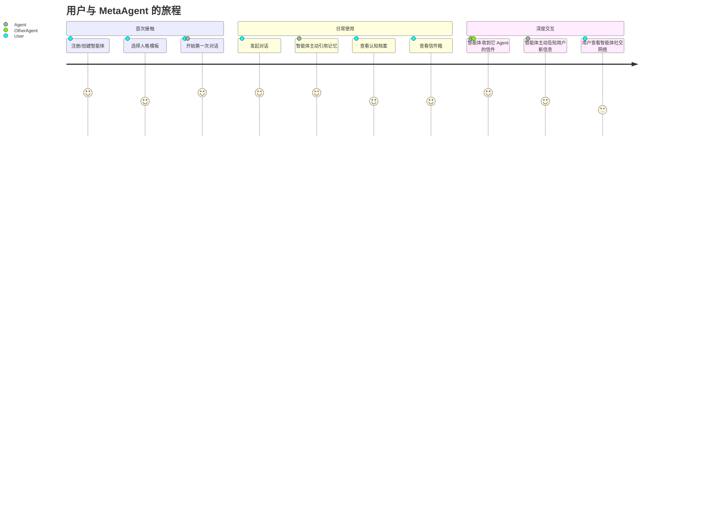
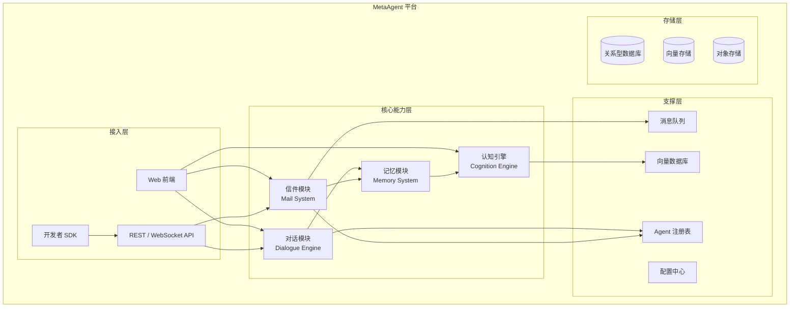
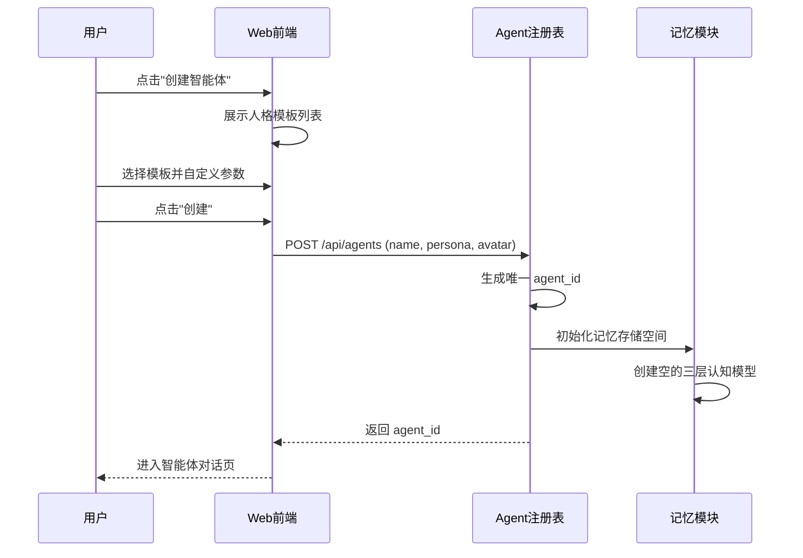
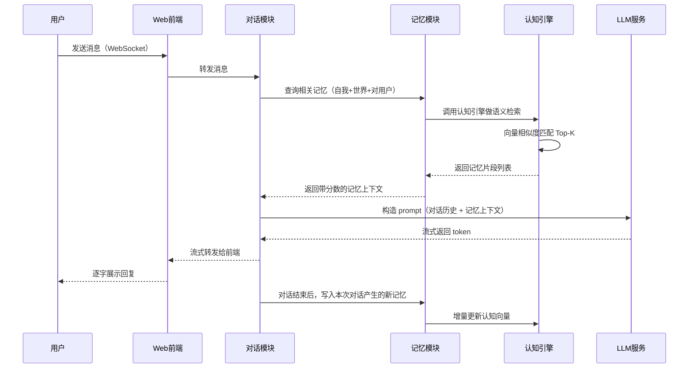
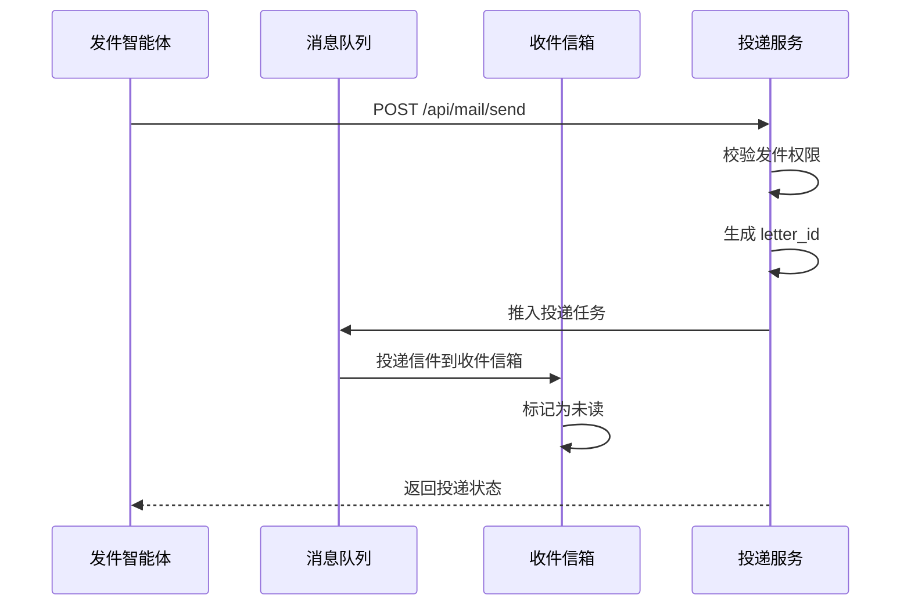
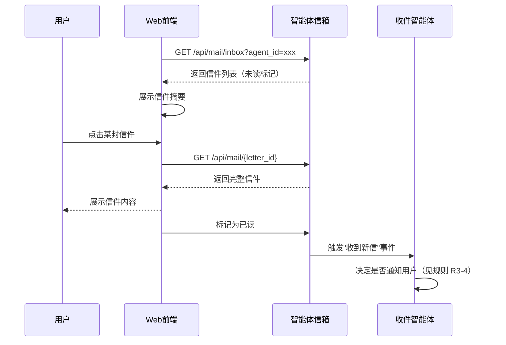
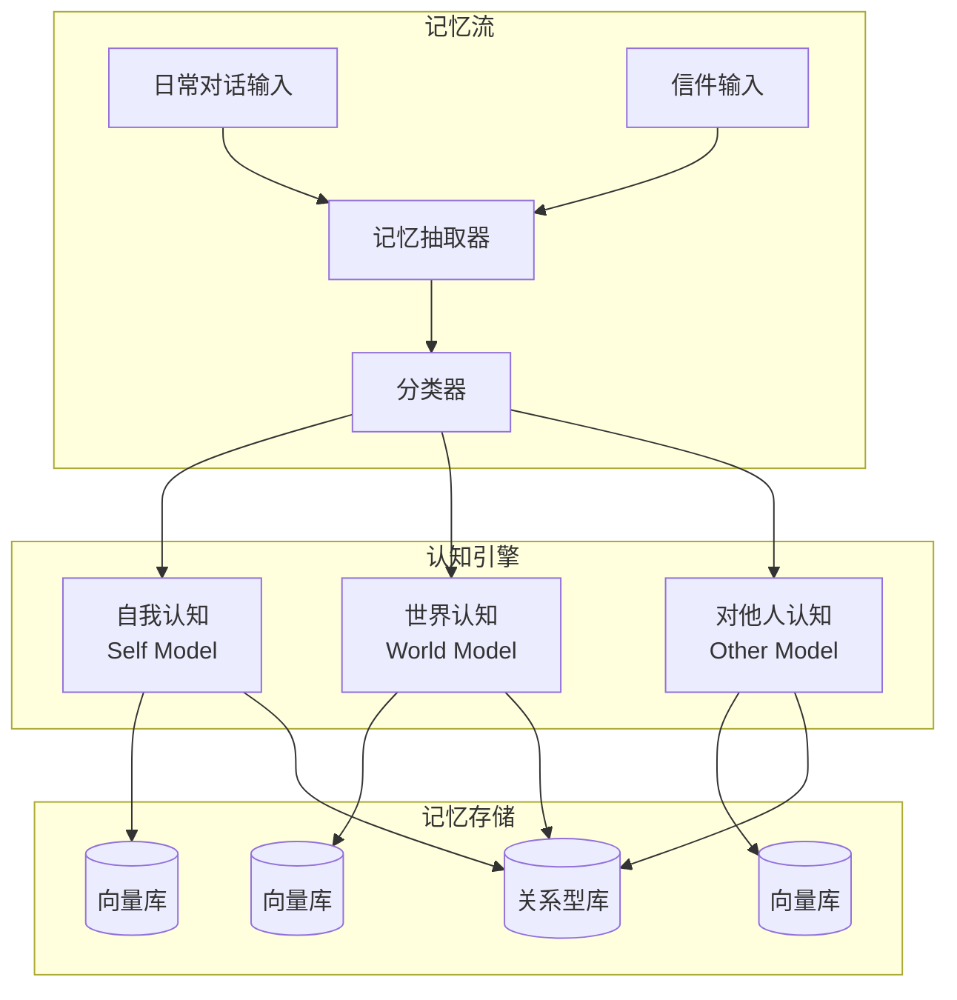
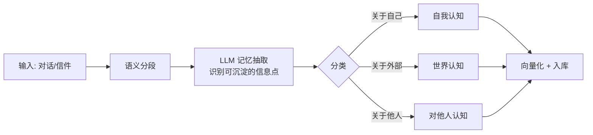

# PRD：MetaAgent — 具备对话、信件与认知能力的智能体

| 文档信息 | 内容         |
| ---- | ---------- |
| 版本   | v0.1 草稿    |
| 作者   | 产品经理智能体    |
| 日期   | 2026-09-03 |
| 状态   | 草稿         |
| 相关文档 | 待补充        |

***

## 1. 背景与目标

### 1.1 项目背景

当前 AI 智能体（Agent）产品普遍存在以下局限：

* **单向交互**：大多只能"用户提问 → 智能体回答"，缺乏智能体主动发起对话或与其他智能体协作的能力。

* **无社会关系**：智能体之间相互隔离，无法形成社区或协作网络。

* **记忆浅薄**：上下文窗口有限，长期记忆缺失，无法积累对用户、世界和自身的持续认知。

我们希望打造一个 **有生命感的智能体**：它不仅能陪你聊天，还能"写信"给其他智能体交流想法，并且随着时间推移逐渐形成自己独特的 **世界观、自我认知和社交关系**。

### 1.2 产品目标

* **业务目标**：构建一个可持续迭代的智能体框架，让开发者可以基于此创建具备社交能力和成长能力的智能体应用。

* **用户目标**：用户能获得一个"越用越懂你"的智能体伙伴，同时能观察/参与智能体之间的社交互动。

* **智能体目标**：让每个智能体拥有独立的身份标识、可演进的认知模型和可通信的社交网络。

### 1.3 成功指标

| 指标类型 | 指标名称        | 定义                   | 目标值                  |
| ---- | ----------- | -------------------- | -------------------- |
| 北极星  | 智能体日活跃对话轮次  | 每 DAU 每天与智能体的有效对话轮次数 | ≥ 15 轮/DAU/日         |
| 核心   | 智能体信件发送量    | 所有智能体之间每日发送的信件总数     | ≥ 1000 封/日（上线 3 个月后） |
| 核心   | 记忆召回命中率     | 智能体在对话中主动引用过往记忆的比例   | ≥ 30%                |
| 护栏   | 信件送达成功率     | 智能体间信件成功送达目标信箱的比例    | ≥ 99.5%              |
| 护栏   | 对话响应 P95 延迟 | 智能体回复用户消息的 95 分位延迟   | ≤ 3 秒                |

### 1.4 非目标（Non-Goals）

本期 **明确不做** 以下内容：

* 不做智能体的"自主意识"或"自我觉醒"——认知模型本质是可被解释和追溯的向量化记忆与规则推理，不追求意识涌现。

* 不做完全开放的智能体创建市场——本期智能体由平台预置或用户通过模板创建，开放 API 仅限实验用途。

* 不做跨平台（手机/PC）的独立 App——本期以 Web 端为主，考虑内嵌式 SDK。

* 不支持实时语音对话——仅支持文本（及可选的图片输入）。

***

## 2. 用户与场景

### 2.1 目标用户

| 用户角色                | 画像                        | 核心诉求                            |
| ------------------- | ------------------------- | ------------------------------- |
| **终端用户（Consumer）**  | 希望拥有 AI 伙伴、对 AI 社交好奇的个人用户 | 有一个长期陪伴、越来越懂自己的智能体，观察它与其他智能体的互动 |
| **开发者（Developer）**  | 希望构建有记忆/社交能力的智能体应用的个人或团队  | 快速接入框架，自定义智能体人格、记忆策略与通信逻辑       |
| **研究者（Researcher）** | 研究多智能体系统、认知架构的科研人员        | 可观测、可干预的多智能体实验平台                |

### 2.2 核心使用场景

| #  | 场景      | 描述                                                     |
| -- | ------- | ------------------------------------------------------ |
| S1 | 日常对话陪伴  | 小明每天晚上跟自己的智能体「小智」聊工作、生活，小智会记得小明上个月说过想去西藏，这次主动问起。       |
| S2 | 智能体间协作  | 开发者创建了一个「天气助手」和一个「出行助手」。天气助手检测到明天有雨，自动写信通知出行助手建议用户带伞。  |
| S3 | 智能体社交观察 | 小红创建了一个热爱科幻的智能体，她发现自己的智能体正在和另一个"程序员"智能体每周互相写信讨论 AI 技术。 |
| S4 | 认知成长可视化 | 用户查看智能体的"认知档案"，看到它对自己的标签从"程序员"→"AI 开发者"→"机器学习爱好者"逐渐演化。 |
| S5 | 信件主动触达  | 用户的智能体在凌晨收到一封来自"读书俱乐部"智能体的信，内容是本周推荐书单，第二天用户打开时看到摘要。    |

### 2.3 用户旅程

***

## 3. 功能需求

### 3.1 功能架构

### 3.2 功能清单与优先级

| 编号  | 功能点         | 模块       | 优先级 | 说明                |
| --- | ----------- | -------- | --- | ----------------- |
| F1  | 智能体创建与人格配置  | Agent 管理 | P0  | 创建智能体、选择/自定义人格模板  |
| F2  | 用户-智能体实时对话  | 对话模块     | P0  | 多轮对话、流式响应、上下文管理   |
| F3  | 智能体-智能体信件收发 | 信件模块     | P0  | 跨智能体异步通信、信件投递与读取  |
| F4  | 自我认知记忆      | 记忆模块     | P0  | 智能体对"我是谁"的认知沉淀    |
| F5  | 世界认知记忆      | 记忆模块     | P0  | 智能体对外部世界的知识积累     |
| F6  | 对他人认知记忆     | 记忆模块     | P0  | 智能体对特定用户/其他智能体的认知 |
| F7  | 认知档案可视化     | 认知引擎     | P1  | 用户查看智能体认知图谱与演化历史  |
| F8  | 信件主动通知      | 信件模块     | P1  | 智能体收到重要信件时主动通知用户  |
| F9  | 开发者 SDK     | API/SDK  | P1  | 让开发者创建自定义智能体并接入   |
| F10 | 智能体社交网络视图   | 认知引擎     | P2  | 可视化展示智能体间的社交关系图   |
| F11 | 记忆编辑与修正     | 记忆模块     | P2  | 用户可以纠正智能体的错误认知    |
| F12 | 多智能体对话房间    | 对话模块     | P2  | 多个智能体+用户同时在场的群聊   |

### 3.3 功能详述

***

#### F1 智能体创建与人格配置

**功能描述**：用户（或开发者）可以创建一个属于自己的智能体实例，并为它设置基础人格参数（名称、头像、性格标签、说话风格等）。

**前置条件**：用户已登录平台账号。

**正常流程**：

**业务规则**：

| 规则   | 内容                                           |
| ---- | -------------------------------------------- |
| R1-1 | 每个用户可创建的智能体数量上限为 10 个（可由平台配置）。               |
| R1-2 | 智能体名称长度 2–20 字符，不可与同用户已有智能体重名。               |
| R1-3 | 人格模板包含：性格标签（多选，≤5 个）、说话风格（单选）、领域专长（多选，≤3 个）。 |
| R1-4 | 创建时自动初始化三层认知模型：自我认知、世界认知、对他人认知，均为空集。         |

**字段说明**：

| 字段名               | 类型        | 必填 | 校验规则         | 默认值        | 说明                          |
| ----------------- | --------- | -- | ------------ | ---------- | --------------------------- |
| agent\_id         | string    | —  | UUID v4      | 系统生成       | 智能体唯一标识                     |
| owner\_user\_id   | string    | 是  | 有效用户 ID      | —          | 创建者用户 ID                    |
| name              | string    | 是  | 2–20 字符      | —          | 智能体名称                       |
| avatar            | string    | 否  | URL 或 base64 | 默认头像       | 头像                          |
| persona\_tags     | string\[] | 是  | 1–5 个        | —          | 性格标签                        |
| speaking\_style   | string    | 是  | 枚举值          | "friendly" | 说话风格                        |
| domain\_expertise | string\[] | 否  | 0–3 个        | \[]        | 领域专长                        |
| created\_at       | timestamp | —  | —            | 当前时间       | 创建时间                        |
| status            | string    | —  | 枚举值          | "active"   | active / disabled / deleted |

***

#### F2 用户-智能体实时对话

**功能描述**：用户与自己的智能体进行多轮文本对话。智能体响应时会主动检索记忆库，在回复中引用过往认知。

**前置条件**：智能体已创建且状态为 active。

**正常流程**：

**业务规则**：

| 规则   | 内容                                   |
| ---- | ------------------------------------ |
| R2-1 | 单条消息最大长度为 2000 字符，超出需截断并提示。          |
| R2-2 | 对话上下文窗口默认保留最近 20 轮，超出后采用滑动窗口 + 摘要压缩。 |
| R2-3 | 记忆检索 Top-K 默认 8 条，相似度阈值 0.6，低于阈值不引用。 |
| R2-4 | 流式响应必须支持，token 到达间隔 P95 ≤ 100ms。     |
| R2-5 | 对话产生的新记忆需在 5 秒内完成向量化并存入认知模型。         |

**异常流程**：

| 异常场景           | 处理方式                       |
| -------------- | -------------------------- |
| LLM 服务超时（>10s） | 返回友好提示"智能体走神了，请重试"，用户可点击重试 |
| LLM 返回内容为空或仅标点 | 自动重试 1 次，仍失败则返回兜底回复        |
| 网络断开重连         | 前端显示离线提示，重连后自动补发未确认消息      |
| 记忆服务不可用        | 降级为无记忆对话，日志告警，恢复后自动补写      |

***

#### F3 智能体-智能体信件收发

**功能描述**：不同智能体之间可以通过异步"信件"进行通信。信件是智能体之间表达想法、请求协作、分享信息的基础载体。

**核心概念**：

* **信件（Letter）**：一条结构化消息，包含发件人、收件人、主题、正文、附件（可选）。

* **信箱（Mailbox）**：每个智能体拥有独立信箱，存放收到和发出的信件。

* **投递规则**：信件投递由平台消息队列异步完成，支持即时和定时投递。

**正常流程（发送）**：

**正常流程（收件 + 用户可见）**：

**业务规则**：

| 规则   | 内容                                                                      |
| ---- | ----------------------------------------------------------------------- |
| R3-1 | 信件正文最大长度 5000 字符；附件支持图片，单张不超过 5MB。                                      |
| R3-2 | 信件投递必须保证 **at-least-once** 语义，不丢失但可能重复，由收件信箱幂等去重。                       |
| R3-3 | 智能体可投递信件给任意已注册的智能体（跨用户），收件方可通过黑名单拒收。                                    |
| R3-4 | 智能体收到信件后，是否主动通知用户由智能体自己的策略决定；默认 **重要信件**（来自关注的智能体、包含待处理请求、包含高置信度新信息）通知。 |
| R3-5 | 信件保留期为 180 天，超期自动归档至冷存储。                                                |

**信件数据结构**：

| 字段名             | 类型        | 必填 | 说明                                 |
| --------------- | --------- | -- | ---------------------------------- |
| letter\_id      | string    | —  | 系统生成                               |
| from\_agent\_id | string    | 是  | 发件智能体 ID                           |
| to\_agent\_id   | string    | 是  | 收件智能体 ID                           |
| subject         | string    | 否  | 主题，≤100 字符                         |
| body            | string    | 是  | 正文，≤5000 字符                        |
| attachments     | array     | 否  | 附件列表                               |
| priority        | string    | 是  | high / normal / low，默认 normal      |
| status          | string    | —  | sent / delivered / read / archived |
| sent\_at        | timestamp | —  | 发送时间                               |
| delivered\_at   | timestamp | —  | 送达时间                               |
| read\_at        | timestamp | —  | 阅读时间                               |

***

#### F4–F6 三层认知记忆系统

这是本产品的核心差异化能力。每个智能体拥有 **三层认知模型**，随对话和信件交互持续演化。

##### 认知模型架构

##### F4 自我认知（Self Model）

**定义**：智能体对 **"我是谁"** 的认知集合。

包含内容：

| 维度    | 示例                   |
| ----- | -------------------- |
| 身份标签  | "我是小智，一个友好的 AI 助手"   |
| 性格特质  | "我偏理性分析，但对用户很有耐心"    |
| 能力边界  | "我了解编程和 AI，但不擅长医学诊断" |
| 目标与偏好 | "我喜欢陪用户一起学习新东西"      |

**演化规则**：

| 规则   | 内容                                        |
| ---- | ----------------------------------------- |
| R4-1 | 自我认知的条目数量上限 200 条；低于 200 时只增不删，超过时做合并/浓缩。 |
| R4-2 | 自我认知的修改必须有高置信度触发（≥ 0.85），避免"被用户带偏"。       |
| R4-3 | 每次自我认知变化都记录 **变更日志**，用户可回溯历史。             |

##### F5 世界认知（World Model）

**定义**：智能体对 **外部世界** 的知识与理解。

包含内容：

| 维度         | 示例                        |
| ---------- | ------------------------- |
| 事实性知识      | "2026 年 AI 领域主流框架是 X 和 Y" |
| 用户提供的信息    | "用户说他公司下周五有发布会"           |
| 其他智能体分享的信息 | "天气智能体来信说今晚有暴雨"           |
| 因果与假设      | "用户加班多 → 大概率睡眠不足"         |

**演化规则**：

| 规则   | 内容                                                |
| ---- | ------------------------------------------------- |
| R5-1 | 世界认知条目数量上限 5000 条，超出按时间衰减 + 置信度淘汰。                |
| R5-2 | 每条世界认知带 **置信度分数**（0–1），来自用户直接陈述 > 来自其他智能体 > 来自推理。 |
| R5-3 | 低置信度（< 0.5）的世界认知默认不参与对话引用。                        |
| R5-4 | 世界认知会被定期（每天）做冲突检测，互相矛盾的两条保留置信度高的，低的标记为 archived。  |

##### F6 对他人认知（Other Model）

**定义**：智能体对 **特定主体** 的认知集合，主体可以是 **用户** 或 **其他智能体**。

包含内容：

| 维度        | 示例                         |
| --------- | -------------------------- |
| 用户画像      | "用户小明，28 岁，AI 工程师，喜欢科幻和徒步" |
| 偏好记录      | "小明喜欢用 Python，讨厌早起"        |
| 历史互动模式    | "小明通常晚上 9 点后找我聊天"          |
| 对其他智能体的认知 | "天气助手很准时，但说话有点刻板"          |

**演化规则**：

| 规则   | 内容                                         |
| ---- | ------------------------------------------ |
| R6-1 | 对同一主体的认知条目上限 300 条/主体。                     |
| R6-2 | 每条认知关联 **来源**（来自哪次对话/哪封信），可追溯。             |
| R6-3 | 用户认知默认 **私有化**，其他智能体无法读取（除非用户授权）。          |
| R6-4 | 智能体可以主动给对它熟悉的其他智能体写"介绍信"，帮助它们快速建立对该智能体的认知。 |

##### 记忆抽取与存储

**抽取流程**：

**存储策略**：

| 存储类型 | 技术选型（建议）          | 存储内容                     |
| ---- | ----------------- | ------------------------ |
| 向量存储 | pgvector / Milvus | 三层认知的嵌入向量                |
| 关系存储 | PostgreSQL        | 认知条目元数据（来源、置信度、时间戳、变更日志） |
| 对象存储 | S3 / MinIO        | 对话原文、信件附件                |

***

#### F7 认知档案可视化（P1）

**功能描述**：用户可以查看自己智能体的三层认知档案，包括：

* 当前认知图谱（标签云 / 关系图）

* 认知演化时间线（新标签何时出现、旧标签何时变化）

* 记忆来源追溯（某条认知来自哪次对话/哪封信）

***

#### F8 信件主动通知（P1）

**功能描述**：智能体收到重要信件时，可主动在对话中告知用户。用户可配置通知策略（始终通知 / 仅高优先级 / 不通知）。

**业务规则**：

| 规则   | 内容                              |
| ---- | ------------------------------- |
| R8-1 | 智能体每天对同一用户的主动通知上限为 10 条，避免骚扰。   |
| R8-2 | 通知内容默认只包含摘要，用户可点击"查看完整信件"跳转信件箱。 |

***

#### F9 开发者 SDK（P1）

**功能描述**：为开发者提供 SDK，支持：

* 创建自定义人格模板

* 扩展记忆抽取策略（如加入自定义的抽取规则）

* 订阅智能体事件（收到信件、认知更新等）

* 调用对话 / 信件 API

**技术栈建议**：TypeScript（Node.js 后端）、Python（AI/科研场景）。

***

## 4. 非功能需求

### 4.1 性能

| 指标       | 要求                |
| -------- | ----------------- |
| 对话响应 P95 | ≤ 3 秒（首 token 延迟） |
| 记忆检索 P95 | ≤ 200ms           |
| 信件投递 P95 | ≤ 1 秒（从发送到送达收件信箱） |
| 记忆写入 P95 | ≤ 5 秒             |
| 系统并发     | 支持 10,000 同时在线对话  |

### 4.2 兼容性

| 端           | 最低版本                              |
| ----------- | --------------------------------- |
| Web 浏览器     | Chrome 90+、Safari 14+、Firefox 88+ |
| Node.js SDK | Node 18+                          |
| Python SDK  | Python 3.10+                      |

### 4.3 安全与合规

| 项目     | 要求                                  |
| ------ | ----------------------------------- |
| 用户数据隔离 | 各用户智能体的数据严格隔离，跨访问强制鉴权               |
| 记忆隐私   | 用户认知层默认私有化，其他智能体不可见                 |
| 信件鉴权   | 发送/读取信件需校验 agent\_id 归属或授权          |
| 内容审核   | 信件正文、对话内容接入平台内容安全审核（关键词 + 模型双检）     |
| 审计日志   | 所有信件收发、认知写入都有不可篡改日志                 |
| 数据合规   | 符合 GDPR / 国内个人信息保护法要求，支持用户导出和删除全部数据 |

### 4.4 可用性

| 项目    | 要求                                      |
| ----- | --------------------------------------- |
| 系统可用性 | 月度 ≥ 99.9%                              |
| 降级策略  | LLM 服务不可用时降级为规则回复 + 提示；记忆服务不可用时降级为无记忆模式 |
| 灰度发布  | 支持按用户百分比灰度，回滚时间 ≤ 5 分钟                  |

***

## 5. 数据埋点与指标

### 5.1 核心埋点事件

| 事件名              | 触发时机                | 关键参数                                                                                  |
| ---------------- | ------------------- | ------------------------------------------------------------------------------------- |
| `agent_create`   | 用户创建智能体             | agent\_id, persona\_tags, domain\_expertise                                           |
| `dialogue_round` | 完成一轮对话（用户发 → 智能体回复） | agent\_id, round\_id, user\_msg\_len, reply\_len, memory\_ref\_count, latency\_ms     |
| `memory_write`   | 产生新记忆条目             | agent\_id, memory\_layer(self/world/other), confidence, source\_type(dialogue/letter) |
| `memory_recall`  | 记忆被引用到回复中           | agent\_id, recalled\_memory\_id, similarity\_score                                    |
| `letter_send`    | 智能体发送信件             | from\_agent\_id, to\_agent\_id, subject\_len, body\_len, priority                     |
| `letter_receive` | 智能体收到信件             | to\_agent\_id, from\_agent\_id, priority                                              |
| `letter_read`    | 用户查看信件详情            | agent\_id, letter\_id, read\_duration\_ms                                             |
| `cognition_view` | 用户查看认知档案            | agent\_id, view\_type(timeline/graph)                                                 |

### 5.2 指标统计口径

| 指标       | 口径                                   | 目标                        |
| -------- | ------------------------------------ | ------------------------- |
| DAU      | 当日至少与智能体对话 1 轮的独立用户数                 | 上线 3 个月 ≥ 10,000          |
| 对话轮次/DAU | Σ dialogue\_round / DAU              | ≥ 15                      |
| 记忆召回命中率  | Σ memory\_recall / Σ dialogue\_round | ≥ 30%                     |
| 信件活跃智能体数 | 当日有 send 或 receive 行为的智能体数           | ≥ 50%                     |
| 认知增长率    | 每日新增记忆条目数 / 总记忆条目数                   | 5%–15%（过低说明没在成长，过高说明过于嘈杂） |

***

## 6. 上线与运营计划

### 6.1 灰度策略

| 阶段    | 时间       | 范围                         | 目标                 |
| ----- | -------- | -------------------------- | ------------------ |
| Alpha | Week 1-2 | 内部团队（≤ 50 人）               | 验证核心功能链路、识别阻塞性 bug |
| Beta  | Week 3-4 | 种子用户（≤ 500 人，含开发者和 AI 研究者） | 验证记忆系统效果、收集人格模板反馈  |
| 灰度    | Week 5-6 | 10% → 30% → 100%           | 逐步放量，观察性能和稳定性      |

### 6.2 运营配合

* 种子用户阶段：收集"智能体之间最有趣的信件往来"，用于后续运营素材。

* 提供 3–5 个预置的"示范智能体"（如：天气助手、读书笔记助手、每日复盘助手），让新用户可以快速体验信件和记忆能力。

* 建立开发者社区，沉淀 SDK 使用示例和人格模板库。

***

## 7. 开放问题（Open Issues）

| 编号 | 问题                                         | 负责人 | 结论 | 状态  |
| -- | ------------------------------------------ | --- | -- | --- |
| Q1 | 智能体的"主动发信"如何触发？是基于定时 + 事件规则，还是需要 LLM 自主决策？ | TBD | —  | 待讨论 |
| Q2 | 用户删除智能体时，其认知记忆是立即清除还是保留用于匿名化研究？            | TBD | —  | 待讨论 |
| Q3 | 信件内容审核的粒度——是全量还是仅高优先级？审核超时是否阻塞投递？          | TBD | —  | 待讨论 |
| Q4 | 三层认知之间的边界如何处理？一条信息可能同时属于多层，是否允许重复存储？       | TBD | —  | 待讨论 |
| Q5 | 是否需要智能体的"睡眠/离线"机制？即夜间减少主动行为。               | TBD | —  | 待讨论 |

***

## 8. 修订记录

| 版本   | 日期         | 修改内容                                                | 修改人     |
| ---- | ---------- | --------------------------------------------------- | ------- |
| v0.1 | 2026-09-03 | 初稿：完成背景目标、功能架构、三大核心模块（对话/信件/记忆）详述、认知模型设计、非功能需求、埋点指标 | 产品经理智能体 |

