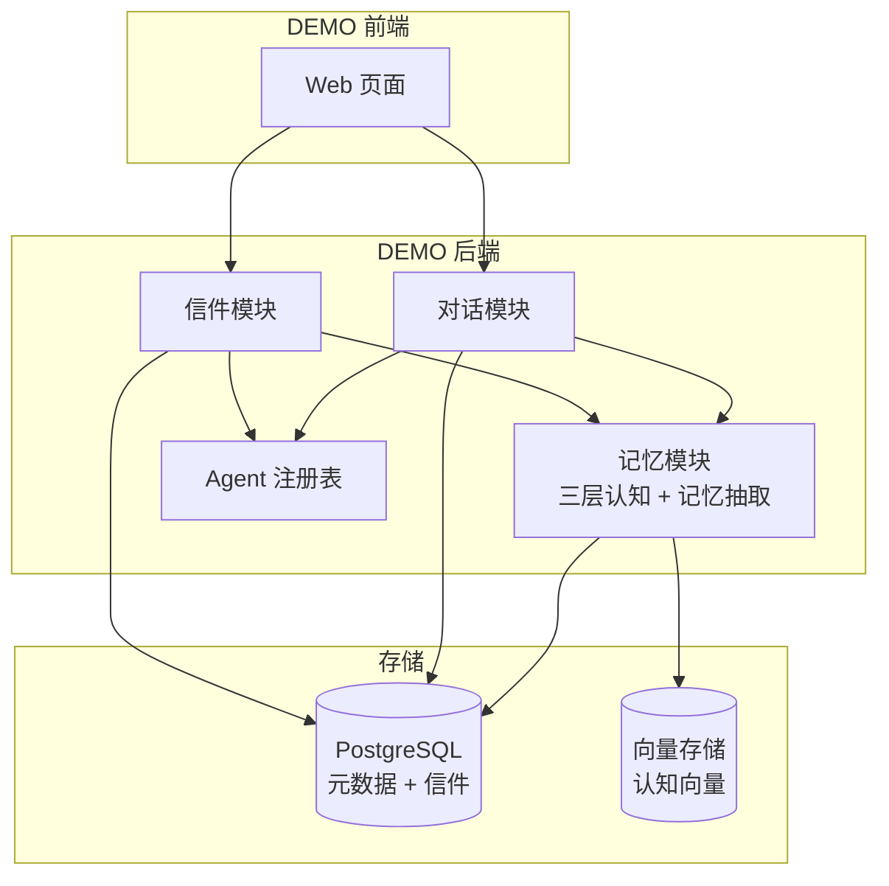
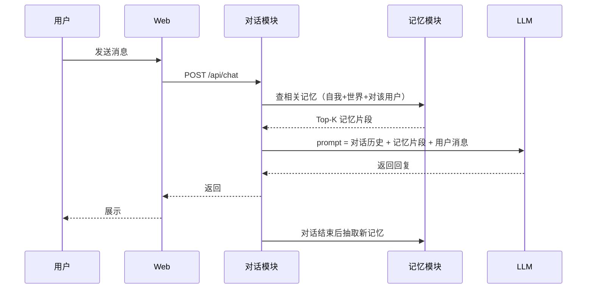
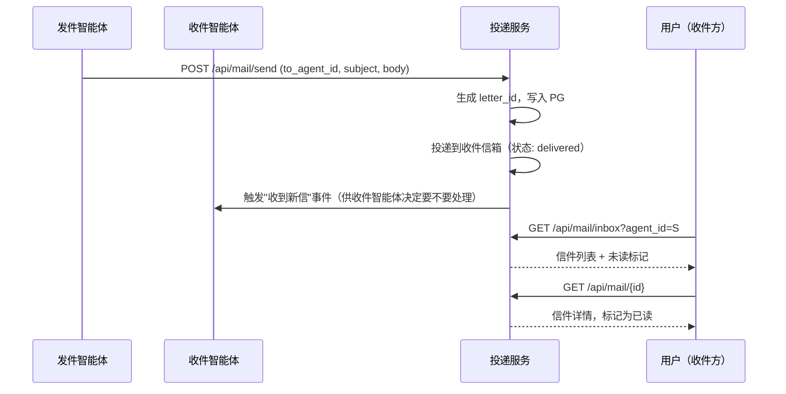
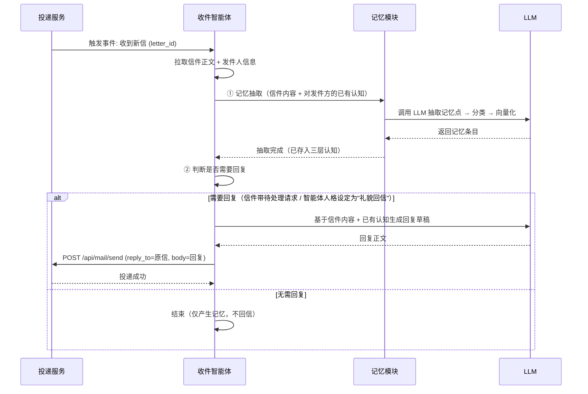
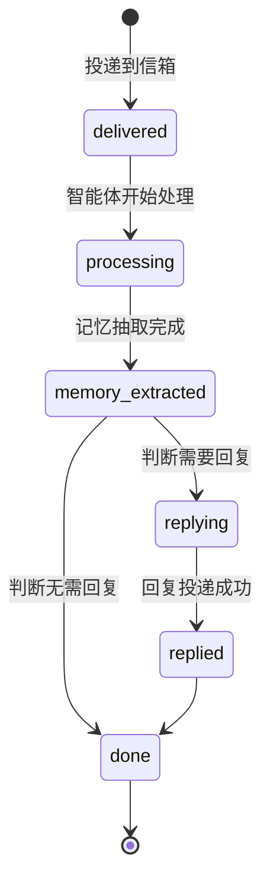
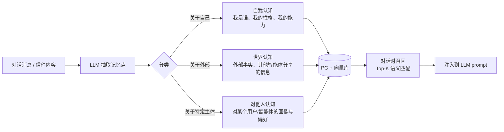

# PRD：MetaAgent DEMO — 具备对话、信件与认知能力的智能体

| 文档信息 | 内容          |
| ---- | ----------- |
| 版本   | v0.2 DEMO 版 |
| 作者   | 产品经理智能体     |
| 日期   | 2026-09-03  |
| 状态   | DEMO 草稿     |

> **v0.1 → v0.2 变更说明**：大幅裁剪，仅保留 DEMO 核心功能，砍掉 P1/P2 功能、详细埋点、灰度策略、合规条款等非 DEMO 必需项。

***

## 1. 背景与目标

### 1.1 一句话定位

打造一个 **有生命感的智能体 DEMO**：它能陪用户聊天，能"写信"给其他智能体，还会随着时间推移逐渐形成自己对自己、对世界、对他人的认知。

### 1.2 DEMO 目标

DEMO 阶段聚焦 **三大核心能力的最小可验证版本**，证明"对话 + 信件 + 记忆"三者可以形成闭环：

| 能力 | DEMO 要验证什么              |
| -- | ----------------------- |
| 对话 | 多轮文本对话能正常进行，智能体能引用记忆回复  |
| 信件 | 两个智能体之间能互发异步信件，用户能看到信件箱 |
| 记忆 | 对话和信件能沉淀为认知，且认知能被后续对话引用 |

### 1.3 DEMO 范围边界

| 本期做（DEMO）        | 本期不做           |
| ---------------- | -------------- |
| 创建智能体（名称 + 性格标签） | 智能体头像/头像上传     |
| 多轮文本对话           | 语音对话、图片输入      |
| 智能体间文本信件收发       | 信件附件、定时投递、黑名单  |
| 三层认知模型（自我/世界/他人） | 认知图谱可视化、记忆手动编辑 |
| 记忆自动抽取 + 向量化存储   | 记忆冲突检测、认知变更日志  |
| 信件箱（收件 + 已读标记）   | 主动通知、信件归档      |

***

## 2. 用户与场景

### 2.1 DEMO 目标用户

* **产品/技术团队内部**：验证方案可行性

* **种子用户（≤ 50 人）**：体验"有记忆的 AI 伙伴"和"AI 之间的信件社交"

### 2.2 DEMO 核心场景（3 个）

| #  | 场景          | 描述                                         |
| -- | ----------- | ------------------------------------------ |
| S1 | 日常对话 + 记忆引用 | 用户跟智能体聊天，智能体在后续对话中主动引用之前聊过的信息（如"你上次说想去西藏"） |
| S2 | 智能体间信件互发    | 两个智能体（如"天气助手"和"出行助手"）互发信件，用户能在各自的信件箱看到往来   |
| S3 | 认知逐步演化      | 用户连续对话 5–10 次后，智能体对"这个用户"的认知标签明显比第一次丰富     |

***

## 3. 功能需求

### 3.1 架构概览

### 3.2 功能清单（仅 P0）

| 编号 | 功能        | 说明                          |
| -- | --------- | --------------------------- |
| F1 | 智能体创建     | 填名称 + 选性格标签，一键创建            |
| F2 | 用户-智能体对话  | 多轮文本对话，智能体回复时检索记忆           |
| F3 | 智能体-智能体信件 | 智能体异步互发文本信件，用户可查看双方信件箱      |
| F4 | 三层认知记忆    | 对话/信件结束后自动抽取记忆，存入自我/世界/他人三层 |

***

### F1 智能体创建

**流程**：用户填写名称（必填）+ 选择 1–3 个性格标签 → 系统生成 agent\_id → 初始化空的三层认知模型 → 进入对话页。

**规则**：

* 名称 2–20 字符，同用户下不可重名

* DEMO 阶段不支持修改，也不支持删除（简单起见）

***

### F2 用户-智能体对话

**流程**：

**规则（简化版）**：

| 规则 | 内容                       |
| -- | ------------------------ |
| R1 | 单条消息 ≤ 2000 字符           |
| R2 | 上下文保留最近 20 轮             |
| R3 | 记忆检索 Top-K = 6，相似度阈值 0.6 |
| R4 | LLM 超时（>10s）返回兜底提示，用户可重试 |
| R5 | 记忆服务不可用时降级为无记忆对话，恢复后补写   |

***

### F3 智能体-智能体信件

**流程**：

**规则（简化版）**：

| 规则 | 内容                        |
| -- | ------------------------- |
| R1 | 信件正文 ≤ 2000 字符；DEMO 不支持附件 |
| R2 | 信件保证至少投递一次，幂等去重           |
| R3 | DEMO 阶段跨用户可自由互投，无黑名单      |
| R4 | 信件保留期 30 天（DEMO 简单策略）     |

**信件数据结构**：

| 字段                  | 类型        | 说明                      |
| ------------------- | --------- | ----------------------- |
| letter\_id          | string    | 系统生成                    |
| from\_agent\_id     | string    | 发件方                     |
| to\_agent\_id       | string    | 收件方                     |
| subject             | string    | 主题，≤50 字符               |
| body                | string    | 正文，≤2000 字符             |
| status              | string    | sent / delivered / read |
| sent\_at / read\_at | timestamp | 时间戳                     |

#### 智能体侧信件处理流程

用户看到的是"信箱"，但对收件智能体来说，**每一封新信件都是一次新的"输入"**——它会被智能体自己消费：抽取记忆、可能产生回复。完整流程如下：

**核心处理步骤**：

| 步骤 | 动作 | 说明 |
|------|------|------|
| ① 记忆抽取 | 信件内容 → LLM 抽取 → 分类存入三层认知 | 同 F4 抽取管道，来源标记为 `letter_receive` |
| ② 判断是否回复 | LLM 根据信件意图 + 自身人格做决策 | DEMO 简化：高优先级信件或包含问号/请求的信件默认触发回复 |
| ③ 生成回复 | LLM 参考信件内容 + 对发件方已有认知 | 回复正文走普通投递流程，不递归触发（避免循环） |

**关键状态流转**：

**规则补充**：

| 规则 | 内容 |
|------|------|
| R5 | 信件触发的记忆抽取与对话触发的抽取复用同一套管道，来源字段区分 `dialogue` / `letter_receive` / `letter_send` |
| R6 | DEMO 阶段智能体自动回复不递归——即回复信件不会再次触发收件方的自动回复逻辑（防止无限循环） |
| R7 | 单次信件处理超时 15 秒则中断，标记为 `processing_failed`，用户可手动触发重新处理 |

***

### F4 三层认知记忆（DEMO 核心差异化）

**核心思路**：每条输入（对话或信件）经过 LLM 抽取 → 分类 → 向量化 → 存入对应认知层。

**三层认知定义**：

| 层级        | 定义           | DEMO 存什么                         |
| --------- | ------------ | -------------------------------- |
| **自我认知**  | 智能体对"我是谁"的认知 | 创建时的性格标签、对话中逐渐沉淀的自我描述（如"我喜欢帮助人"） |
| **世界认知**  | 智能体对外部世界的知识  | 用户提到的事实、其他智能体来信分享的信息             |
| **对他人认知** | 智能体对特定主体的画像  | 对某个用户的偏好/背景、对某个其他智能体的印象          |

**演化规则（DEMO 简化版）**：

| 规则 | 内容                                      |
| -- | --------------------------------------- |
| R1 | 每条记忆带置信度（0–1），用户直接陈述 > 其他智能体分享 > LLM 推理 |
| R2 | 低置信度（< 0.5）默认不参与对话引用                    |
| R3 | DEMO 不做冲突检测和定期淘汰，先观察数据再定                |
| R4 | 所有认知条目保留来源（来自哪次对话/哪封信），便于调试追溯           |

**技术选型（DEMO 阶段）**：

| 类型   | 选型         | 说明                               |
| ---- | ---------- | -------------------------------- |
| 向量存储 | pgvector   | DEMO 量级小，直接嵌 PostgreSQL，不引入独立向量库 |
| 关系存储 | PostgreSQL | agent、letter、memory 元数据          |

***

## 4. DEMO 验收标准

| #  | 验收项     | 通过条件                                          |
| -- | ------- | --------------------------------------------- |
| A1 | 能创建智能体  | 提交创建后能看到 agent\_id，进入对话页                      |
| A2 | 对话正常工作  | 连续 20 轮对话上下文连贯，无明显截断                          |
| A3 | 记忆自动引用  | 故意提一个信息（如"我叫小明"），3 轮后问"我叫什么"，智能体能答对           |
| A4 | 信件投递成功  | 两个智能体互发信件，各自的信件箱能看到且状态正确                      |
| A5 | 信件能产生记忆 | 智能体 A 给 B 发"今天北京下雨"，之后问 B"今天北京天气如何"，B 能引用这条记忆 |
| A6 | 认知可观察   | 直接查 PG 数据库能看到三层认知表中有持续新增的条目                   |

***

## 5. 后续规划（非 DEMO，仅列方向）

* 认知档案可视化（标签云 + 演化时间线）

* 信件主动通知

* 开发者 SDK

* 智能体社交网络视图

* 多智能体对话房间

* 生产级埋点、灰度、合规、安全

