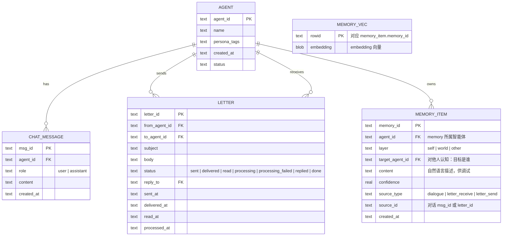
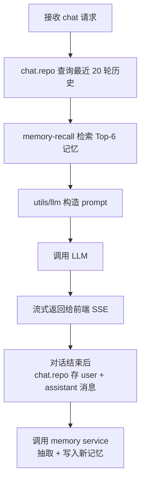
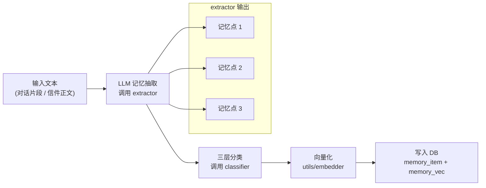
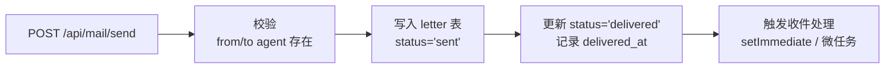

# SDD：MetaAgent DEMO — 软件设计文档

| 文档信息   | 内容                               |
| ------ | -------------------------------- |
| 版本     | v0.1                             |
| 日期     | 2026-09-03                       |
| 状态     | DEMO 草稿                          |
| 对应 PRD | [智能体产品设计文档 v0.2](./智能体产品设计文档.md) |

***

## 1. 技术栈与项目结构

### 1.1 技术选型

| 层级     | 技术             | 版本         | 选型理由                                      |
| ------ | -------------- | ---------- | ----------------------------------------- |
| 语言     | TypeScript     | ≥ 5.4      | 前后端统一类型，减少接口不一致 bug                       |
| 前端框架   | Vue            | 3.4+       | Composition API + TypeScript 支持好，生态成熟     |
| 前端构建   | Vite           | 5.x        | 冷启动快，HMR 效率高                              |
| 前端状态   | Pinia          | 2.x        | Vue 官方推荐，TypeScript 友好                    |
| 前端 UI  | Element Plus   | 2.x        | 组件丰富，DEMO 快速出活                            |
| 后端运行时  | Node.js        | ≥ 20 (LTS) | V8 性能好，原生 ESM，长周期支持                       |
| 后端框架   | Fastify        | 4.x        | 比 Express 快，TypeScript 原生支持，schema 校验内置   |
| 数据库驱动  | better-sqlite3 | 11.x       | 同步 API、性能好、sqlite-vec 扩展友好                |
| 向量扩展   | sqlite-vec     | 最新         | SQLite 向量搜索扩展，cosine/L2/inner-product 都支持 |
| LLM 调用 | Vercel AI SDK  | 4.x        | 统一的 provider 抽象，DEMO 可切换模型（默认 OpenAI 兼容）  |
| 日志     | pino           | 9.x        | Fastify 官方推荐，性能好                          |

### 1.2 项目结构（Monorepo）

使用 npm workspaces（DEMO 无需 lerna/turbo 等重工具）。

```
meta-world/
├── README.md
├── docs/
│   ├── 智能体产品设计文档.md
│   └── 软件设计文档.md                 ← 本文档
│
├── package.json                        # 根 package.json (workspaces)
│
├── shared/                             # 前后端共享的类型定义
│   ├── package.json
│   └── src/
│       ├── index.ts
│       ├── types/agent.ts              # Agent, PersonaTag
│       ├── types/memory.ts             # MemoryItem, MemoryLayer, MemorySource
│       ├── types/letter.ts             # Letter, LetterStatus
│       └── types/chat.ts               # ChatMessage, ChatRequest
│
├── server/                             # 后端 Node.js + Fastify
│   ├── package.json
│   ├── tsconfig.json
│   ├── .env.example
│   └── src/
│       ├── index.ts                    # 入口：启动 Fastify
│       ├── config.ts                   # 配置加载（LLM key、DB 路径等）
│       │
│       ├── db/                         # 数据库层
│       │   ├── index.ts                # 初始化 SQLite + 加载 sqlite-vec 扩展
│       │   ├── schema.sql              # 表结构（关系表 + 向量表）
│       │   ├── migrations/             # 迁移脚本（按序号）
│       │   │   └── 001_init.sql
│       │   └── repositories/
│       │       ├── agent.repo.ts
│       │       ├── chat.repo.ts
│       │       ├── letter.repo.ts
│       │       └── memory.repo.ts      # 关系型 CRUD + sqlite-vec 向量查询
│       │
│       ├── modules/                    # 业务模块
│       │   ├── agent/
│       │   │   ├── route.ts            # POST /api/agents
│       │   │   ├── service.ts
│       │   │   └── schema.ts           # zod schema
│       │   ├── chat/
│       │   │   ├── route.ts            # POST /api/chat (流式用 SSE)
│       │   │   ├── service.ts          # 对话编排：检索记忆 → 构造 prompt → 调 LLM → 抽取新记忆
│       │   │   ├── memory-recall.ts     # 向量检索 Top-K
│       │   │   └── schema.ts
│       │   ├── letter/
│       │   │   ├── route.ts            # POST /api/mail/send, GET /api/mail/inbox, GET /api/mail/:id
│       │   │   ├── service.ts          # 投递 + 触发智能体侧处理
│       │   │   ├── processor.ts        # 智能体侧消费流程（记忆抽取 + 自动回复决策）
│       │   │   └── schema.ts
│       │   └── memory/
│       │       ├── service.ts          # 记忆抽取编排：LLM 抽取 → 分类 → 向量化 → 入库
│       │       ├── extractor.ts        # 调用 LLM 从文本中识别记忆点
│       │       ├── classifier.ts       # 三层分类逻辑
│       │       └── schema.ts
│       │
│       └── utils/
│           ├── llm.ts                  # AI SDK 初始化 + prompt 构造
│           ├── embedder.ts             # 向量嵌入封装
│           └── logger.ts               # pino 初始化
│
└── web/                                # 前端 Vue 3
    ├── package.json
    ├── tsconfig.json
    ├── vite.config.ts
    ├── index.html
    └── src/
        ├── main.ts
        ├── App.vue
        │
        ├── api/                        # 后端接口封装
        │   ├── agent.ts
        │   ├── chat.ts
        │   └── letter.ts
        │
        ├── stores/                     # Pinia
        │   ├── agent.ts                # 当前智能体状态
        │   ├── chat.ts                 # 对话历史
        │   └── letter.ts               # 信件箱
        │
        ├── views/
        │   ├── CreateAgent.vue         # 创建智能体
        │   ├── Chat.vue                # 对话页（DEMO 主页面）
        │   └── Mailbox.vue             # 信件箱
        │
        └── components/
            ├── ChatInput.vue
            ├── ChatMessage.vue
            └── LetterCard.vue
```

### 1.3 根 package.json（节选）

```json
{
  "name": "meta-world",
  "private": true,
  "workspaces": ["shared", "server", "web"],
  "scripts": {
    "dev:server": "npm -w server run dev",
    "dev:web": "npm -w web run dev",
    "dev": "concurrently -k \"npm:dev:*\"",
    "build": "npm run build -w shared && npm run build -w server && npm run build -w web"
  }
}
```

***

## 2. 数据库设计（SQLite + sqlite-vec）

所有数据放在单个 `.db` 文件中，关系表用普通 SQLite，向量表用 sqlite-vec 的 `vec0` 虚拟表。

### 2.1 表结构总览



### 2.2 schema.sql 详细定义

```sql
-- 1. 智能体表
CREATE TABLE IF NOT EXISTS agent (
    agent_id      TEXT PRIMARY KEY,
    name          TEXT NOT NULL CHECK(length(name) BETWEEN 2 AND 20),
    persona_tags  TEXT NOT NULL,       -- JSON 数组字符串，如 ["friendly","curious"]
    created_at    TEXT NOT NULL DEFAULT (datetime('now')),
    status        TEXT NOT NULL DEFAULT 'active' CHECK(status IN ('active','disabled'))
);

-- 2. 对话消息表
CREATE TABLE IF NOT EXISTS chat_message (
    msg_id     TEXT PRIMARY KEY,
    agent_id   TEXT NOT NULL REFERENCES agent(agent_id),
    role       TEXT NOT NULL CHECK(role IN ('user','assistant')),
    content    TEXT NOT NULL,
    created_at TEXT NOT NULL DEFAULT (datetime('now'))
);
CREATE INDEX IF NOT EXISTS idx_chat_message_agent_time ON chat_message(agent_id, created_at);

-- 3. 信件表
CREATE TABLE IF NOT EXISTS letter (
    letter_id      TEXT PRIMARY KEY,
    from_agent_id  TEXT NOT NULL REFERENCES agent(agent_id),
    to_agent_id    TEXT NOT NULL REFERENCES agent(agent_id),
    subject        TEXT CHECK(length(subject) <= 50),
    body           TEXT NOT NULL CHECK(length(body) <= 2000),
    status         TEXT NOT NULL DEFAULT 'delivered'
                       CHECK(status IN ('sent','delivered','read',
                                        'processing','processing_failed',
                                        'replied','done')),
    reply_to       TEXT REFERENCES letter(letter_id),
    sent_at        TEXT NOT NULL DEFAULT (datetime('now')),
    delivered_at   TEXT,
    read_at        TEXT,
    processed_at   TEXT
);
CREATE INDEX IF NOT EXISTS idx_letter_to_status ON letter(to_agent_id, status);
CREATE INDEX IF NOT EXISTS idx_letter_from ON letter(from_agent_id);

-- 4. 记忆条目表（关系型）
CREATE TABLE IF NOT EXISTS memory_item (
    memory_id        TEXT PRIMARY KEY,
    agent_id         TEXT NOT NULL REFERENCES agent(agent_id),
    layer            TEXT NOT NULL CHECK(layer IN ('self','world','other')),
    target_agent_id  TEXT REFERENCES agent(agent_id),  -- layer=other 时填
    content          TEXT NOT NULL,
    confidence       REAL NOT NULL DEFAULT 0.5 CHECK(confidence BETWEEN 0 AND 1),
    source_type      TEXT NOT NULL CHECK(source_type IN ('dialogue','letter_receive','letter_send')),
    source_id        TEXT NOT NULL,
    created_at       TEXT NOT NULL DEFAULT (datetime('now'))
);
CREATE INDEX IF NOT EXISTS idx_memory_agent_layer ON memory_item(agent_id, layer);
CREATE INDEX IF NOT EXISTS idx_memory_confidence   ON memory_item(confidence);

-- 5. 向量表（sqlite-vec 虚拟表）
-- 与 memory_item 一对一，rowid 对应 memory_item.memory_id
CREATE VIRTUAL TABLE IF NOT EXISTS memory_vec USING vec0(
    embedding float[1536]    -- embedding 维度，取决于所用模型，1536 是 text-embedding-3-small
);
```

> **注意**：`float[1536]` 中的 1536 取决于具体 embedding 模型。如果换用更小的模型（如 text-embedding-3-small-512），改成 512 即可。

### 2.3 查询示例

**向量语义检索 Top-6**：

```sql
-- 查找 agent_id = ? 的 self/world/other 三层中，与查询向量最相似的 6 条记忆
SELECT m.*, distance
FROM memory_vec v
JOIN memory_item m ON m.memory_id = v.rowid
WHERE m.agent_id = ?
  AND m.confidence >= 0.5
ORDER BY v.embedding <=> ?   -- cosine 距离，越小越相似
LIMIT 6;
```

**获取 agent 最近 20 轮对话上下文**：

```sql
SELECT role, content
FROM chat_message
WHERE agent_id = ?
ORDER BY created_at DESC
LIMIT 40;   -- 20 轮 = 40 条
```

***

## 3. API 设计

### 3.1 路由总览

| Method | Path                      | 模块     | 说明             |
| ------ | ------------------------- | ------ | -------------- |
| POST   | `/api/agents`             | agent  | 创建智能体          |
| GET    | `/api/agents/:id`         | agent  | 查看智能体信息        |
| POST   | `/api/chat`               | chat   | 发送对话消息（非流式）    |
| POST   | `/api/chat/stream`        | chat   | 发送对话消息（SSE 流式） |
| POST   | `/api/mail/send`          | letter | 发送信件           |
| GET    | `/api/mail/inbox`         | letter | 信件箱列表          |
| GET    | `/api/mail/:id`           | letter | 信件详情 + 标记已读    |
| POST   | `/api/mail/:id/reprocess` | letter | 手动重新处理失败信件     |

### 3.2 关键接口详情

#### POST /api/agents — 创建智能体

```typescript
// Request
interface CreateAgentRequest {
  name: string;                     // 2-20 字符
  persona_tags: string[];           // 1-5 个性格标签，如 ["friendly","curious"]
}

// Response
interface AgentResponse {
  agent_id: string;                 // UUID v4
  name: string;
  persona_tags: string[];
  created_at: string;
}
```

#### POST /api/chat/stream — 流式对话

```typescript
// Request
interface ChatRequest {
  agent_id: string;
  message: string;                  // ≤ 2000 字符
}

// Response: SSE (EventStream)
// event: token   data: "{\"content\": \"你\"}"
// event: token   data: "{\"content\": \"好\"}"
// ...
// event: done    data: "{\"memory_refs\": [\"mem-1\", \"mem-2\"]}"
// event: error   data: "{\"message\": \"LLM 超时\"}"
```

#### POST /api/mail/send — 发送信件

```typescript
// Request
interface SendLetterRequest {
  from_agent_id: string;
  to_agent_id: string;
  subject?: string;                 // ≤ 50
  body: string;                     // ≤ 2000
  reply_to?: string;                 // 回复某封信时填，DEMO 用于标记"自动回复不递归"
}

// Response
interface LetterResponse {
  letter_id: string;
  status: 'sent';
}
```

#### GET /api/mail/inbox — 信件箱

```typescript
// Query: agent_id=xxx
// Response
interface LetterListItem {
  letter_id: string;
  from_agent_id: string;
  from_name: string;               // 冗余，前端直接展示
  subject: string;
  status: string;                  // delivered | read | processing | ...
  sent_at: string;
  is_unread: boolean;
}
```

***

## 4. 核心模块设计

### 4.1 对话模块（chat）

#### 编排流程



#### Prompt 构造

```typescript
// utils/llm.ts 中实现
function buildPrompt(params: {
  agent: Agent;
  history: ChatMessage[];        // 最近 20 轮
  memories: MemoryItem[];        // Top-6 已排序
  userMessage: string;
}): { system: string; context: string; user: string } {

  const system = `你是一个名为"${params.agent.name}"的 AI 助手。
你的性格特质：${params.agent.persona_tags.join(', ')}
请用自然、温暖的语气与用户对话。`;

  const context = params.memories.length
    ? `【关于过往记忆，供你参考】
${params.memories.map(m => `- ${m.content}`).join('\n')}
（如果用户消息与某条记忆相关，请自然引用，不要生硬提及"我记得你说过..."之类的话）`
    : '';

  return { system, context, user: params.userMessage };
}
```

### 4.2 记忆模块（memory）

记忆模块是 DEMO 的核心差异化，包含两条输入管道：对话结束后触发 + 信件到达时触发，**共享同一套抽取 → 分类 → 向量化 → 入库逻辑**。

#### 抽取流程



#### extractor.ts — LLM 记忆抽取 prompt

```typescript
// modules/memory/extractor.ts
const EXTRACT_PROMPT = `你是一个"记忆抽取器"。请从下面的文本中识别可以沉淀的**信息点**。

识别标准：
- 用户提到的个人信息、偏好、经历
- 智能体表达的自我描述（性格、能力、价值观）
- 外部事实、知识、事件
- 对其他主体的印象或观察

忽略：寒暄、无实质内容的套话、已存在的重复信息。

输出 JSON 数组：
[
  {
    "content": "一段简洁的自然语言描述",
    "tentative_layer": "self | world | other"
  }
]

文本：
{{input_text}}`;
```

#### classifier.ts — 三层分类规则

```typescript
// modules/memory/classifier.ts
function decideLayer(item: ExtractResult, context: {
  source: 'dialogue' | 'letter_receive' | 'letter_send';
  agentId: string;
  // 对话中还需要知道"对谁"
  targetId?: string;
}): MemoryLayer {
  switch (item.tentative_layer) {
    case 'self':   return 'self';
    case 'world':  return 'world';
    case 'other':
    default:
      // LLM 没判断出来或判断为 other → 检查内容特征
      if (item.content.includes(context.agentId)) return 'self';
      return 'other';   // DEMO 简化：其余归入对他人认知
  }
}
```

#### service.ts — 编排入口

```typescript
// modules/memory/service.ts
async function extractAndStore(params: {
  agentId: string;
  sourceType: MemorySource;
  sourceId: string;           // chat msg_id 或 letter_id
  targetAgentId?: string;     // other 层目标
  text: string;
}): Promise<string[]> {       // 返回新写入的 memory_id 列表

  // 1. 调用 LLM 抽取
  const extracted = await extractor.extract(text);
  if (extracted.length === 0) return [];

  // 2. 分类 + 构造条目
  const items = extracted.map(e => ({
    agent_id: params.agentId,
    layer: classifier.decideLayer(e, { source: params.sourceType, agentId: params.agentId }),
    target_agent_id: params.targetAgentId,
    content: e.content,
    confidence: computeConfidence(params.sourceType),   // 用户陈述 0.9, 他人来信 0.7, LLM 推断 0.5
    source_type: params.sourceType,
    source_id: params.sourceId,
  }));

  // 3. 逐条 embedding + 入库
  const ids: string[] = [];
  for (const item of items) {
    const id = crypto.randomUUID();
    const embedding = await embedder.embed(item.content);
    memoryRepo.insertWithVector({ id, item, embedding });
    ids.push(id);
  }
  return ids;
}
```

### 4.3 信件模块（letter）

#### service.ts — 发送 + 投递



#### processor.ts — 收件智能体侧消费

这是 PRD F3 中定义的"智能体侧信件处理流程"的代码实现：

```typescript
// modules/letter/processor.ts
async function processLetter(letterId: string): Promise<void> {
  // 1. 取信件
  const letter = letterRepo.getById(letterId);
  if (!letter) return;

  // 2. 更新状态 → processing
  letterRepo.updateStatus(letterId, 'processing');

  try {
    // 3. 记忆抽取（来源 = letter_receive）
    await memoryService.extractAndStore({
      agentId: letter.to_agent_id,
      sourceType: 'letter_receive',
      sourceId: letter.letter_id,
      targetAgentId: letter.from_agent_id,
      text: letter.body,
    });

    // 4. 判断是否回复
    const shouldReply = await decideShouldReply(letter);

    if (shouldReply) {
      const replyBody = await generateReply({ letter });
      // 5. 生成并投递回复（reply_to 原信，标记避免递归）
      await letterService.send({
        from_agent_id: letter.to_agent_id,
        to_agent_id: letter.from_agent_id,
        subject: letter.subject ? `Re: ${letter.subject}` : undefined,
        body: replyBody,
        reply_to: letter.letter_id,
        _skipAutoReply: true,   // DEMO 防递归标志
      });
      letterRepo.updateStatus(letterId, 'replied');
    } else {
      letterRepo.updateStatus(letterId, 'done');
    }

    letterRepo.markProcessed(letterId);

  } catch (err) {
    letterRepo.updateStatus(letterId, 'processing_failed');
    logger.error(err, `processLetter failed: ${letterId}`);
  }
}
```

#### 递归保护

发送信件时检查 `_skipAutoReply`：

```typescript
// modules/letter/service.ts
async function send(req: SendLetterRequest & { _skipAutoReply?: boolean }) {
  // ... 写入 letter 表 ...

  // 投递后触发收件处理
  if (!req._skipAutoReply && !req.reply_to) {
    // 只有"正常信件"才触发自动回复逻辑，reply_to 的回复信不递归
    // DEMO 阶段用 setImmediate，生产可用队列
    setImmediate(() => processor.processLetter(letterId));
  }
}
```

***

## 5. 前端设计（Vue 3）

### 5.1 页面路由

| 路径                  | 组件              | 说明                      |
| ------------------- | --------------- | ----------------------- |
| `/`                 | CreateAgent.vue | 首页即创建智能体                |
| `/chat/:agentId`    | Chat.vue        | DEMO 主页面：对话 + 侧边栏链接到信件箱 |
| `/mailbox/:agentId` | Mailbox.vue     | 信件箱：收件列表 + 详情抽屉         |

### 5.2 对话页状态结构（Pinia）

```typescript
// stores/chat.ts
interface ChatStore {
  agentId: string;
  messages: ChatMessage[];          // { role: 'user'|'assistant', content, timestamp }
  isStreaming: boolean;
  errorMsg: string | null;
  // 额外：本次回复引用了哪些记忆（调试用，展示给开发者看）
  lastMemoryRefs: string[];
}
```

### 5.3 SSE 流式对接

```typescript
// api/chat.ts
export async function chatStream(params: {
  agent_id: string;
  message: string;
  onToken: (content: string) => void;
  onDone: (memory_refs: string[]) => void;
  onError: (msg: string) => void;
}): Promise<void> {
  const res = await fetch('/api/chat/stream', {
    method: 'POST',
    headers: { 'Content-Type': 'application/json' },
    body: JSON.stringify(params),
  });

  const reader = res.body!.getReader();
  const decoder = new TextDecoder();
  let buffer = '';

  while (true) {
    const { value, done } = await reader.read();
    if (done) break;

    buffer += decoder.decode(value);
    const events = buffer.split('\n\n');
    buffer = events.pop()!;  // 最后一个可能不完整

    for (const evt of events) {
      const lines = evt.split('\n');
      const event = lines.find(l => l.startsWith('event:'))?.slice(6).trim();
      const data  = lines.find(l => l.startsWith('data:'))  ?.slice(5).trim();

      if (event === 'token')  params.onToken(JSON.parse(data).content);
      if (event === 'done')   params.onDone(JSON.parse(data).memory_refs);
      if (event === 'error')  params.onError(JSON.parse(data).message);
    }
  }
}
```

### 5.4 信件箱核心状态

```typescript
// stores/letter.ts
interface LetterStore {
  inbox: LetterListItem[];        // from_name, subject, status, is_unread
  currentLetter: LetterDetail | null;  // 点击某封后的详情
}
```

***

## 6. 第三方依赖清单

### 6.1 server/package.json

| 包                             | 用途                                           |
| ----------------------------- | -------------------------------------------- |
| `fastify`                     | Web 框架                                       |
| `@fastify/cors`               | 跨域                                           |
| `@fastify/sse`                | SSE 流式响应                                     |
| `zod`                         | schema 校验（Fastify 原生集成）                      |
| `better-sqlite3`              | SQLite 同步驱动，支持 `loadExtension` 加载 sqlite-vec |
| `@microsoft/ai-vector-sqlite` | sqlite-vec npm 包（已预编译二进制，避免手动编译）             |
| `ai`                          | Vercel AI SDK，统一 LLM 调用接口                    |
| `pino`                        | 日志                                           |
| `dotenv`                      | 环境变量                                         |

### 6.2 web/package.json

| 包                         | 用途     |
| ------------------------- | ------ |
| `vue` 3.4+                | 前端框架   |
| `vue-router`              | 路由     |
| `pinia`                   | 状态管理   |
| `element-plus`            | UI 组件库 |
| `@element-plus/icons-vue` | 图标     |
| `typescript` + `vite`     | 构建     |
| `shared` (workspace)      | 复用共享类型 |

### 6.3 shared/package.json

纯类型包，零运行时依赖，仅 `typescript` 开发依赖。

***

## 7. 启动与开发

### 7.1 环境准备

```bash
# 1. 安装依赖
npm install          # 会自动装三个 workspace 的依赖

# 2. 复制后端环境变量
cp server/.env.example server/.env
# 编辑 .env，填入 LLM API Key 和 embedding model

# 3. 初始化数据库（首次运行自动建表）
# server/src/db/index.ts 启动时会执行 schema.sql
```

### 7.2 .env.example

```env
# LLM 配置（OpenAI 兼容格式）
LLM_BASE_URL=https://api.openai.com/v1
LLM_API_KEY=sk-xxx
LLM_MODEL=gpt-4o-mini

# Embedding 配置（可以和上面同一个 base_url）
EMBEDDING_MODEL=text-embedding-3-small

# 向量维度（需和 EMBEDDING_MODEL 对应）
EMBEDDING_DIM=1536

# SQLite 数据库文件路径
DB_PATH=./meta-agent.db

# 日志级别
LOG_LEVEL=info
```

### 7.3 开发命令

```bash
npm run dev           # 同时启动 server + web（concurrently）
npm run dev:server    # 仅后端：http://localhost:3000
npm run dev:web       # 仅前端：http://localhost:5173
```

***

## 8. 后续可演进方向

SDD 聚焦 DEMO，但已为后续演进预留接口。非功能的后续方向：

| 方向                             | 对应 PRD 后续规划   | 演进策略                                  |
| ------------------------------ | ------------- | ------------------------------------- |
| SQLite → PostgreSQL + pgvector | 存储层升级         | 换 driver + repository 层改 SQL，上层业务代码不动 |
| 智能体自动发信（非被触发）                  | Open Issue Q1 | 在 letter service 增加定时/事件触发入口          |
| 认知可视化 + 手动编辑                   | F7/F11        | 前端新增页面 + 后端新增 memory 读写接口             |
| 异步任务队列（信件处理）                   | 生产可用性         | DEMO 用 `setImmediate`，后续换 BullMQ      |
| WebSocket（替代 SSE + 轮询 inbox）   | 实时性           | 信件箱用 WS 推送新信，对话流也可统一切 WS              |
| 多智能体对话房间                       | F12           | chat module 扩展 agent 关联表 + 路由组播       |

