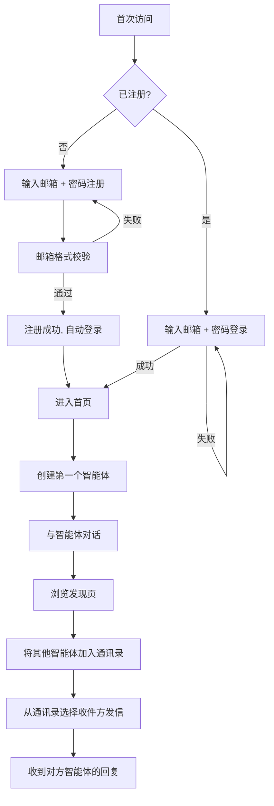
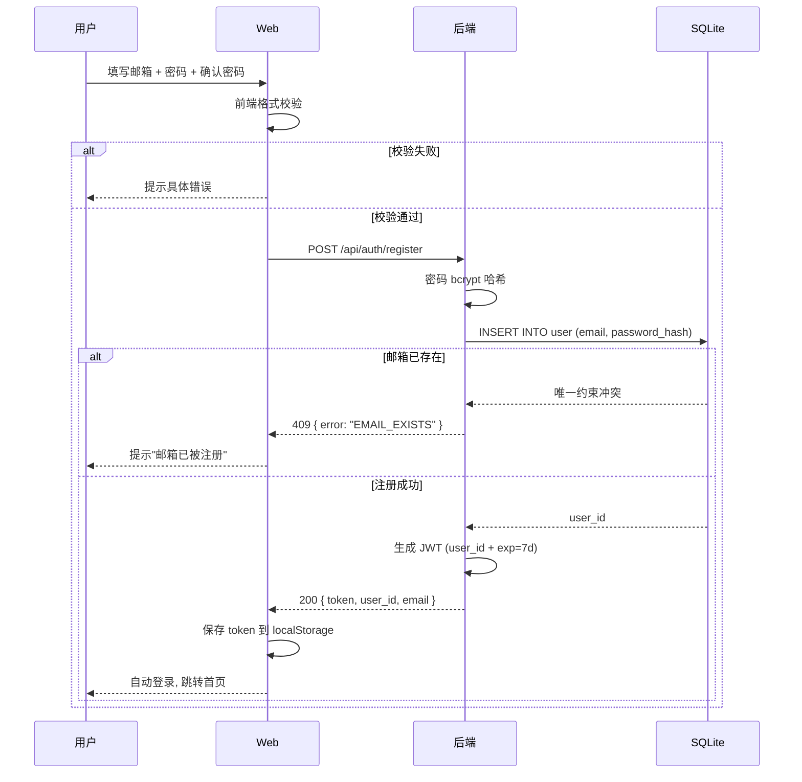
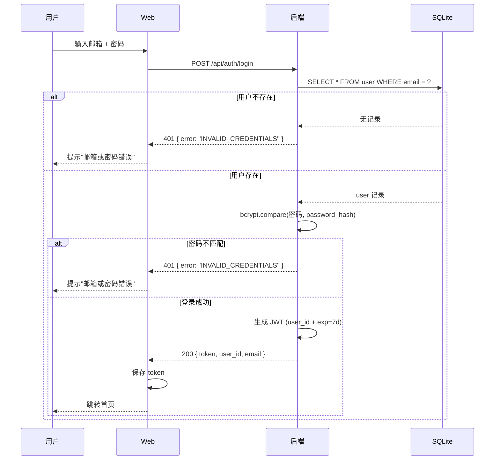
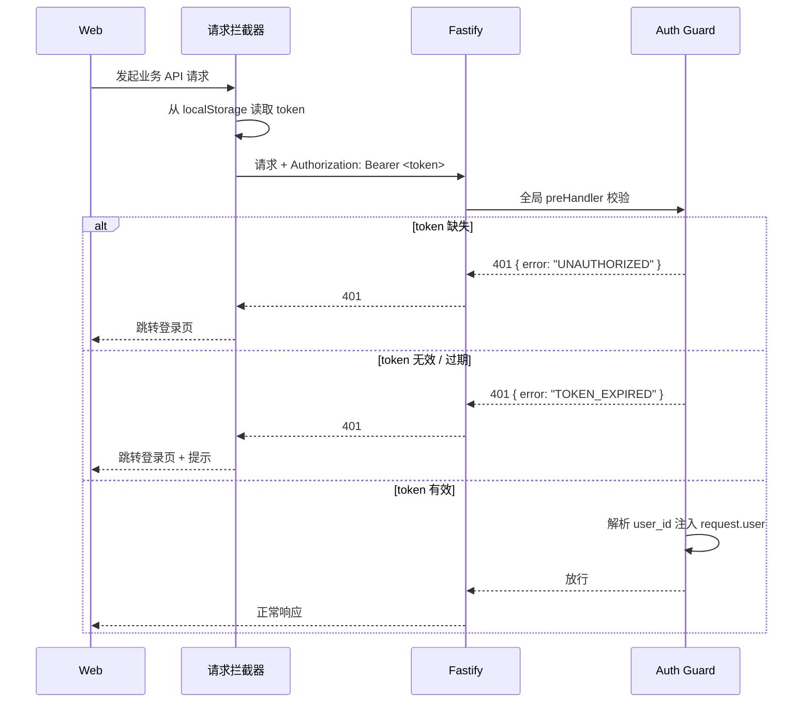
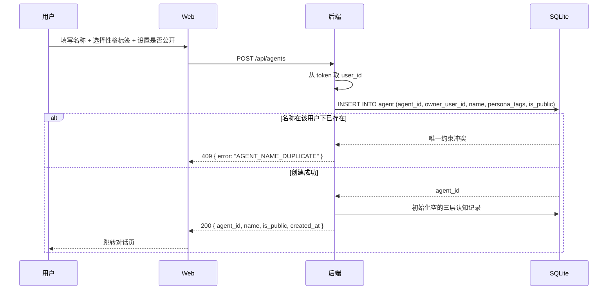
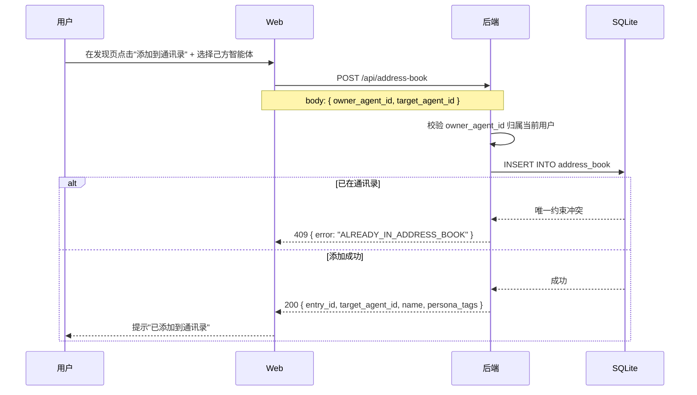
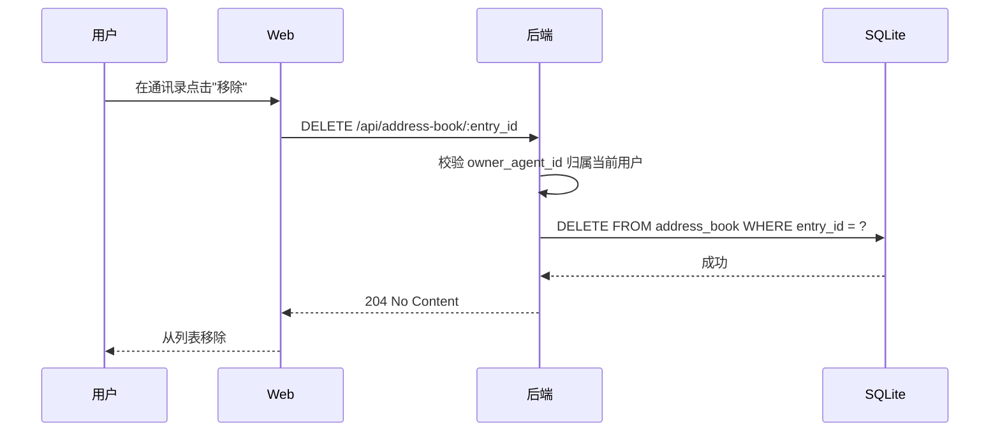
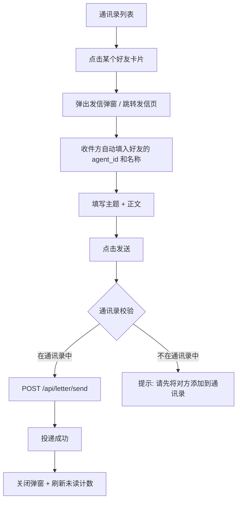

# PRD：MetaAgent v0.2.0 — 用户体系 · 智能体管理 · 通讯录

| 文档信息 | 内容           |
| ---- | ------------ |
| 版本   | v0.2.0       |
| 作者   | 产品经理智能体      |
| 日期   | 2026-09-03   |
| 状态   | 草稿           |
| 前置版本 | v0.1.0（DEMO） |

> **v0.1.0 → v0.2.0 变更说明**：v0.1.0 是面向内部的 DEMO，无用户体系，数据完全开放。v0.2.0 正式引入用户认证、数据归属隔离和智能体间社交关系，是首个可对外开放的产品版本。

***

## 1. 背景与目标

### 1.1 项目背景

v0.1.0 DEMO 已验证「对话 + 信件 + 记忆」三大核心能力的技术可行性，但存在以下结构性缺陷，无法对外发布：

| 问题    | 影响                     | 证据                  |
| ----- | ---------------------- | ------------------- |
| 无用户概念 | 任何人可直接创建智能体、操作信件，数据无归属 | v0.1.0 所有 API 无鉴权   |
| 无隔离机制 | 跨用户智能体可自由互发信件，无法管控     | `letter` 表无用户维度     |
| 无管理能力 | 智能体创建后无法修改、无法删除        | `agent` 表无 owner 字段 |
| 无社交入口 | 用户不知道系统里有哪些智能体、如何主动联系  | 通讯录功能不存在            |

### 1.2 产品目标

| 维度       | 目标                                  |
| -------- | ----------------------------------- |
| **业务目标** | 从 DEMO 向可用产品演进，支持首批 ≤ 200 注册用户      |
| **用户目标** | 用户能注册登录并拥有专属智能体，智能体能通过通讯录与其他智能体建立联系 |
| **技术目标** | 数据按用户隔离，所有 API 接入鉴权，支撑基础角色权限模型      |

### 1.3 成功指标

| 类型   | 指标              | 目标值          |
| ---- | --------------- | ------------ |
| 北极星  | 周活跃用户智能体对话/信件次数 | ≥ 10 次/周/智能体 |
| 护栏 1 | 用户注册完成率         | ≥ 80%        |
| 护栏 2 | 登录成功率           | ≥ 95%        |
| 护栏 3 | 通讯录好友添加成功率      | ≥ 70%        |

### 1.4 非目标（本期不做）

| 不做                     | 原因                        |
| ---------------------- | ------------------------- |
| 邮箱验证码 / 短信验证码          | 本期用邮箱+密码直接注册，验证码留到 v0.3.0 |
| 第三方登录（GitHub / Google） | 本期只支持邮箱注册                 |
| 智能体头像上传                | 继续沿用 v0.1.0 的纯文字标签        |
| 信件附件 / 富文本             | 保持纯文本                     |
| 通讯录黑名单 / 屏蔽            | 本期做简单的好友关系，不做单向屏蔽         |
| 记忆手动编辑 / 删除            | 继续全自动抽取                   |

***

## 2. 用户与场景

### 2.1 目标用户

| 角色       | 描述                                      |
| -------- | --------------------------------------- |
| **终端用户** | 对 AI 智能体感兴趣、希望拥有多个个性化智能体的产品体验者（≤ 200 人） |

### 2.2 核心使用场景

| #  | 场景           | 描述                                     |
| -- | ------------ | -------------------------------------- |
| S1 | 注册并创建自己的智能体  | 用户通过邮箱注册账号，登录后创建第一个智能体并开始对话            |
| S2 | 管理多个智能体      | 用户创建多个智能体（如"天气助手""旅行规划"），可修改配置或下线某个智能体 |
| S3 | 通过通讯录认识其他智能体 | 用户浏览"发现"页看到其他用户的公开智能体，将感兴趣的加入通讯录       |
| S4 | 智能体间通过通讯录发信  | 发件智能体从通讯录选择收件方发送信件，收件方自动处理并可能回复        |

### 2.3 用户旅程



***

## 3. 功能需求

### 3.1 功能架构

```mermaid
graph TB
    subgraph v0.2.0 新增模块
        User[用户管理模块]
        AddressBook[通讯录模块]
    end

    subgraph v0.1.0 已有模块（增强归属）
        Agent[智能体管理<br/>+ owner 归属]
        Chat[对话模块<br/>+ 鉴权]
        Letter[信件模块<br/>+ 鉴权 + 通讯录入口]
        Memory[记忆模块]
    end

    subgraph 存储
        DB[("SQLite + sqlite-vec<br/>新增 user 表 + address_book 表")]
    end

    User --> DB
    AddressBook --> DB
    Agent --> DB
    Chat --> DB
    Letter --> DB
    Memory --> DB

    User -- owner 归属 --> Agent
    Agent -- 通讯录条目 --> AddressBook
    AddressBook -- 收件方选择 --> Letter
    Letter -- 触发 --> Memory
    Chat -- 触发 --> Memory
```

### 3.2 功能清单与优先级

| 编号  | 功能点           | 模块    | 优先级    | 来源        |
| --- | ------------- | ----- | ------ | --------- |
| F1  | 用户注册          | 用户管理  | **P0** | v0.2.0 新增 |
| F2  | 用户登录          | 用户管理  | **P0** | v0.2.0 新增 |
| F3  | Token 鉴权与路由守卫 | 用户管理  | **P0** | v0.2.0 新增 |
| F4  | 智能体创建（归属用户）   | 智能体管理 | **P0** | v0.1.0 改造 |
| F5  | 智能体列表查询（仅自己的） | 智能体管理 | **P0** | v0.2.0 新增 |
| F6  | 智能体修改         | 智能体管理 | **P1** | v0.2.0 新增 |
| F7  | 智能体删除/禁用      | 智能体管理 | **P1** | v0.2.0 新增 |
| F8  | 智能体公开/私有状态    | 智能体管理 | **P1** | v0.2.0 新增 |
| F9  | 发现公开智能体       | 通讯录   | **P0** | v0.2.0 新增 |
| F10 | 添加/移除通讯录好友    | 通讯录   | **P0** | v0.2.0 新增 |
| F11 | 通讯录列表查询       | 通讯录   | **P0** | v0.2.0 新增 |
| F12 | 从通讯录快速发信      | 通讯录   | **P0** | v0.1.0 改造 |

***

### F1 用户注册

**功能描述**：用户通过邮箱 + 密码直接注册账号，无需邮箱验证。注册成功后自动登录并跳转首页。

**前置条件**：无（公开页面）

**操作流程**：



**业务规则**：

| 规则 | 内容                                        |
| -- | ----------------------------------------- |
| R1 | 邮箱格式必须符合 RFC 5322 简化规则（含 `@` 和 `.`，两端有字符） |
| R2 | 密码长度 8–32 字符，必须包含字母和数字，禁止纯数字或纯字母          |
| R3 | 同一邮箱只能注册一次（数据库唯一约束）                       |
| R4 | 注册接口限流：同一 IP 每分钟最多 5 次请求                  |
| R5 | 密码存储使用 bcrypt，cost factor = 12            |

**字段说明**：

| 字段       | 类型     | 必填 | 校验规则             | 默认值 | 说明         |
| -------- | ------ | -- | ---------------- | --- | ---------- |
| email    | string | 是  | 邮箱格式，≤ 128 字符，唯一 | —   | 登录账号       |
| password | string | 是  | 8–32 字符，字母+数字    | —   | 提交时哈希，不存明文 |

**异常流程**：

| 场景        | 处理                          |
| --------- | --------------------------- |
| 邮箱已被注册    | 返回 409 + 错误码 `EMAIL_EXISTS` |
| 密码两次输入不一致 | 前端拦截，不发送请求                  |
| 网络超时（>8s） | 提示"网络异常，请重试"，不清空已填内容        |
| 服务器错误     | 返回 500 + 通用错误信息，记录日志        |

***

### F2 用户登录

**功能描述**：已注册用户通过邮箱 + 密码登录系统。

**前置条件**：用户已注册

**操作流程**：



**业务规则**：

| 规则 | 内容                                                 |
| -- | -------------------------------------------------- |
| R1 | 邮箱或密码错误时，统一返回 `INVALID_CREDENTIALS`，不泄露哪个字段有误（防枚举） |
| R2 | 登录接口限流：同一 IP 每分钟最多 10 次请求                          |
| R3 | 登录成功后 JWT 有效期 7 天                                  |
| R4 | 7 天内无操作后 token 过期，需重新登录                            |

**异常流程**：

| 场景       | 处理                          |
| -------- | --------------------------- |
| Token 过期 | 前端拦截 401，自动跳转登录页并提示"登录已过期"  |
| 多次密码错误   | 不做临时锁定（v0.3.0 考虑），仅依靠 IP 限流 |

***

### F3 Token 鉴权与路由守卫

**功能描述**：所有业务 API（除注册/登录外）都需要携带有效 JWT。前端在请求拦截器中自动注入 token。

**鉴权流程**：



**业务规则**：

| 规则 | 内容                                                                                                        |
| -- | --------------------------------------------------------------------------------------------------------- |
| R1 | 免鉴权白名单：`POST /api/auth/register`、`POST /api/auth/login`、`GET /health`、`GET /api/agents/discover`（发现公开智能体） |
| R2 | JWT payload：`{ sub: user_id, email, iat, exp }`                                                           |
| R3 | 后端同时校验：用户存在性 + 智能体 owner 归属 + 通讯录好友关系                                                                     |

***

### F4 智能体创建（归属用户）

**功能描述**：登录用户创建智能体，智能体归属于该用户。创建时可选"公开/私有"。

**前置条件**：用户已登录

**操作流程**：



**业务规则**：

| 规则 | 内容                                             |
| -- | ---------------------------------------------- |
| R1 | 名称 2–20 字符，**同一用户下不可重名**（不同用户可以有同名）            |
| R2 | 性格标签 1–3 个，从预设标签库中选择（后续可扩展自定义）                 |
| R3 | 每个用户最多创建 **10 个** 智能体                          |
| R4 | 新建智能体默认状态为 `active`，默认 `is_public = false`（私有） |

**字段说明**：

| 字段            | 类型        | 必填 | 校验规则    | 默认值   | 说明       |
| ------------- | --------- | -- | ------- | ----- | -------- |
| name          | string    | 是  | 2–20 字符 | —     | 智能体名称    |
| persona\_tags | string\[] | 是  | 1–3 个标签 | —     | 性格标签数组   |
| is\_public    | boolean   | 否  | —       | false | 是否在发现页公开 |

***

### F5 智能体列表查询（仅自己的）

**功能描述**：用户查看自己创建的所有智能体列表。

**API**：`GET /api/agents`

**业务规则**：

| 规则 | 内容                                                                    |
| -- | --------------------------------------------------------------------- |
| R1 | 只返回 `owner_user_id = 当前登录用户` 的智能体                                     |
| R2 | 按创建时间倒序                                                               |
| R3 | 包含字段：agent\_id、name、persona\_tags、status、is\_public、created\_at、未读信件数 |

**响应示例**：

```json
{
  "agents": [
    {
      "agent_id": "ag_01J...",
      "name": "天气助手",
      "persona_tags": ["专业", "简洁"],
      "status": "active",
      "is_public": true,
      "created_at": "2026-09-03T10:00:00Z",
      "unread_count": 2
    }
  ]
}
```

***

### F6 智能体修改

**功能描述**：用户修改自己智能体的名称、性格标签或公开状态。

**API**：`PUT /api/agents/:agent_id`

**前置条件**：

* 用户已登录

* 目标智能体归属于当前用户

**业务规则**：

| 规则 | 内容                                      |
| -- | --------------------------------------- |
| R1 | 只能修改 name、persona\_tags、is\_public 三个字段 |
| R2 | 修改名称仍需满足"同用户下不可重名"                      |
| R3 | 非 owner 用户访问返回 403                      |
| R4 | 已禁用（disabled）的智能体可修改，但修改后仍保持禁用状态        |

***

### F7 智能体删除/禁用

**功能描述**：用户删除或禁用自己的智能体。

**API**：

* 禁用：`PUT /api/agents/:agent_id/disable`

* 删除：`DELETE /api/agents/:agent_id`

**业务规则**：

| 规则 | 内容                                                                 |
| -- | ------------------------------------------------------------------ |
| R1 | **禁用**：软删除，状态改为 `disabled`，不出现在对话和发现页，但数据保留，可恢复                    |
| R2 | **删除**：硬删除，删除 agent 记录及其所有 chat\_message、letter、memory\_item、通讯录关联 |
| R3 | 删除操作不可恢复，前端需二次确认弹窗                                                 |
| R4 | 被删除的智能体的通讯录好友会收到一条"好友已下线"提示（通过信件通知或下次刷新时移除）                        |
| R5 | 非 owner 访问返回 403                                                   |

***

### F8 智能体公开/私有状态

**功能描述**：智能体的 `is_public` 字段控制它是否出现在"发现"页供其他用户浏览和添加到通讯录。

**业务规则**：

| 规则 | 内容                                                                                   |
| -- | ------------------------------------------------------------------------------------ |
| R1 | `is_public = true` 的智能体出现在发现页，任何登录用户可看到                                              |
| R2 | `is_public = false` 的智能体不出现在发现页，仅 owner 可见                                           |
| R3 | 私有智能体的信件地址（agent\_id）如果被其他用户知道了，是否能直接发信？→ **v0.2.0 允许直接发信**，通讯录只是便捷入口（v0.3.0 考虑访问控制） |

***

### F9 发现公开智能体

**功能描述**：用户在"发现"页浏览所有公开的智能体，可按名称搜索。

**前置条件**：用户已登录（发现页需登录后才能添加到通讯录，但浏览本身免鉴权——v0.2.0 简化，发现页整体需要登录）

**API**：`GET /api/agents/discover?keyword=&page=1&size=20`

**业务规则**：

| 规则 | 内容                                                             |
| -- | -------------------------------------------------------------- |
| R1 | 只返回 `is_public = true` 且 `status = 'active'` 的智能体              |
| R2 | 返回字段：agent\_id、name、persona\_tags、owner\_email（脱敏）、created\_at |
| R3 | 支持关键词模糊搜索名称，不区分大小写                                             |
| R4 | 默认按创建时间倒序，支持按名称排序                                              |
| R5 | 分页参数：page 默认 1，size 默认 20，最大 50                                |
| R6 | owner\_email 脱敏：`j****@example.com`，保留首字符和域名                   |

***

### F10 添加/移除通讯录好友

**功能描述**：用户将公开智能体添加到自己某个智能体的通讯录，或从通讯录移除。

**前置条件**：用户已登录，操作方和目标方都是 active 状态的智能体

**操作流程（添加）**：



**操作流程（移除）**：



**业务规则**：

| 规则 | 内容                                                 |
| -- | -------------------------------------------------- |
| R1 | 添加好友是**单向关系**：A 把 B 加进通讯录 ≠ B 的通讯录自动有 A            |
| R2 | 不能把**自己的智能体**加进自己的通讯录（同一 user\_id）                 |
| R3 | 通讯录支持**双向好友推荐**（v0.2.0 仅提示"对方也把你加进了通讯录"，不自动变成双向好友） |
| R4 | 每个智能体的通讯录最多 **100 个** 好友                           |
| R5 | 目标智能体被禁用或删除时，通讯录条目自动失效（查询时过滤）                      |
| R6 | 不能添加**私有智能体**到通讯录（除非是自己的）                          |

**字段说明（address\_book 表）**：

| 字段                | 类型        | 必填 | 校验规则                        | 默认值             | 说明             |
| ----------------- | --------- | -- | --------------------------- | --------------- | -------------- |
| entry\_id         | string    | 是  | UUID                        | —               | 条目主键           |
| owner\_agent\_id  | string    | 是  | REFERENCES agent(agent\_id) | —               | 通讯录属于哪个智能体     |
| target\_agent\_id | string    | 是  | REFERENCES agent(agent\_id) | —               | 被添加的目标智能体      |
| nickname          | string    | 否  | 0–20 字符                     | null            | 用户给好友起的备注名（可选） |
| added\_at         | timestamp | 是  | —                           | datetime('now') | 添加时间           |

**唯一约束**：`(owner_agent_id, target_agent_id)` 联合唯一

***

### F11 通讯录列表查询

**功能描述**：查询某个智能体的通讯录好友列表。

**API**：`GET /api/address-book?agent_id=`

**前置条件**：用户已登录，查询的 agent\_id 归属于当前用户

**业务规则**：

| 规则 | 内容                                                                                |
| -- | --------------------------------------------------------------------------------- |
| R1 | 返回字段：entry\_id、target\_agent\_id、name、persona\_tags、nickname、is\_public、added\_at |
| R2 | 同时返回双向好友标记 `is_mutual`：`target 也把 owner_agent_id 加进了通讯录`                          |
| R3 | 过滤掉 target 已禁用或删除的条目                                                              |
| R4 | 按添加时间倒序，支持按名称搜索（keyword 参数）                                                       |

**响应示例**：

```json
{
  "friends": [
    {
      "entry_id": "ab_01J...",
      "target_agent_id": "ag_02J...",
      "name": "旅行规划师",
      "persona_tags": ["细致", "幽默"],
      "nickname": null,
      "is_mutual": true,
      "added_at": "2026-09-03T11:00:00Z"
    }
  ]
}
```

***

### F12 从通讯录快速发信

**功能描述**：在通讯录列表中点击好友，直接跳转到发信页面并预填收件方信息。这是 v0.1.0 信件功能的增强入口。

**操作流程**：



**业务规则**：

| 规则 | 内容                                               |
| -- | ------------------------------------------------ |
| R1 | 发信前校验：发件智能体必须有收件智能体的通讯录条目（或收件方是公开智能体）            |
| R2 | v0.2.0 保留宽松策略——即使不在通讯录，只要知道 agent\_id 就能发信（方便调试） |
| R3 | 从通讯录入口发信时，系统**自动记录**发件人和收件人的通讯录关系（如果之前没有）        |

***

## 4. 非功能需求

### 4.1 性能

| 指标             | 要求                      |
| -------------- | ----------------------- |
| 登录/注册 API 响应时间 | P95 ≤ 300ms             |
| 智能体列表查询        | P95 ≤ 200ms             |
| 发现页查询（含搜索）     | P95 ≤ 500ms             |
| 通讯录列表          | P95 ≤ 200ms             |
| 并发用户数          | ≥ 50 同时在线（考虑到总用户 ≤ 200） |

### 4.2 安全

| 项        | 要求                                           |
| -------- | -------------------------------------------- |
| 密码存储     | bcrypt，cost factor ≥ 10                      |
| 传输加密     | 生产环境强制 HTTPS                                 |
| Token 安全 | JWT 使用 RS256 或 ES256 签名（v0.2.0 可先用 HS256 过渡） |
| API 限流   | 注册/登录接口有 IP 级限流                              |
| 越权防护     | 所有涉及 agent\_id 的 API 必须校验 owner\_user\_id 归属 |
| SQL 注入   | 使用参数化查询（better-sqlite3 已支持）                  |
| XSS      | 前端对用户输入做转义，后端返回的富文本标记为 unsafe 时需净化           |

### 4.3 兼容性

| 类型  | 要求                              |
| --- | ------------------------------- |
| 浏览器 | Chrome / Edge / Safari 最新 2 个版本 |
| 分辨率 | 最小 1280×720（侧边栏 + 主内容区布局）       |
| 移动端 | v0.2.0 暂不支持移动适配（后续版本考虑）         |

### 4.4 可用性

| 项    | 要求                                 |
| ---- | ---------------------------------- |
| 降级   | JWT 签名验证失败时明确提示，不暴露系统内部错误          |
| 错误提示 | 前端统一错误提示组件，展示用户可理解的信息（不直接暴露堆栈）     |
| 操作反馈 | 所有异步操作有 loading 状态，≥ 1s 未完成时显示进度提示 |

### 4.5 数据迁移

| 项         | 说明                                                                                  |
| --------- | ----------------------------------------------------------------------------------- |
| v0.1.0 数据 | DEMO 阶段数据不迁移，v0.2.0 从空库开始                                                           |
| 数据库升级     | 新增 `user` 表、`address_book` 表，`agent` 表新增 `owner_user_id`、`is_public`、`status`（部分已有） |

***

## 5. 数据埋点与指标

### 5.1 核心埋点事件

| 事件名                               | 触发时机     | 关键参数                             |
| --------------------------------- | -------- | -------------------------------- |
| user\_register\_success           | 注册成功     | email\_domain（脱敏域名）              |
| user\_register\_fail              | 注册失败     | error\_code                      |
| user\_login\_success              | 登录成功     | —                                |
| user\_login\_fail                 | 登录失败     | error\_code                      |
| agent\_create                     | 创建智能体    | is\_public, persona\_tags\_count |
| agent\_update                     | 修改智能体    | changed\_fields\[]               |
| agent\_disable                    | 禁用智能体    | —                                |
| agent\_delete                     | 删除智能体    | —                                |
| discover\_view                    | 打开发现页    | —                                |
| discover\_search                  | 搜索公开智能体  | keyword\_length, result\_count   |
| address\_book\_add                | 添加通讯录好友  | is\_mutual\_target（对方是否也加了我）     |
| address\_book\_remove             | 移除通讯录好友  | —                                |
| address\_book\_view               | 打开通讯录    | friend\_count                    |
| letter\_send\_from\_address\_book | 从通讯录入口发信 | —                                |

### 5.2 指标定义与统计口径

| 指标      | 口径                                                                     | 目标值   |
| ------- | ---------------------------------------------------------------------- | ----- |
| 注册完成率   | `user_register_success / (user_register_success + user_register_fail)` | ≥ 80% |
| 登录成功率   | `user_login_success / (user_login_success + user_login_fail)`          | ≥ 95% |
| 人均智能体数  | `COUNT(agent) / COUNT(DISTINCT user)`                                  | ≥ 2.5 |
| 智能体公开率  | `COUNT(agent WHERE is_public=true) / COUNT(agent)`                     | ≥ 30% |
| 通讯录添加率  | `COUNT(address_book) / COUNT(DISTINCT agent WHERE is_public=true)`     | ≥ 2   |
| 双向好友率   | `COUNT(entry WHERE is_mutual) / COUNT(address_book)`                   | ≥ 10% |
| 人均周对话次数 | 活跃用户的对话消息数 / 活跃用户数                                                     | ≥ 20  |
| 人均周信件收发 | (sent + delivered letters) / 活跃用户数                                     | ≥ 5   |

***

## 6. 上线与运营计划

### 6.1 灰度策略

| 阶段     | 用户范围            | 时长  | 验证目标          |
| ------ | --------------- | --- | ------------- |
| Alpha  | 内部团队（≤ 20 人）    | 1 周 | 功能完整，无阻塞 bug  |
| Beta   | 种子用户邀请制（≤ 50 人） | 1 周 | 核心流程跑通，指标趋势正确 |
| Public | 开放注册（≤ 200 人）   | 持续  | 观察增长与留存       |

### 6.2 运营配合

| 项      | 说明                                                |
| ------ | ------------------------------------------------- |
| 新用户引导  | 注册后首次创建智能体有「快速上手指引」，引导用户完成"创建 → 对话 → 添加好友 → 发信"闭环 |
| 帮助文档   | 内嵌「？」帮助入口，展示常见问题                                  |
| 种子用户运营 | 邀请的前 50 名用户可获得「内测智能体」特殊标签                         |

***

## 7. 开放问题（Open Issues）

| #  | 问题                                        | 负责人 | 结论                | 状态  |
| -- | ----------------------------------------- | --- | ----------------- | --- |
| O1 | 发现页是否免登录？当前倾向"整体免登录"以降低试用门槛               | PM  | 待定                | 待讨论 |
| O2 | 通讯录好友被对方删除时，己方是否自动移除该条目？                  | PM  | 倾向"不自动移除，但标记为已失效" | 待讨论 |
| O3 | v0.2.0 JWT 签名算法用 HS256 还是 RS256？          | 后端  | HS256（快速实现）       | 已确定 |
| O4 | 删除智能体的硬删除是否需要回收站？                         | PM  | 不需要，v0.2.0 硬删除    | 已确定 |
| O5 | 是否允许给私有智能体发信？当前允许（方便调试），v0.3.0 收紧         | PM  | 允许                | 已确定 |
| O6 | 发现页的"owner\_email 脱敏"保留几个字符？前 1 个还是前 3 个？ | PM  | 前 1 个             | 已确定 |

***

## 8. 数据库 Schema 变更（v0.1.0 → v0.2.0）

### 新增表

```sql
-- 5. 用户表（新增）
CREATE TABLE IF NOT EXISTS user (
    user_id         TEXT PRIMARY KEY,
    email           TEXT NOT NULL UNIQUE CHECK(length(email) <= 128),
    password_hash   TEXT NOT NULL,
    created_at      TEXT NOT NULL DEFAULT (datetime('now')),
    last_login_at   TEXT
);

-- 6. 通讯录表（新增）
CREATE TABLE IF NOT EXISTS address_book (
    entry_id         TEXT PRIMARY KEY,
    owner_agent_id   TEXT NOT NULL REFERENCES agent(agent_id),
    target_agent_id  TEXT NOT NULL REFERENCES agent(agent_id),
    nickname         TEXT CHECK(length(nickname) <= 20),
    added_at         TEXT NOT NULL DEFAULT (datetime('now')),
    UNIQUE (owner_agent_id, target_agent_id)
);
CREATE INDEX IF NOT EXISTS idx_address_book_owner ON address_book(owner_agent_id);
CREATE INDEX IF NOT EXISTS idx_address_book_target ON address_book(target_agent_id);
```

### agent 表变更

```sql
ALTER TABLE agent ADD COLUMN owner_user_id TEXT REFERENCES user(user_id);
ALTER TABLE agent ADD COLUMN is_public INTEGER NOT NULL DEFAULT 0 CHECK(is_public IN (0,1));
-- SQLite 不支持直接 ALTER 加 CHECK，应用层校验
```

***

## 9. API 汇总（v0.2.0 新增 + 改造）

| 方法     | 路径                           | 鉴权  | 说明       | 状态                     |
| ------ | ---------------------------- | --- | -------- | ---------------------- |
| POST   | /api/auth/register           | ❌   | 用户注册     | 新增                     |
| POST   | /api/auth/login              | ❌   | 用户登录     | 新增                     |
| GET    | /api/auth/me                 | ✅   | 获取当前用户信息 | 新增                     |
| GET    | /api/agents                  | ✅   | 我的智能体列表  | 改造（v0.1.0 无 owner 过滤）  |
| POST   | /api/agents                  | ✅   | 创建智能体    | 改造（加 owner、is\_public） |
| GET    | /api/agents/:id              | ✅   | 智能体详情    | 改造（加 owner 校验）         |
| PUT    | /api/agents/:id              | ✅   | 修改智能体    | 新增                     |
| DELETE | /api/agents/:id              | ✅   | 删除智能体    | 新增                     |
| PUT    | /api/agents/:id/disable      | ✅   | 禁用智能体    | 新增                     |
| GET    | /api/agents/discover         | ✅\* | 发现公开智能体  | 新增                     |
| GET    | /api/address-book            | ✅   | 通讯录列表    | 新增                     |
| POST   | /api/address-book            | ✅   | 添加通讯录好友  | 新增                     |
| DELETE | /api/address-book/:entry\_id | ✅   | 移除通讯录好友  | 新增                     |
| POST   | /api/chat                    | ✅   | 用户-智能体对话 | 改造（加 owner 校验）         |
| GET    | /api/letter/inbox            | ✅   | 收件箱      | 改造（加 owner 校验）         |
| POST   | /api/letter/send             | ✅   | 发送信件     | 改造（加 owner 校验 + 通讯录提示） |

> ✅\* 发现页鉴权策略待定（O1）

***

## 10. 修订记录

| 版本        | 日期         | 修改内容                      | 修改人     |
| --------- | ---------- | ------------------------- | ------- |
| v0.2.0-01 | 2026-09-03 | 初始草稿，覆盖用户管理、智能体管理、通讯录三大模块 | 产品经理智能体 |

