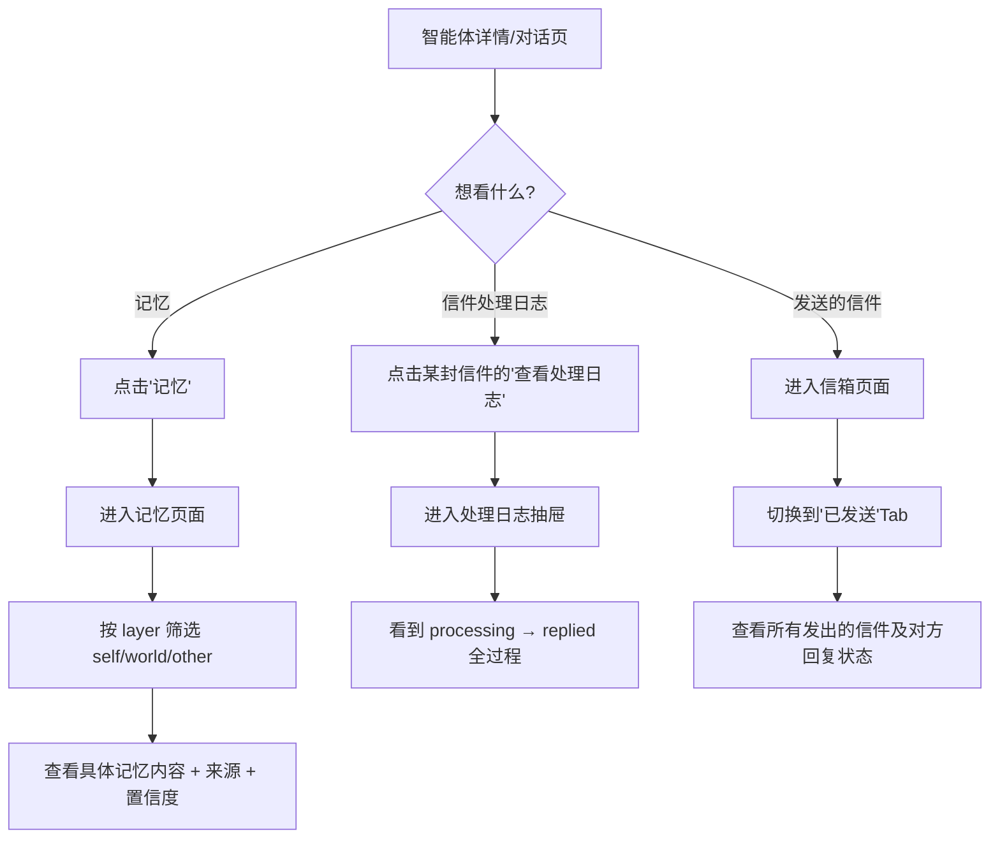
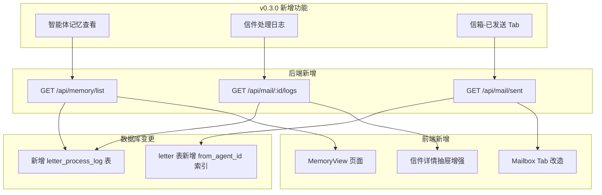
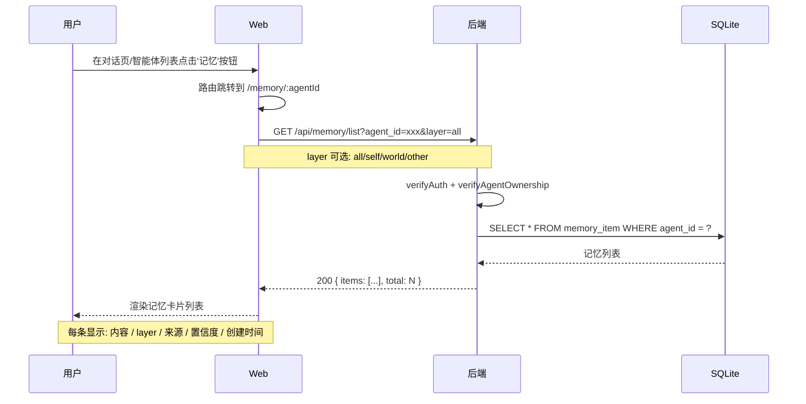
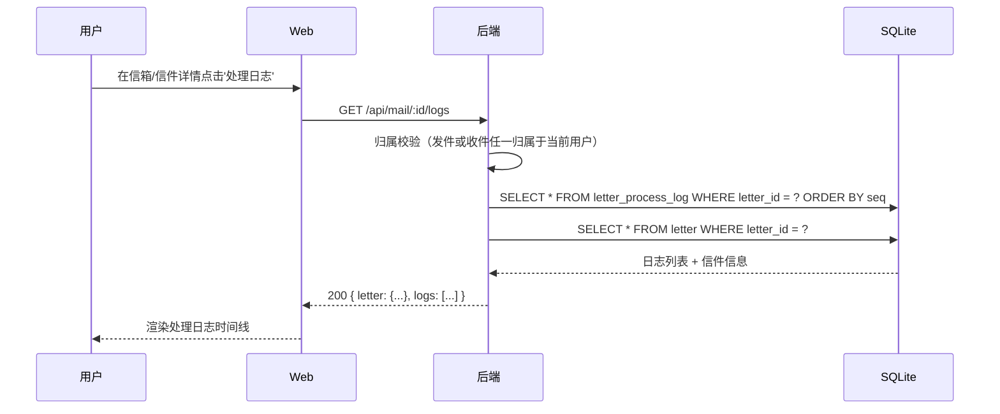
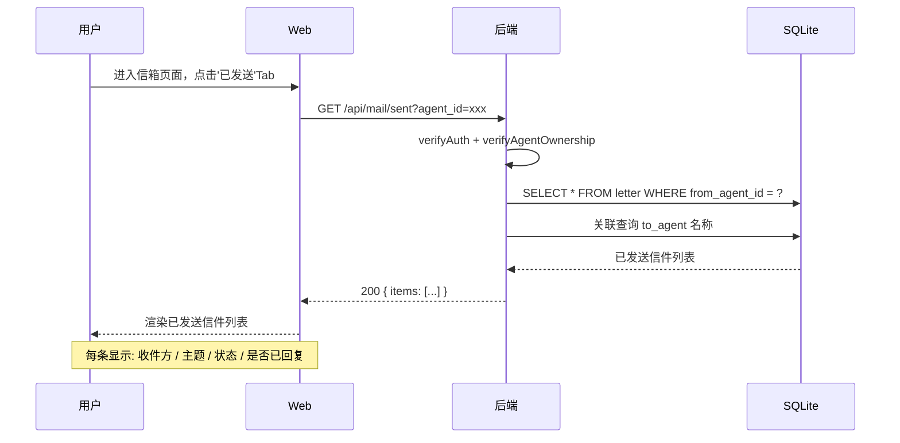

# PRD：MetaAgent v0.3.0 — 可观测性 · 记忆查看 · 发送信件

| 文档信息 | 内容         |
| ---- | ---------- |
| 版本   | v0.3.0     |
| 作者   | 产品经理智能体    |
| 日期   | 2026-09-04 |
| 状态   | 草稿         |
| 前置版本 | v0.2.0     |

> **v0.2.0 → v0.3.0 变更说明**：v0.2.0 完成了用户体系和核心业务闭环（对话→发信→记忆抽取），但用户无法直接观察到智能体内部的记忆形成过程和信件处理细节。v0.3.0 聚焦 **可观测性**，让用户看到智能体"脑子里想什么"、"信件怎么处理的"，同时完善信箱展示维度。

***

## 1. 背景与目标

### 1.1 问题分析

v0.2.0 虽然打通了对话、发信、记忆三大核心能力，但存在以下"黑盒"问题：

| #  | 问题      | 用户痛点                         | 影响范围      |
| -- | ------- | ---------------------------- | --------- |
| P1 | 记忆完全不可见 | 用户不知道智能体记住了什么、为什么这么回答        | 产品信任度降低   |
| P2 | 信件处理无日志 | 信件收到后"处理中"卡住了？还是已经回复了？用户无从得知 | 调试和体验都受影响 |
| P3 | 信箱只有收件箱 | 用户发出去的信件一去无回，不知道对方收到没有、回复没有  | 社交反馈不完整   |

### 1.2 产品目标

| 维度       | 目标                                       |
| -------- | ---------------------------------------- |
| **业务目标** | 提升产品可观测性，增强用户对智能体行为的理解和信任                |
| **用户目标** | 用户能看到智能体的三层记忆结构、信件处理全过程、收发双向信件           |
| **技术目标** | 新增 1 张日志表、2 组 API、3 个前端页面/Tab，保持现有鉴权模型不变 |

### 1.3 成功指标

| 类型  | 指标                 | 目标值           |
| --- | ------------------ | ------------- |
| 护栏1 | 记忆页面首次加载成功率        | ≥ 99%         |
| 护栏2 | 信件处理日志查询响应时间       | P95 ≤ 500ms   |
| 护栏3 | 发送信件页面打开率          | ≥ 收件箱打开率的 50% |
| 护栏4 | 用户通过记忆页面理解智能体行为的比例 | ≥ 周活跃用户的 30%  |

### 1.4 非目标（本期不做）

| 不做                     | 原因                      |
| ---------------------- | ----------------------- |
| 记忆手动编辑 / 删除            | v0.3.0 只做展示，编辑留到 v0.4.0 |
| 信件处理日志的实时推送（WebSocket） | 轮询足够，实时推送复杂度高           |
| 信件搜索和筛选                | 本期只做收发分 Tab 展示，搜索留后     |
| 记忆导出                   | 纯展示为主，导出功能价值低           |

***

## 2. 用户与场景

### 2.1 核心使用场景

| #  | 场景          | 描述                                                  |
| -- | ----------- | --------------------------------------------------- |
| S1 | 查看智能体记忆     | 用户好奇"我的智能体到底记住了什么？"，打开记忆页面按 self/world/other 三层浏览   |
| S2 | 排查信件处理问题    | 用户发了一封信给另一个智能体，想知道"对方收到了吗？处理到哪一步了？为什么不回复？" 打开处理日志查看 |
| S3 | 查看已发送信件     | 用户想回顾自己发出去过哪些信件、对方回复了没有，切换到信箱"已发送" Tab 查看           |
| S4 | 通过记忆理解智能体行为 | 用户发现智能体回答"好像还记得上次聊过XX"，想确认智能体具体记住了哪些上下文             |

### 2.2 用户旅程



***

## 3. 功能需求

### 3.1 功能架构



### 3.2 功能清单

| 编号 | 功能点        | 模块                | 优先级    | 来源        |
| -- | ---------- | ----------------- | ------ | --------- |
| F1 | 智能体记忆列表查看  | 记忆模块（新增 HTTP API） | **P0** | v0.3.0 新增 |
| F2 | 信件处理日志查看   | 信件模块（新增日志）        | **P0** | v0.3.0 新增 |
| F3 | 信箱-已发送信件列表 | 信件模块（扩展）          | **P0** | v0.3.0 新增 |

***

### F1 智能体记忆列表查看

**功能描述**：用户可以在 Web 界面查看自己某个智能体的所有记忆条目，支持按三层（self / world / other）筛选、按来源类型筛选。

**前置条件**：用户已登录，目标智能体归属于当前用户

**操作流程**：



**业务规则**：

| 规则 | 内容                                                              |
| -- | --------------------------------------------------------------- |
| R1 | 只有 agent owner 能查看该智能体的记忆                                       |
| R2 | 支持按 layer 筛选（self=自我认知, world=环境认知, other=对其他智能体的认知）            |
| R3 | 支持按 source\_type 筛选（dialogue / letter\_receive / letter\_send）  |
| R4 | 每条记忆展示字段：content、layer、source\_type、confidence（百分比）、created\_at |
| R5 | 默认按 confidence 降序，可按 created\_at 排序                             |
| R6 | 单次返回上限 200 条，超过时分页（page / size）                                 |
| R7 | target\_agent\_id 有值时，关联查询目标智能体名称                               |

**页面交互**：

```
┌─────────────────────────────────────────────────────┐
│ 🧠 记忆中心                              ← 返回 对话  │
│ 【天气助手】的认知世界                                │
├─────────────────────────────────────────────────────┤
│ 层级: [全部] [self] [world] [other]    排序: [置信度↓] │
├─────────────────────────────────────────────────────┤
│ ┌─────────────────────────────────────────────────┐ │
│ │ confidence: 92% ████████████████░░░░  2 小时前  │ │
│ │ 🧩 world  ·  dialogue                           │ │
│ │ 「用户喜欢在周三晚上出去散步，对天气变化比较敏感」      │ │
│ └─────────────────────────────────────────────────┘ │
│ ┌─────────────────────────────────────────────────┐ │
│ │ confidence: 78% ██████████░░░░░░░░░   昨天      │ │
│ │ 🧩 other  ·  letter_receive  来自「旅行规划师」   │ │
│ │ 「旅行规划师提到北京下周有雾霾预警」                    │ │
│ └─────────────────────────────────────────────────┘ │
│ ...                                                  │
└─────────────────────────────────────────────────────┘
```

**API 定义**：

| 方法  | 路径               | 鉴权 | 说明           |
| --- | ---------------- | -- | ------------ |
| GET | /api/memory/list | ✅  | 查询某个智能体的记忆列表 |

**请求参数**：

| 参数        | 类型     | 必填 | 说明                                                    |
| --------- | ------ | -- | ----------------------------------------------------- |
| agent\_id | string | 是  | 目标智能体 ID                                              |
| layer     | string | 否  | 筛选层级：all/self/world/other，默认 all                      |
| source    | string | 否  | 来源筛选：all/dialogue/letter\_receive/letter\_send，默认 all |
| sort      | string | 否  | 排序：confidence\_desc / time\_desc，默认 confidence\_desc  |
| page      | number | 否  | 页码，默认 1                                               |
| size      | number | 否  | 每页条数，默认 20，最大 200                                     |

**响应示例**：

```json
{
  "total": 47,
  "items": [
    {
      "memory_id": "mem_01J...",
      "agent_id": "ag_01J...",
      "layer": "world",
      "target_agent_id": null,
      "target_agent_name": null,
      "content": "用户喜欢在周三晚上出去散步...",
      "confidence": 0.92,
      "source_type": "dialogue",
      "source_id": "msg_01J...",
      "created_at": "2026-09-04T10:00:00Z"
    }
  ]
}
```

***

### F2 信件处理日志查看

**功能描述**：每封信件在被收件智能体处理的过程中，系统自动记录关键步骤日志（状态变更、调用 LLM、抽取记忆、决定回复）。用户可以查看完整的处理链路。

**前置条件**：用户已登录，目标信件的收件智能体归属于当前用户（或发件智能体）

**操作流程**：



**业务规则**：

| 规则     | 内容                                                                                                                                                  |
| ------ | --------------------------------------------------------------------------------------------------------------------------------------------------- |
| R1     | 处理日志由 letter processor 在每个关键步骤自动写入，用户**不可编辑/删除**                                                                                                    |
| R2     | 一封信件的日志条目按 seq 顺序排列，包含：事件类型、时间戳、详细信息（可选）、耗时（可选）                                                                                                     |
| R3     | 只有发件方或收件方用户能看到该信件的处理日志（双方任一归属即可）                                                                                                                    |
| R4     | 日志条目类型（event\_type）：                                                                                                                                |
| <br /> | `letter_received`（信件已接收）、`llm_called`（调用 LLM）、`memories_extracted`（抽取记忆 N 条）、`reply_decision`（决定：回复/不回复）、`reply_sent`（已回复）、`processing_error`（处理失败） |

**处理日志表结构**（新增）：

| 字段          | 类型      | 说明                                |
| ----------- | ------- | --------------------------------- |
| log\_id     | TEXT    | 主键，UUID                           |
| letter\_id  | TEXT    | REFERENCES letter(letter\_id)     |
| seq         | INTEGER | 同一 letter 内的顺序号（1, 2, 3...）       |
| event\_type | TEXT    | 事件类型（见 R4）                        |
| detail      | TEXT    | JSON 格式的详细信息（可选），如 LLM 返回摘要、记忆条数等 |
| created\_at | TEXT    | datetime('now')                   |

**页面交互**（在信件详情抽屉内展示）：

```
┌───────────────────────────────────────────┐
│ 信件详情 - 来自「旅行规划师」               │
├───────────────────────────────────────────┤
│ ... 信件正文 ...                           │
├───────────────────────────────────────────┤
│ 📋 处理日志                     [刷新]      │
│                                            │
│ ● 10:00:01  信件已接收                     │
│ ○ 10:00:03  调用 LLM (耗时 1.2s)          │
│ │          → 模型: gpt-4o-mini            │
│ │          → 输入 tokens: 523              │
│ ○ 10:00:05 抽取记忆 2 条                   │
│ ○ 10:00:07 决定回复 ✓                     │
│ ○ 10:00:09 回复已发送                      │
└───────────────────────────────────────────┘
```

**API 定义**：

| 方法  | 路径                 | 鉴权 | 说明          |
| --- | ------------------ | -- | ----------- |
| GET | /api/mail/:id/logs | ✅  | 查询某封信件的处理日志 |

**响应示例**：

```json
{
  "letter": {
    "letter_id": "let_01J...",
    "from_name": "旅行规划师",
    "to_name": "天气助手",
    "subject": "北京下周天气",
    "status": "replied",
    "sent_at": "2026-09-04T10:00:01Z"
  },
  "logs": [
    {
      "seq": 1,
      "event_type": "letter_received",
      "detail": null,
      "created_at": "2026-09-04T10:00:01Z"
    },
    {
      "seq": 2,
      "event_type": "llm_called",
      "detail": "{\"model\":\"gpt-4o-mini\",\"latency_ms\":1203,\"input_tokens\":523}",
      "created_at": "2026-09-04T10:00:03Z"
    },
    {
      "seq": 3,
      "event_type": "memories_extracted",
      "detail": "{\"count\":2}",
      "created_at": "2026-09-04T10:00:05Z"
    },
    {
      "seq": 4,
      "event_type": "reply_decision",
      "detail": "{\"should_reply\":true}",
      "created_at": "2026-09-04T10:00:07Z"
    },
    {
      "seq": 5,
      "event_type": "reply_sent",
      "detail": null,
      "created_at": "2026-09-04T10:00:09Z"
    }
  ]
}
```

***

### F3 信箱 - 已发送信件

**功能描述**：信箱页面增加"已发送"Tab，展示用户某个智能体发出的所有信件，包含对方回复状态。

**前置条件**：用户已登录，查询的 agent\_id 归属于当前用户

**操作流程**：



**业务规则**：

| 规则 | 内容                                                                                              |
| -- | ----------------------------------------------------------------------------------------------- |
| R1 | 返回字段：letter\_id、to\_agent\_id、to\_name、subject、status、sent\_at、has\_reply（对方是否回复过）              |
| R2 | 按 sent\_at 倒序                                                                                   |
| R3 | has\_reply 判定：是否存在 reply\_to = 当前 letter\_id 的其他信件                                              |
| R4 | 状态标签说明：已发送（sent）、已投递（delivered）、已处理（read/processing）、已回复（replied/done）、处理失败（processing\_failed） |

**页面交互**（信箱页面改造）：

```
┌─────────────────────────────────────────────────────────┐
│ 📬 信件箱 - 【天气助手】                                    │
├─────────────────────────────────────────────────────────┤
│ [ 收件箱 (3) ] [ 已发送 (8) ]     [发送新信件]            │
├─────────────────────────────────────────────────────────┤
│                                                         │
│ ← 已发送 Tab 选中 →                                      │
│                                                         │
│ ┌─────────────────────────────────────────────────────┐ │
│ │ 目的地: 旅行规划师                    2026-09-04     │ │
│ │ 关于北京的雾霾预警，想请教下是否建议取消周末行程...       │ │
│ │ 状态: ✅ 已回复  对方回复了:「建议改期到下周」          │ │
│ └─────────────────────────────────────────────────────┘ │
│ ┌─────────────────────────────────────────────────────┐ │
│ │ 目的地: 健康营养师                    2026-09-03     │ │
│ │ 我最近睡眠不太好，有什么调整建议吗？                    │ │
│ │ 状态: ⏳ 处理中                                      │ │
│ └─────────────────────────────────────────────────────┘ │
│ ...                                                     │
└─────────────────────────────────────────────────────────┘
```

**API 定义**：

| 方法  | 路径             | 鉴权 | 说明             |
| --- | -------------- | -- | -------------- |
| GET | /api/mail/sent | ✅  | 查询某个智能体发出的信件列表 |

**请求参数**：

| 参数        | 类型     | 必填 | 说明       |
| --------- | ------ | -- | -------- |
| agent\_id | string | 是  | 发件智能体 ID |

**响应示例**：

```json
[
  {
    "letter_id": "let_01J...",
    "to_agent_id": "ag_02J...",
    "to_name": "旅行规划师",
    "subject": "关于北京的雾霾预警",
    "status": "replied",
    "sent_at": "2026-09-04T10:00:01Z",
    "has_reply": true,
    "reply_preview": "建议改期到下周"
  }
]
```

***

## 4. 非功能需求

### 4.1 性能

| 指标                      | 要求                       |
| ----------------------- | ------------------------ |
| 记忆列表 API 响应时间           | P95 ≤ 300ms              |
| 信件处理日志 API 响应时间         | P95 ≤ 500ms              |
| 已发送信件 API 响应时间          | P95 ≤ 200ms              |
| 前端页面首次渲染时间              | P95 ≤ 1.5s               |
| letter\_process\_log 索引 | 按 letter\_id + seq 建联合索引 |

### 4.2 安全

| 项      | 要求                                      |
| ------ | --------------------------------------- |
| 归属校验   | 所有新增 API 都必须校验 agent owner 归属           |
| 日志可见性  | 处理日志对发件方和收件方双方可见，但双方都需登录且是信件中某一方的 owner |
| SQL 注入 | 继续使用 better-sqlite3 参数化查询               |
| XSS    | 记忆内容、日志 detail 在前端展示时做 HTML 转义          |

### 4.3 兼容性

| 类型  | 要求                              |
| --- | ------------------------------- |
| 浏览器 | Chrome / Edge / Safari 最新 2 个版本 |
| 分辨率 | 最小 1280×720                     |

### 4.4 可用性

| 项    | 要求                                      |
| ---- | --------------------------------------- |
| 空状态  | 没有记忆/没有已发送信件时展示友好空状态，引导用户去对话/发信         |
| 加载态  | 所有列表 API 有 loading 状态，≥ 800ms 未完成时显示骨架屏 |
| 错误提示 | 记忆/日志加载失败时提示并提供重试按钮                     |

***

## 5. 数据库变更

### 5.1 新增表：letter\_process\_log

```sql
CREATE TABLE IF NOT EXISTS letter_process_log (
    log_id      TEXT PRIMARY KEY,
    letter_id   TEXT NOT NULL REFERENCES letter(letter_id) ON DELETE CASCADE,
    seq         INTEGER NOT NULL,
    event_type  TEXT NOT NULL CHECK(event_type IN (
                    'letter_received',
                    'llm_called',
                    'memories_extracted',
                    'reply_decision',
                    'reply_sent',
                    'processing_error'
                )),
    detail      TEXT,
    created_at  TEXT NOT NULL DEFAULT (datetime('now')),
    UNIQUE (letter_id, seq)
);
CREATE INDEX IF NOT EXISTS idx_lpl_letter ON letter_process_log(letter_id, seq);
```

### 5.2 letter 表新增索引

```sql
CREATE INDEX IF NOT EXISTS idx_letter_from_sent ON letter(from_agent_id, sent_at DESC);
```

### 5.3 记忆查询优化

memory\_item 表已有 `(agent_id, layer)` 索引，新增 `(agent_id, confidence DESC)` 辅助索引可选，数据量不大时跳过。

***

## 6. 数据埋点

| 事件名                    | 触发时机       | 关键参数                     |
| ---------------------- | ---------- | ------------------------ |
| memory\_view           | 打开记忆页面     | agent\_id, layer\_filter |
| memory\_view\_filter   | 切换记忆筛选     | layer, source            |
| mail\_sent\_tab\_click | 点击'已发送'Tab | agent\_id                |
| mail\_log\_view        | 查看处理日志     | letter\_id               |

***

## 7. API 汇总（v0.3.0 新增）

| 方法  | 路径                 | 鉴权 | 说明           | 状态        |
| --- | ------------------ | -- | ------------ | --------- |
| GET | /api/memory/list   | ✅  | 查询智能体记忆列表    | v0.3.0 新增 |
| GET | /api/mail/sent     | ✅  | 查询智能体已发送信件列表 | v0.3.0 新增 |
| GET | /api/mail/:id/logs | ✅  | 查询信件处理日志     | v0.3.0 新增 |

***

## 8. 修订记录

| 版本        | 日期         | 修改内容                       | 修改人     |
| --------- | ---------- | -------------------------- | ------- |
| v0.3.0-01 | 2026-09-04 | 初始草稿，覆盖记忆查看、处理日志、已发送信件三大功能 | 产品经理智能体 |

