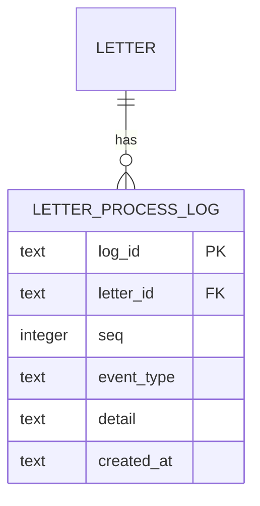

# SDD：MetaAgent v0.3.0 — 软件设计文档

| 文档信息   | 内容                                         |
| ------ | ------------------------------------------ |
| 版本     | v0.3.0                                     |
| 日期     | 2026-09-04                                 |
| 状态     | 草稿                                         |
| 对应 PRD | [PRD-智能体产品设计文档 v0.3.0](./PRD-智能体产品设计文档.md) |
| 前置 SDD | v0.2.0                                     |

> **v0.2.0 → v0.3.0 变更说明**：v0.3.0 聚焦可观测性，新增 1 张日志表、扩展 memory/letter 模块的只读查询能力。后端新增约 500 行代码（主要在 processor 中写入日志），前端新增 1 个 MemoryView 页面、改造 Mailbox 页面增加 Tab。

***

## 1. 技术栈变更

### 1.1 无新增依赖

v0.3.0 不引入任何新的 npm 包，复用现有技术栈：

| 层级  | 技术                                        | 说明                       |
| --- | ----------------------------------------- | ------------------------ |
| 后端  | Fastify 4.x + better-sqlite3 + sqlite-vec | 无变化                      |
| 前端  | Vue 3.4 + Vite + Pinia + Element Plus     | 无变化                      |
| 数据库 | SQLite                                    | 新增 1 张表，letter 表新增 1 个索引 |

***

## 2. 数据库设计

### 2.1 ER 图（v0.3.0 增量）



### 2.2 新增表：letter\_process\_log

```sql
-- ================================================================
-- v0.3.0 新增：信件处理日志表
-- ================================================================

CREATE TABLE IF NOT EXISTS letter_process_log (
    log_id      TEXT PRIMARY KEY,
    letter_id   TEXT NOT NULL REFERENCES letter(letter_id) ON DELETE CASCADE,
    seq         INTEGER NOT NULL,
    event_type  TEXT NOT NULL CHECK(event_type IN (
                    'letter_received',
                    'llm_called',
                    'memories_extracted',
                    'reply_decision',
                    'reply_sent',
                    'processing_error'
                )),
    detail      TEXT,            -- JSON 格式，可选
    created_at  TEXT NOT NULL DEFAULT (datetime('now')),
    UNIQUE (letter_id, seq)
);

CREATE INDEX IF NOT EXISTS idx_lpl_letter_seq
    ON letter_process_log(letter_id, seq);
```

### 2.3 索引增强

```sql
-- letter 表：已发送信件查询的复合索引
CREATE INDEX IF NOT EXISTS idx_letter_from_sent
    ON letter(from_agent_id, sent_at DESC);
```

### 2.4 迁移脚本

新建文件：`server/src/db/migrations/003_add_letter_process_log.sql`

```sql
BEGIN TRANSACTION;

-- 新增 letter_process_log 表
CREATE TABLE IF NOT EXISTS letter_process_log (
    log_id      TEXT PRIMARY KEY,
    letter_id   TEXT NOT NULL REFERENCES letter(letter_id) ON DELETE CASCADE,
    seq         INTEGER NOT NULL,
    event_type  TEXT NOT NULL CHECK(event_type IN (
                    'letter_received',
                    'llm_called',
                    'memories_extracted',
                    'reply_decision',
                    'reply_sent',
                    'processing_error'
                )),
    detail      TEXT,
    created_at  TEXT NOT NULL DEFAULT (datetime('now')),
    UNIQUE (letter_id, seq)
);

-- 补索引
CREATE INDEX IF NOT EXISTS idx_lpl_letter_seq
    ON letter_process_log(letter_id, seq);

CREATE INDEX IF NOT EXISTS idx_letter_from_sent
    ON letter(from_agent_id, sent_at DESC);

COMMIT;
```

### 2.5 schema.sql 更新

在现有 [schema.sql](file:///workspace/server/src/db/schema.sql) 末尾追加 letter\_process\_log 表定义和 letter 表的新索引。

### 2.6 db/index.ts 迁移逻辑扩展

```typescript
// server/src/db/index.ts（迁移检查片段）
const HAS_LETTER_PROCESS_LOG = _db.prepare(
    `SELECT name FROM sqlite_master WHERE type='table' AND name='letter_process_log'`
).get();

if (!HAS_LETTER_PROCESS_LOG) {
    logger.info('Running migration 003: add letter_process_log');
    const migration = fs.readFileSync(
        path.join(__dirname, 'migrations', '003_add_letter_process_log.sql'),
        'utf-8'
    );
    _db.exec(migration);
}
```

***

## 3. 后端模块设计

### 3.1 模块总览

```
server/src/
├── db/
│   ├── migrations/
│   │   └── 003_add_letter_process_log.sql     ← 新增
│   └── repositories/
│       ├── memory.repo.ts                      ← 改造：新增 listForAgent 方法
│       ├── letter.repo.ts                      ← 改造：新增 listSent + getLogs + hasReply
│       └── letter-process-log.repo.ts          ← 新增
│
├── modules/
│   ├── memory/
│   │   ├── route.ts                            ← 新增：GET /api/memory/list
│   │   └── service.ts                          ← 新增查询编排方法
│   └── letter/
│       ├── route.ts                            ← 改造：新增 /sent 和 /:id/logs
│       ├── service.ts                          ← 改造：新增 listSent + getLogs
│       └── processor.ts                        ← 改造：每个关键步骤写日志
```

### 3.2 Letter Process Log Repository（新增）

```typescript
// server/src/db/repositories/letter-process-log.repo.ts
import { randomUUID } from 'node:crypto';
import { getDb } from '../index.js';

export interface LetterProcessLogRow {
  log_id: string;
  letter_id: string;
  seq: number;
  event_type: string;
  detail: string | null;
  created_at: string;
}

export const letterProcessLogRepo = {
  /** 获取某封信的下一个 seq 序号 */
  nextSeq(letterId: string): number {
    const db = getDb();
    const row = db
      .prepare(
        `SELECT MAX(seq) AS m FROM letter_process_log WHERE letter_id = ?`
      )
      .get(letterId) as { m: number | null };
    return (row.m ?? 0) + 1;
  },

  /** 写入一条处理日志 */
  insert(letterId: string, eventType: string, detail?: Record<string, unknown>): void {
    const db = getDb();
    const logId = randomUUID();
    const seq = this.nextSeq(letterId);
    db.prepare(
      `INSERT INTO letter_process_log (log_id, letter_id, seq, event_type, detail)
       VALUES (?, ?, ?, ?, ?)`
    ).run(
      logId,
      letterId,
      seq,
      eventType,
      detail ? JSON.stringify(detail) : null
    );
  },

  /** 查询某封信的所有处理日志，按 seq 排序 */
  listByLetter(letterId: string): LetterProcessLogRow[] {
    const db = getDb();
    return db
      .prepare(
        `SELECT * FROM letter_process_log WHERE letter_id = ? ORDER BY seq ASC`
      )
      .all(letterId) as LetterProcessLogRow[];
  },

  /** 清空某封信的日志（reprocess 时调用） */
  clearByLetter(letterId: string): void {
    const db = getDb();
    db.prepare(`DELETE FROM letter_process_log WHERE letter_id = ?`).run(letterId);
  },
};
```

### 3.3 Memory Repository 改造

新增 `listForAgent` 方法，替代原来只有 `insertWithVector` 和 `recall` 的状态。

```typescript
// server/src/db/repositories/memory.repo.ts（新增方法）
export interface MemoryListParams {
  agent_id: string;
  layer?: 'all' | 'self' | 'world' | 'other';
  source?: 'all' | 'dialogue' | 'letter_receive' | 'letter_send';
  sort?: 'confidence_desc' | 'time_desc';
  page?: number;
  size?: number;
}

export interface MemoryListItem extends MemoryItem {
  target_agent_name: string | null;
}

export const memoryRepo = {
  // ... 原有 insertWithVector / recall 方法不变 ...

  listForAgent(params: MemoryListParams): { items: MemoryListItem[]; total: number } {
    const db = getDb();
    const {
      agent_id,
      layer = 'all',
      source = 'all',
      sort = 'confidence_desc',
      page = 1,
      size = 20,
    } = params;

    const where: string[] = ['m.agent_id = ?'];
    const args: any[] = [agent_id];

    if (layer !== 'all') {
      where.push('m.layer = ?');
      args.push(layer);
    }
    if (source !== 'all') {
      where.push('m.source_type = ?');
      args.push(source);
    }

    const orderBy =
      sort === 'time_desc' ? 'm.created_at DESC' : 'm.confidence DESC, m.created_at DESC';

    const whereSql = where.join(' AND ');

    // total count
    const total = (
      db.prepare(
        `SELECT COUNT(*) AS c FROM memory_item m WHERE ${whereSql}`
      ).get(...args) as any
    ).c as number;

    // rows with target agent name
    const offset = (page - 1) * size;
    const rows = db
      .prepare(
        `SELECT m.*, a.name AS target_agent_name
         FROM memory_item m
         LEFT JOIN agent a ON a.agent_id = m.target_agent_id
         WHERE ${whereSql}
         ORDER BY ${orderBy}
         LIMIT ? OFFSET ?`
      )
      .all(...args, Math.min(size, 200), offset) as any[];

    return {
      total,
      items: rows.map(r => ({
        memory_id: r.memory_id,
        agent_id: r.agent_id,
        layer: r.layer,
        target_agent_id: r.target_agent_id || undefined,
        target_agent_name: r.target_agent_name,
        content: r.content,
        confidence: r.confidence,
        source_type: r.source_type,
        source_id: r.source_id,
        created_at: r.created_at,
      })),
    };
  },
};
```

### 3.4 Letter Repository 改造

```typescript
// server/src/db/repositories/letter.repo.ts（新增方法）

export interface SentLetterListItem {
  letter_id: string;
  to_agent_id: string;
  to_name: string;
  subject: string | null;
  status: LetterStatus;
  sent_at: string;
  has_reply: boolean;
  reply_preview: string | null;
}

export const letterRepo = {
  // ... 原有方法不变 ...

  /** 查询某智能体发出的所有信件 */
  listSent(agentId: string): SentLetterListItem[] {
    const db = getDb();
    const rows = db
      .prepare(
        `SELECT
            l.letter_id,
            l.to_agent_id,
            a2.name AS to_name,
            l.subject,
            l.status,
            l.sent_at,
            r.body AS reply_body
         FROM letter l
         JOIN agent a2 ON a2.agent_id = l.to_agent_id
         LEFT JOIN letter r ON r.reply_to = l.letter_id
         WHERE l.from_agent_id = ?
         ORDER BY l.sent_at DESC`
      )
      .all(agentId) as any[];

    // 用 Map 去重：一封原信可能有多封回复，取最新的
    const latestReply = new Map<string, string>();
    const result: SentLetterListItem[] = [];
    const seen = new Set<string>();

    rows.forEach(r => {
      if (seen.has(r.letter_id)) return;
      seen.add(r.letter_id);

      result.push({
        letter_id: r.letter_id,
        to_agent_id: r.to_agent_id,
        to_name: r.to_name,
        subject: r.subject,
        status: r.status,
        sent_at: r.sent_at,
        has_reply: !!r.reply_body,
        reply_preview: r.reply_body ? r.reply_body.slice(0, 80) : null,
      });
    });

    return result;
  },

  /** 判断一封原信是否已有回复 */
  hasReply(letterId: string): boolean {
    const db = getDb();
    const row = db
      .prepare(`SELECT 1 FROM letter WHERE reply_to = ? LIMIT 1`)
      .get(letterId) as any;
    return !!row;
  },
};
```

### 3.5 Memory 路由（新增）

新建文件 `server/src/modules/memory/route.ts`

```typescript
// server/src/modules/memory/route.ts
import type { FastifyInstance } from 'fastify';
import { memoryRepo } from '../../db/repositories/memory.repo.js';
import { verifyAuth, verifyAgentOwnership } from '../../middleware/index.js';

export async function memoryRoutes(app: FastifyInstance) {
  // GET /api/memory/list?agent_id=xxx
  app.get(
    '/memory/list',
    { preHandler: [verifyAuth, verifyAgentOwnership] },
    async (req, reply) => {
      const q = req.query as {
        agent_id: string;
        layer?: string;
        source?: string;
        sort?: string;
        page?: string;
        size?: string;
      };
      if (!q.agent_id) return reply.code(400).send({ error: 'agent_id required' });

      const validLayers = ['all', 'self', 'world', 'other'];
      const validSources = ['all', 'dialogue', 'letter_receive', 'letter_send'];
      const validSorts = ['confidence_desc', 'time_desc'];

      const result = memoryRepo.listForAgent({
        agent_id: q.agent_id,
        layer: (validLayers.includes(q.layer || 'all') ? q.layer : 'all') as any,
        source: (validSources.includes(q.source || 'all') ? q.source : 'all') as any,
        sort: (validSorts.includes(q.sort || '') ? q.sort : 'confidence_desc') as any,
        page: Number(q.page) || 1,
        size: Number(q.size) || 20,
      });

      reply.send(result);
    }
  );
}
```

注册到 `server/src/index.ts`：

```typescript
import { memoryRoutes } from './modules/memory/route.js';
// ...
app.register(memoryRoutes, { prefix: '/api' });
```

### 3.6 Letter 路由改造

```typescript
// server/src/modules/letter/route.ts（新增两个路由）

export async function letterRoutes(app: FastifyInstance) {
  // ... 原有 send / inbox / read / reprocess 不变 ...

  // GET /api/mail/sent?agent_id=xxx — 已发送信件列表
  app.get(
    '/mail/sent',
    { preHandler: [verifyAuth, verifyAgentOwnership] },
    async (req, reply) => {
      const { agent_id } = req.query as { agent_id: string };
      if (!agent_id) return reply.code(400).send({ error: 'agent_id required' });
      reply.send(letterService.listSent(agent_id));
    }
  );

  // GET /api/mail/:id/logs — 信件处理日志
  app.get('/mail/:id/logs', { preHandler: [verifyAuth] }, async (req, reply) => {
    const id = (req.params as { id: string }).id;
    const result = letterService.getLogs(id, getAuthUser(req).sub);
    if (!result) return reply.code(404).send({ error: 'LETTER_NOT_FOUND' });
    reply.send(result);
  });
}
```

### 3.7 Letter Service 改造

```typescript
// server/src/modules/letter/service.ts（新增两个方法）
import { letterProcessLogRepo } from '../../db/repositories/letter-process-log.repo.js';

export const letterService = {
  // ... 原有 send / listInbox / read / reprocess 不变 ...

  listSent(agentId: string) {
    return letterRepo.listSent(agentId);
  },

  /**
   * 查询信件处理日志
   * 归属校验：发件方或收件方任一归属于当前用户即可
   */
  getLogs(letterId: string, userId: string) {
    const letter = letterRepo.getById(letterId);
    if (!letter) return null;

    // 归属检查
    const fromAgent = agentRepo.getById(letter.from_agent_id);
    const toAgent = agentRepo.getById(letter.to_agent_id);
    const isOwner =
      (fromAgent && fromAgent.owner_user_id === userId) ||
      (toAgent && toAgent.owner_user_id === userId);
    if (!isOwner) return null;

    // 查日志 + 补充信件概要
    const logs = letterProcessLogRepo.listByLetter(letterId);
    return {
      letter: {
        letter_id: letter.letter_id,
        from_name: fromAgent?.name || '(已删除)',
        to_name: toAgent?.name || '(已删除)',
        subject: letter.subject,
        status: letter.status,
        sent_at: letter.sent_at,
      },
      logs: logs.map(l => ({
        seq: l.seq,
        event_type: l.event_type,
        detail: l.detail ? JSON.parse(l.detail) : null,
        created_at: l.created_at,
      })),
    };
  },
};
```

### 3.8 Letter Processor 改造（核心）

在 `processLetter` 的每个关键步骤中插入日志写入。

```typescript
// server/src/modules/letter/processor.ts（改造片段）
import { letterProcessLogRepo } from '../../db/repositories/letter-process-log.js';

export async function processLetter(
  letterId: string,
  options: { skipReplyDecision?: boolean } = {}
) {
  // 1. 信件已接收
  letterProcessLogRepo.insert(letterId, 'letter_received');

  const letter = letterRepo.getById(letterId);
  if (!letter) {
    letterProcessLogRepo.insert(letterId, 'processing_error', { message: 'LETTER_NOT_FOUND' });
    return;
  }

  try {
    // 2. 调用 LLM（记录耗时）
    const t0 = Date.now();
    // ... 原有 LLM 调用逻辑 ...
    const t1 = Date.now();
    letterProcessLogRepo.insert(letterId, 'llm_called', {
      model: config.llm.model,
      latency_ms: t1 - t0,
      input_tokens: estimateTokens(prompt),
    });

    // 3. 抽取记忆
    // ... 原有记忆抽取逻辑 ...
    letterProcessLogRepo.insert(letterId, 'memories_extracted', {
      count: extractedCount,
    });

    // 4. 决定回复
    letterProcessLogRepo.insert(letterId, 'reply_decision', {
      should_reply: shouldReply,
      reason: decisionReason,
    });

    // 5. 回复已发送
    if (shouldReply) {
      await letterService.send(replyLetter);
      letterProcessLogRepo.insert(letterId, 'reply_sent', {
        reply_letter_id: replyId,
      });
    }

    // 更新信件最终状态
    letterRepo.updateStatus(letterId, shouldReply ? 'replied' : 'read');
  } catch (err: any) {
    logger.error(err, `processLetter failed: ${letterId}`);
    letterProcessLogRepo.insert(letterId, 'processing_error', {
      message: err?.message || String(err),
    });
    letterRepo.updateStatus(letterId, 'processing_failed');
  }
}
```

reprocess 时需先清空旧日志：

```typescript
// letterService.reprocess 改造
reprocess(id: string) {
  letterRepo.updateStatus(id, 'delivered');
  letterProcessLogRepo.clearByLetter(id);  // ← 新增：清空旧日志
  setImmediate(() => {
    processLetter(id).catch(err =>
      logger.error(err, `reprocessLetter failed: ${id}`)
    );
  });
},
```

***

## 4. Shared 类型更新

### 4.1 memory.ts 扩展

```typescript
// shared/src/types/memory.ts（新增字段）
export interface MemoryListItem extends MemoryItem {
  target_agent_name: string | null;
}

export interface MemoryListResponse {
  total: number;
  items: MemoryListItem[];
}
```

### 4.2 letter.ts 扩展

```typescript
// shared/src/types/letter.ts（新增类型）

export interface SentLetterListItem {
  letter_id: string;
  to_agent_id: string;
  to_name: string;
  subject?: string;
  status: LetterStatus;
  sent_at: string;
  has_reply: boolean;
  reply_preview?: string | null;
}

export type LetterProcessEventType =
  | 'letter_received'
  | 'llm_called'
  | 'memories_extracted'
  | 'reply_decision'
  | 'reply_sent'
  | 'processing_error';

export interface LetterProcessLogItem {
  seq: number;
  event_type: LetterProcessEventType;
  detail: Record<string, unknown> | null;
  created_at: string;
}

export interface LetterLogsResponse {
  letter: {
    letter_id: string;
    from_name: string;
    to_name: string;
    subject?: string;
    status: LetterStatus;
    sent_at: string;
  };
  logs: LetterProcessLogItem[];
}
```

### 4.3 shared/src/index.ts

```typescript
// 无需改动，letter.ts 和 memory.ts 已有 export
```

***

## 5. 前端设计

### 5.1 新增/改造文件清单

| 文件                                                               | 类型 | 说明                     |
| ---------------------------------------------------------------- | -- | ---------------------- |
| [MemoryView.vue](file:///workspace/web/src/views/MemoryView.vue) | 新增 | 记忆页面                   |
| [Mailbox.vue](file:///workspace/web/src/views/Mailbox.vue)       | 改造 | 增加收发 Tab + 处理日志抽屉      |
| [letter.ts (api)](file:///workspace/web/src/api/letter.ts)       | 改造 | 新增 listSent + getLogs  |
| [memory.ts (api)](file:///workspace/web/src/api/memory.ts)       | 新增 | 记忆列表 API               |
| [router.ts](file:///workspace/web/src/router.ts)                 | 改造 | 新增 /memory/:agentId 路由 |

### 5.2 新增路由

```typescript
// web/src/router.ts（新增）
{
  path: '/memory/:agentId',
  name: 'Memory',
  component: () => import('./views/MemoryView.vue'),
  meta: { requiresAuth: true },
},
```

### 5.3 新增 API 文件

`web/src/api/memory.ts`

```typescript
import { request } from './request';
import type { MemoryListResponse } from '@meta-world/shared';

export interface MemoryListParams {
  agent_id: string;
  layer?: string;
  source?: string;
  sort?: string;
  page?: number;
  size?: number;
}

export async function listMemories(params: MemoryListParams): Promise<MemoryListResponse> {
  const qs = new URLSearchParams();
  Object.entries(params).forEach(([k, v]) => {
    if (v !== undefined && v !== null) qs.append(k, String(v));
  });
  return request<MemoryListResponse>(`/memory/list?${qs.toString()}`);
}
```

### 5.4 letter API 扩展

```typescript
// web/src/api/letter.ts（新增两个方法）
import type { SentLetterListItem, LetterLogsResponse } from '@meta-world/shared';

export async function listSent(agentId: string): Promise<SentLetterListItem[]> {
  return request<SentLetterListItem[]>(`/mail/sent?agent_id=${agentId}`);
}

export async function getLetterLogs(id: string): Promise<LetterLogsResponse> {
  return request<LetterLogsResponse>(`/mail/${id}/logs`);
}
```

### 5.5 MemoryView\.vue 页面设计要点

* **Layout**：顶部显示智能体名称、返回按钮、排序切换

* **Filter Bar**：layer 三按钮（self/world/other）+ source 下拉

* **List**：Element Plus 卡片列表，每个卡片包含

  * 置信度进度条（百分比显示）

  * Layer 标签（不同颜色）

  * Source 标签

  * 记忆正文（可截断/展开）

  * 目标智能体名称（target\_agent\_id 有值时）

  * 创建时间

* **空状态**：ElEmpty 引导用户去对话或发信

### 5.6 Mailbox.vue 改造要点

* **增加 Tab 切换**：`el-tabs`，收件箱 / 已发送

* **收件箱 Tab**：保持现有逻辑不变

* **已发送 Tab**：

  * 调用 `listSent(agentId)`

  * 每条卡片显示：收件方名称、主题、状态 Tag（el-tag 不同颜色）、回复预览（has\_reply=true 时显示前 80 字）、发送时间

* **处理日志抽屉**：

  * 复用现有信件详情抽屉，在下方追加处理日志区域

  * 点击"查看处理日志"按钮打开，调用 `getLetterLogs(id)`

  * 使用 `el-timeline` 组件展示日志时间线

  * 每个 timeline-item 显示 event\_type 图标（el-icon）、时间、detail JSON 解析后的摘要

### 5.7 各事件类型的图标映射

```typescript
const LOG_ICONS: Record<string, string> = {
  letter_received: 'MailReceived',
  llm_called: 'MagicStick',
  memories_extracted: 'Collection',
  reply_decision: 'Decision',       // 自定义 icon 或用 Select
  reply_sent: 'Promotion',
  processing_error: 'Warning',
};

const LOG_COLORS: Record<string, string> = {
  letter_received: '#409EFF',
  llm_called: '#909399',
  memories_extracted: '#67C23A',
  reply_decision: '#E6A23C',
  reply_sent: '#67C23A',
  processing_error: '#F56C6C',
};
```

***

## 6. index.ts 注册更新

```typescript
// server/src/index.ts（更新）
import { memoryRoutes } from './modules/memory/route.js';

// ...
app.register(authRoutes,        { prefix: '/api' });
app.register(addressBookRoutes, { prefix: '/api' });
app.register(agentRoutes,      { prefix: '/api' });
app.register(memoryRoutes,     { prefix: '/api' });    // ← 新增
app.register(chatRoutes,        { prefix: '/api' });
app.register(letterRoutes,     { prefix: '/api' });
```

***

## 7. API 汇总（完整）

| 方法  | 路径                 | 鉴权 | 归属校验                 | 模块     |
| --- | ------------------ | -- | -------------------- | ------ |
| GET | /api/memory/list   | ✅  | verifyAgentOwnership | memory |
| GET | /api/mail/sent     | ✅  | verifyAgentOwnership | letter |
| GET | /api/mail/:id/logs | ✅  | service 层校验          | letter |

***

## 8. 风险与注意事项

| #  | 风险点                 | 应对方案                                                             |
| -- | ------------------- | ---------------------------------------------------------------- |
| R1 | processor 中写日志阻塞主流程 | letterProcessLogRepo.insert 是纯内存操作（INSERT 单行），可接受；如需进一步优化可改为异步队列 |
| R2 | 旧版信件无日志             | 正常，只有 v0.3.0 之后处理的信件才有日志；reprocess 会补日志                          |
| R3 | memory 表数据量大        | 单次查询限制 size ≤ 200，分页，加索引                                         |
| R4 | 前端处理日志 detail 渲染    | detail 是 JSON 字符串，前端 JSON.parse 后安全展示，避免 eval                    |

