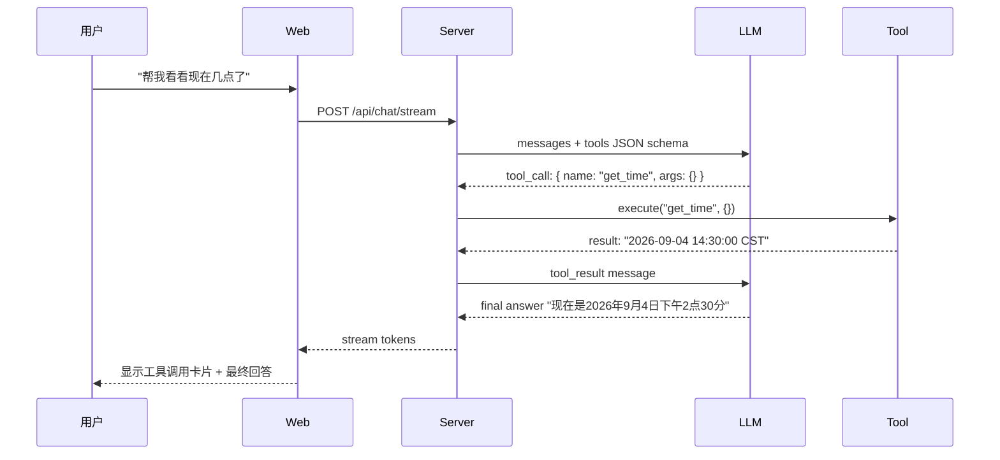
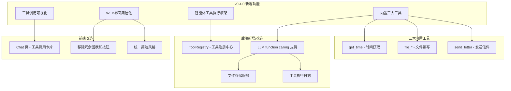
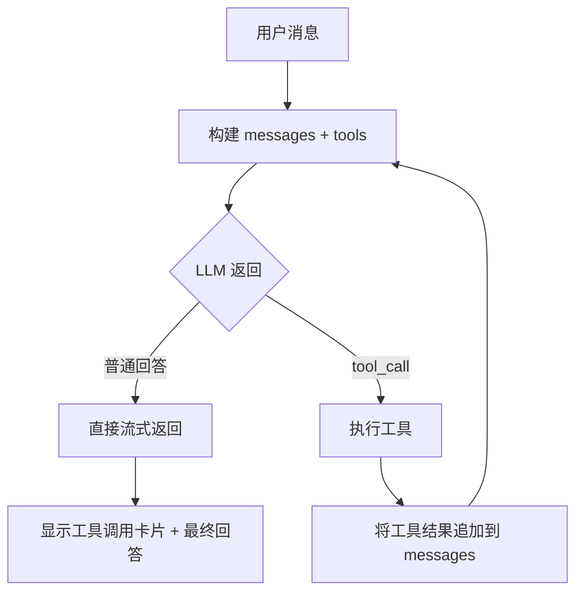

# PRD：MetaAgent v0.4.0 — 智能体工具能力 · WEB界面简洁化

| 文档信息 | 内容         |
| ---- | ---------- |
| 版本   | v0.4.0     |
| 作者   | 产品经理智能体    |
| 日期   | 2026-09-04 |
| 状态   | 草稿         |
| 前置版本 | v0.3.0     |

> **v0.3.0 → v0.4.0 变更说明**：v0.3.0 实现了可观测性，让用户看到智能体的记忆和信件处理过程。但智能体始终只是一个"对话机器人"——它无法主动获取时间、读写文件、发送信件等。v0.4.0 的核心目标是让智能体具备**工具执行能力**，成为一个能真正"做事"的 Agent。同时对 WEB 界面进行简化，去掉冗余图表、label 和按钮，打造更清爽的用户体验。

***

## 1. 背景与目标

### 1.1 问题分析

| #  | 问题           | 用户痛点                               | 影响范围   |
| -- | ------------ | ---------------------------------- | ------ |
| P1 | 智能体只能对话，不能做事 | 用户问"现在几点了？"智能体只能瞎猜；让它"帮我写个文件"做不到   | 产品价值封顶 |
| P2 | 功能扩展困难       | 每个新能力都需要改 LLM prompt 和后端硬编码，无法快速迭代 | 开发效率低  |
| P3 | 界面过于臃肿       | 各页面充斥冗余的图表、标签、装饰性按钮，信息密度不合理        | 用户体验差  |
| P4 | 工具能力无安全边界    | 未来如果开放更多工具，缺乏统一的权限控制和沙箱机制          | 安全风险   |

### 1.2 产品目标

| 维度       | 目标                                                      |
| -------- | ------------------------------------------------------- |
| **业务目标** | 让智能体从"对话者"升级为"执行者"，具备获取时间、文件读写、发送信件三大核心能力               |
| **用户目标** | 用户可以让智能体主动查询时间/日期、管理文件、代发信件，且界面清爽无干扰                    |
| **技术目标** | 建立可扩展的 Tool 框架，新增工具零后端代码；LLM 支持 function calling（tools） |
| **体验目标** | 页面去掉冗余图表和过度装饰，保留核心交互                                    |

### 1.3 成功指标

| 类型  | 指标                  | 目标值                    |
| --- | ------------------- | ---------------------- |
| 护栏1 | 工具调用成功率             | ≥ 98%                  |
| 护栏2 | 新增一个工具的开发周期         | ≤ 1h（仅需配置 JSON schema） |
| 护栏3 | 页面 DOM 节点数量（Chat 页） | 相比 v0.3.0 减少 ≥ 30%     |
| 护栏4 | 用户首次使用工具功能的转化率      | ≥ 周活跃用户的 20%           |

### 1.4 非目标（本期不做）

| 不做                      | 原因                       |
| ----------------------- | ------------------------ |
| 工具执行结果的可视化时间线           | 本期先在对话流中以消息气泡形式展示即可      |
| 文件读写的云端存储同步             | 本期用本地存储，云端留到后续版本         |
| 多智能体协作执行工具              | 单智能体先跑通，多智能体编排复杂         |
| Streamlit/Gradio 风格工具面板 | 先用 Chat 流内联展示，面板化留后      |
| 邮件/短信等更多渠道              | 本期只做信件发送（复用已有 letter 模块） |

***

## 2. 用户与场景

### 2.1 核心使用场景

| #  | 场景      | 描述                                                  |
| -- | ------- | --------------------------------------------------- |
| S1 | 查询时间/日期 | 用户问"现在几点了？"、"今天是星期几？"、"2026年国庆节是周几？"等，智能体调用时间工具准确回答 |
| S2 | 文件管理    | 用户说"帮我写一篇日记"、"读一下昨天的笔记"、"列出我所有的文件"，智能体调用文件工具        |
| S3 | 代发信件    | 用户说"帮我给旅行规划师发封信，问下周天气"，智能体自动调用发送信件工具                |
| S4 | 界面清爽化   | 用户访问任何页面，都感觉简洁、干净、无干扰                               |

### 2.2 工具执行流程



***

## 3. 功能需求

### 3.1 功能架构



### 3.2 功能清单

| 编号 | 功能点                  | 模块                 | 优先级    | 来源        |
| -- | -------------------- | ------------------ | ------ | --------- |
| F1 | 工具注册框架               | Tool Registry      | **P0** | v0.4.0 新增 |
| F2 | get\_time 工具         | 内置工具               | **P0** | v0.4.0 新增 |
| F3 | file\_read/write 工具  | 内置工具               | **P0** | v0.4.0 新增 |
| F4 | send\_letter 工具      | 内置工具（复用 letter 模块） | **P0** | v0.4.0 新增 |
| F5 | LLM function calling | chat 模块改造          | **P0** | v0.4.0 新增 |
| F6 | Chat 页工具调用卡片         | Chat.vue           | **P0** | v0.4.0 新增 |
| F7 | WEB 界面简洁化            | 全部页面               | **P0** | v0.4.0 改造 |

***

### F1 工具注册框架

**功能描述**：建立一个可扩展的工具注册中心，每个工具用 JSON Schema 定义其 name、description、parameters。新增工具只需实现接口并注册，无需改动 LLM 调用逻辑。

**工具接口定义**：

```typescript
interface Tool {
  name: string;                    // 唯一标识，如 "get_time"
  description: string;             // LLM 用于理解何时调用
  parameters: JsonSchema;          // 参数 JSON Schema
  execute(args: any, context: ToolContext): Promise<any>;
}

interface ToolContext {
  agentId: string;
  userId: string;
}
```

**注册中心**：

```typescript
class ToolRegistry {
  private tools: Map<string, Tool>;
  
  register(tool: Tool): void;
  getToolList(): Tool[];              // 获取所有工具（LLM 用）
  async execute(name: string, args: any, ctx: ToolContext): Promise<any>;
}
```

**业务规则**：

| 规则 | 内容                                                  |
| -- | --------------------------------------------------- |
| R1 | 工具在服务启动时注册，新增工具只需 `registry.register(new MyTool())` |
| R2 | 同一进程内工具名唯一，重复注册报错                                   |
| R3 | execute 内部捕获异常，返回标准化错误对象 `{ error: string }`        |
| R4 | 工具执行有 30s 超时保护，超时返回错误                               |

***

### F2 get\_time 工具

**功能描述**：获取当前时间/日期/时区信息。

**调用示例**：

```json
// LLM 发出 tool_call
{
  "name": "get_time",
  "arguments": {
    "format": "iso|readable|unix",    // 可选，默认 "readable"
    "timezone": "Asia/Shanghai"        // 可选，默认自动检测
  }
}

// 返回
{
  "datetime": "2026-09-04T14:30:00+08:00",
  "readable": "2026年9月4日 星期四 14:30:00",
  "unix": 1757017800,
  "timezone": "Asia/Shanghai"
}
```

**边界情况**：

| 输入          | 行为                               |
| ----------- | -------------------------------- |
| format 无效   | 返回 `{ error: "INVALID_FORMAT" }` |
| timezone 无效 | 默认使用 UTC 并在返回中注明                 |

***

### F3 file\_read / file\_write 工具

**功能描述**：智能体可以读写用户的本地文件目录。每个用户有独立的沙箱目录（`data/users/{userId}/files/`），工具只允许在该目录内操作，禁止路径穿越。

**file\_write 调用**：

```json
{
  "name": "file_write",
  "arguments": {
    "path": "notes/diary-2026-09-04.txt",
    "content": "今天天气不错..."
  }
}

// 返回
{ "success": true, "path": "notes/diary-2026-09-04.txt", "size": 128 }
```

**file\_read 调用**：

```json
{
  "name": "file_read",
  "arguments": {
    "path": "notes/diary-2026-09-04.txt"
  }
}

// 返回
{ "content": "今天天气不错...", "size": 128 }
```

**file\_list 调用**：

```json
{
  "name": "file_list",
  "arguments": {
    "directory": ""    // 可选，默认根目录
  }
}

// 返回
{
  "files": [
    { "name": "notes", "type": "dir" },
    { "name": "todo.txt", "type": "file", "size": 42 }
  ]
}
```

**file\_delete 调用**：

```json
{
  "name": "file_delete",
  "arguments": {
    "path": "old-notes.txt"
  }
}

// 返回
{ "success": true }
```

**安全边界**：

| 规则 | 内容                                     |
| -- | -------------------------------------- |
| R1 | 所有路径必须在用户沙箱目录内，`path` 中的 `../` 自动移除或拒绝 |
| R2 | 单文件大小上限 1MB，超出返回错误                     |
| R3 | 不支持二进制文件读写，只支持 UTF-8 文本                |
| R4 | 文件操作记录到日志，可追溯                          |

***

### F4 send\_letter 工具

**功能描述**：智能体可以直接调用发送信件工具，替代原有的"用户点按钮发信"交互。内部复用已有的 letter 模块。

**调用示例**：

```json
{
  "name": "send_letter",
  "arguments": {
    "target_agent_id": "ag_02J...",
    "subject": "北京下周天气",
    "body": "你好，请问北京下周天气如何？"
  }
}

// 返回
{ "success": true, "letter_id": "let_01J...", "status": "sent" }
```

**业务规则**：

| 规则 | 内容                                        |
| -- | ----------------------------------------- |
| R1 | target\_agent\_id 必须在通讯录中存在               |
| R2 | subject 可选，默认从 body 前 30 字截取              |
| R3 | 发送后自动触发 letter processor 处理链路（抽取记忆、对方回复等） |
| R4 | 调用者的 agent\_id 自动作为发件方                    |

***

### F5 LLM Function Calling 集成

**功能描述**：Chat 模块支持 function calling（tools 模式）。当 LLM 判断需要调用工具时，返回 tool\_call；Server 执行后把结果作为 tool message 传回，LLM 再生成最终回答。

**处理流程**：



**循环上限**：最多 5 轮 tool\_call，防止 LLM 陷入死循环。

***

### F6 Chat 页工具调用卡片

**功能描述**：当对话中发生工具调用时，在消息流中插入一个"工具调用"卡片，展示调用的工具名、参数和结果摘要。

**UI 设计**：

```
┌────────────────────────────────────────────┐
│ 🔧 调用工具                                │
│ ┌──────────────────────────────────────┐  │
│ │ 🕐 get_time                          │  │
│ │ 参数: { format: "readable" }         │  │
│ │ 结果: 2026年9月4日 14:30:00           │  │
│ └──────────────────────────────────────┘  │
└────────────────────────────────────────────┘
```

***

### F7 WEB 界面简洁化

**功能描述**：去掉各页面中冗余的图表、装饰性 label、不必要的按钮。统一视觉风格为"极简 + 留白"。

**具体改造项**：

| 页面              | 改造内容                                                   |
| --------------- | ------------------------------------------------------ |
| **Chat**        | 去掉 header 里的"通讯录/信件箱"按钮（移到侧边栏）；去掉消息气泡外的卡片边框；工具调用卡片轻量展示 |
| **AgentList**   | 去掉 agent 卡片上的冗余标签；简化空状态文案                              |
| **CreateAgent** | 去掉表单分组边框；用占位符替代部分 label                                |
| **MemoryView**  | 去掉置信度进度条（改为纯百分比文字）；简化筛选器                               |
| **Mailbox**     | 去掉信件卡片边框；纯列表展示                                         |
| **整体**          | 统一使用更简洁的色彩方案；减少阴影和圆角                                   |

**设计原则**：

| 原则   | 说明                        |
| ---- | ------------------------- |
| 少即是多 | 能用文字就不用图标，能用图标就不用动画       |
| 内容优先 | 核心信息占 80% 视觉权重，装饰元素 ≤ 20% |
| 操作便捷 | 高频操作放在触手可及的位置，低频操作隐藏到菜单   |

***

## 4. 非功能需求

### 4.1 性能

| 指标                       | 要求          |
| ------------------------ | ----------- |
| 工具执行响应时间（get\_time）      | P95 ≤ 100ms |
| 工具执行响应时间（file\_\*）       | P95 ≤ 300ms |
| 工具执行响应时间（send\_letter）   | P95 ≤ 500ms |
| Chat 流式首 token 时间（含工具调用） | P95 ≤ 2s    |
| 前端页面首次渲染时间               | P95 ≤ 1.2s  |

### 4.2 安全

| 项    | 要求                                     |
| ---- | -------------------------------------- |
| 文件隔离 | 每个用户独立沙箱目录，禁止路径穿越                      |
| 工具权限 | 执行工具前校验 agent 归属                       |
| 超时保护 | 所有工具执行 30s 超时                          |
| 参数校验 | 工具参数严格按 JSON Schema 校验，LLM 返回异常参数时拒绝执行 |
| 敏感日志 | 文件路径、信件内容不完整记录到日志（只记录摘要）               |

### 4.3 兼容性

| 类型  | 要求                                               |
| --- | ------------------------------------------------ |
| 浏览器 | Chrome / Edge / Safari 最新 2 个版本                  |
| 分辨率 | 最小 1280×720                                      |
| LLM | 任何支持 function calling 的模型（已适配 deepseek-v4-flash） |

### 4.4 可用性

| 项    | 要求                                |
| ---- | --------------------------------- |
| 工具失败 | 智能体自动用自然语言告知用户"抱歉，我查时间时遇到了问题：..." |
| 空状态  | 文件为空时显示引导文案                       |
| 错误提示 | 工具调用失败时前端展示错误摘要                   |

***

## 5. 数据埋点

| 事件名                 | 触发时机       | 关键参数                           |
| ------------------- | ---------- | ------------------------------ |
| tool\_call          | 智能体执行工具时   | tool\_name, agent\_id, success |
| tool\_call\_error   | 工具执行失败     | tool\_name, error\_type        |
| tool\_chat\_trigger | 用户问题触发工具调用 | first\_tool\_in\_session       |

***

## 6. API 汇总（v0.4.0 新增/改造）

| 方法   | 路径               | 鉴权 | 说明                | 状态        |
| ---- | ---------------- | -- | ----------------- | --------- |
| GET  | /api/tools/list  | ✅  | 获取已注册的所有工具列表（调试用） | v0.4.0 新增 |
| POST | /api/chat/stream | ✅  | 改造：支持 tools 参数    | v0.4.0 改造 |

> 注：工具不暴露独立 HTTP API，由 LLM function calling 统一调度执行。

***

## 7. 修订记录

| 版本        | 日期         | 修改内容                         | 修改人     |
| --------- | ---------- | ---------------------------- | ------- |
| v0.4.0-01 | 2026-09-04 | 初始草稿，覆盖工具框架、三大内置工具、界面简洁化三大主题 | 产品经理智能体 |

